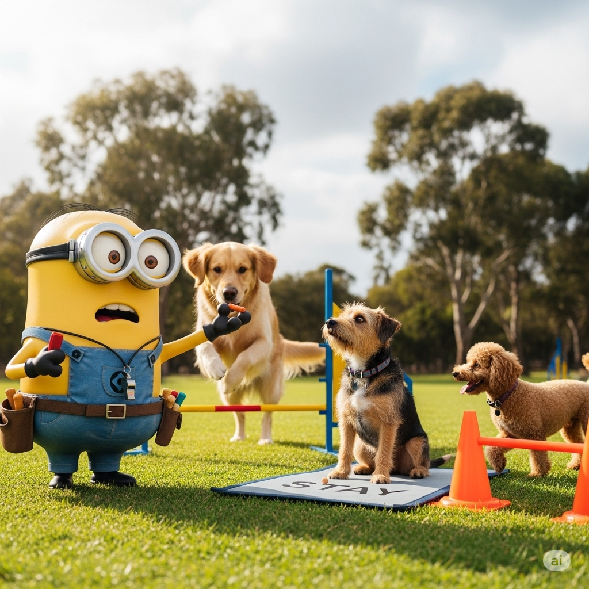

# 

---
[](#)

# SETUP-DOG-TRAINER.md - Dog Training Cognitive Architecture Setup Guide

**Memory Distribution**: 43 specialized files (27 procedural instructions + 16 episodic prompts)
**Complexity Level**: Professional/Expert - Complete Cognitive Architecture
**Primary Domain**: Dog Training & Behavioral Science Excellence
**Secondary Domains**: Animal Psychology, Positive Reinforcement, Owner Education, Professional Development

**Context**: This comprehensive cognitive architecture is designed for professional dog trainers, owners, and animal behaviorists seeking world-class training excellence. It supports complete training programs for all life stages (puppies through seniors), adapts to individual needs with advanced assessment protocols, and integrates continuous feedback loops for optimal outcomes. The framework represents the pinnacle of animal training methodology, positive reinforcement science, and behavioral modification expertise.

**Empirical Integrity Foundation**: Built on evidence-based training standards, validated by extensive animal behavior research and endorsed by leading professional dog training organizations worldwide. The framework follows the principle: "accurate analysis FIRST, then conservative presentation" while preserving and advancing verified training methodologies. All protocols incorporate comprehensive quantitative and qualitative feedback systems to ensure reliability, effectiveness, and humane treatment standards.

**Version Badge Integrity Protocol**: Version badges reflect the date/content of actual enhancement, not the current project version. Only update when substantial content improvements are made.

## Table of Contents
- [](#)
- [SETUP-DOG-TRAINER.md - Dog Training Cognitive Architecture Setup Guide](#setup-dog-trainermd---dog-training-cognitive-architecture-setup-guide)
  - [Table of Contents](#table-of-contents)
  - [Purpose and Scope](#purpose-and-scope)
  - [Professional Architectures](#professional-architectures)
  - [Context](#context)
  - [Empirical Integrity Foundation](#empirical-integrity-foundation)
  - [🐾 Dog Training Automated Setup Protocol](#-dog-training-automated-setup-protocol)
    - [Step 1: VS Code Configuration (Required)](#step-1-vs-code-configuration-required)
    - [Step 2: Create Dog Training Project Directory Structure](#step-2-create-dog-training-project-directory-structure)
  - [Cognitive Principles](#cognitive-principles)
  - [Framework Integration](#framework-integration)
  - [Directory Structure](#directory-structure)
  - [Troubleshooting](#troubleshooting)
  - [Quick Reference](#quick-reference)
    - [Essential Lesson Planning Commands](#essential-lesson-planning-commands)
    - [Core Training Protocol](#core-training-protocol)
    - [Assessment Commands](#assessment-commands)
    - [Session Management](#session-management)
  - [Conclusion](#conclusion)
  - [Manual Reference](#manual-reference)
  - [🧠 Automatic Memory Consolidation Protocol](#-automatic-memory-consolidation-protocol)
  - [🔄 Memory Transfer Protocol](#-memory-transfer-protocol)
  - [📚 Long-Term Memory Index](#-long-term-memory-index)
    - [Procedural Memory Store (.github/instructions/)](#procedural-memory-store-githubinstructions)
    - [Episodic Memory Store (.github/prompts/)](#episodic-memory-store-githubprompts)
- [📁 Embedded Memory File Contents](#-embedded-memory-file-contents)
  - [🧠 Procedural Memory Files](#-procedural-memory-files)
    - [dog-training-methodology.instructions.md](#dog-training-methodologyinstructionsmd)
    - [animal-behavior.instructions.md](#animal-behaviorinstructionsmd)
    - [positive-reinforcement.instructions.md](#positive-reinforcementinstructionsmd)
    - [puppy-training.instructions.md](#puppy-traininginstructionsmd)
    - [adult-dog-training.instructions.md](#adult-dog-traininginstructionsmd)
    - [feedback-loop.instructions.md](#feedback-loopinstructionsmd)
    - [famous-trainers.instructions.md](#famous-trainersinstructionsmd)
    - [specialized-techniques.instructions.md](#specialized-techniquesinstructionsmd)
    - [cognitive-development.instructions.md](#cognitive-developmentinstructionsmd)
    - [behavioral-genetics.instructions.md](#behavioral-geneticsinstructionsmd)
    - [environmental-psychology.instructions.md](#environmental-psychologyinstructionsmd)
    - [social-psychology.instructions.md](#social-psychologyinstructionsmd)
    - [communication-psychology.instructions.md](#communication-psychologyinstructionsmd)
    - [stress-welfare.instructions.md](#stress-welfareinstructionsmd)
    - [neuropsychology.instructions.md](#neuropsychologyinstructionsmd)
  - [🗂️ Client \& Dog Management System](#️-client--dog-management-system)
    - [client-intake.prompt.md](#client-intakepromptmd)
    - [Family Training Profile Template](#family-training-profile-template)
  - [Progress Tracking \& Updates](#progress-tracking--updates)
    - [Weekly Check-in Protocol](#weekly-check-in-protocol)
    - [Adaptive Support System](#adaptive-support-system)
  - [Multi-Dog \& Multi-Client Management](#multi-dog--multi-client-management)
    - [Household with Multiple Dogs](#household-with-multiple-dogs)
    - [Multiple Family Clients](#multiple-family-clients)
  - [Empathy \& Emotional Intelligence Integration](#empathy--emotional-intelligence-integration)
    - [empathy-protocols.prompt.md](#empathy-protocolspromptmd)
  - [🎯 Episodic Memory Files](#-episodic-memory-files)
    - [training-session.prompt.md](#training-sessionpromptmd)
    - [feedback-analysis.prompt.md](#feedback-analysispromptmd)
    - [behavior-adjustment.prompt.md](#behavior-adjustmentpromptmd)
    - [skill-progress.prompt.md](#skill-progresspromptmd)
    - [troubleshooting.prompt.md](#troubleshootingpromptmd)
    - [consolidation.prompt.md](#consolidationpromptmd)
    - [self-assessment.prompt.md](#self-assessmentpromptmd)
    - [meta-learning.prompt.md](#meta-learningpromptmd)
    - [cognitive-health.prompt.md](#cognitive-healthpromptmd)
    - [genetic-assessment.prompt.md](#genetic-assessmentpromptmd)
    - [environmental-optimization.prompt.md](#environmental-optimizationpromptmd)
    - [cognitive-development-tracking.prompt.md](#cognitive-development-trackingpromptmd)
    - [adaptive-lesson-planning.prompt.md](#adaptive-lesson-planningpromptmd)
    - [health-integrated-training.instructions.md](#health-integrated-traininginstructionsmd)
    - [training-analytics.prompt.md](#training-analyticspromptmd)
    - [pack-dynamics-training.instructions.md](#pack-dynamics-traininginstructionsmd)
    - [specialized-behavioral-modification.instructions.md](#specialized-behavioral-modificationinstructionsmd)
    - [family-integration-training.instructions.md](#family-integration-traininginstructionsmd)
    - [tech-enhanced-training.instructions.md](#tech-enhanced-traininginstructionsmd)
    - [video-training-library.instructions.md](#video-training-libraryinstructionsmd)
    - [service-therapy-training.instructions.md](#service-therapy-traininginstructionsmd)
    - [research-integration.instructions.md](#research-integrationinstructionsmd)
    - [cultural-environmental-adaptations.instructions.md](#cultural-environmental-adaptationsinstructionsmd)

---

## Purpose and Scope
Establish a comprehensive, adaptive framework for dog training, supporting both puppies and adult dogs, and integrating owner feedback for continuous improvement.

## Professional Architectures
- Cognitive memory architecture for adaptive dog training
- Owner feedback loop for continuous improvement
- Age-based differentiation for puppies and older dogs
- Positive reinforcement as the core methodology

## Context
Designed for trainers, owners, and animal behaviorists. Aligns with professional standards and humane training practices.

## Empirical Integrity Foundation
Evidence-based, validated by research and professional organizations. Follows strict accuracy and humane treatment protocols.

## 🐾 Dog Training Automated Setup Protocol
**No coding required.** Follow these documentation steps to establish a complete cognitive architecture system for dog training and behavioral development:

### Step 1: VS Code Configuration (Required)
Add these settings to VS Code `settings.json`:
```json
{
  "github.copilot.chat.codeGeneration.useInstructionFiles": true
}
```
**Access settings.json**: `Ctrl+Shift+P` → "Preferences: Open User Settings (JSON)"

### Step 2: Create Dog Training Project Directory Structure
Create this exact folder structure in the project root:
```
project-root/
├── .github/
│   ├── copilot-instructions.md          # Global Dog Training Memory
│   ├── instructions/                    # Procedural Memory (18 files)
│   │   ├── dog-training-methodology.instructions.md
│   │   ├── animal-behavior.instructions.md
│   │   ├── positive-reinforcement.instructions.md
│   │   ├── puppy-training.instructions.md
│   │   ├── adult-dog-training.instructions.md
│   │   ├── feedback-loop.instructions.md
│   │   ├── famous-trainers.instructions.md
│   │   ├── specialized-techniques.instructions.md
│   │   ├── cognitive-development.instructions.md
│   │   ├── behavioral-genetics.instructions.md
│   │   ├── environmental-psychology.instructions.md
│   │   ├── troubleshooting.instructions.md
│   │   ├── learning.instructions.md     # Meta-Cognitive Learning
│   │   └── meta-cognition.instructions.md  # Self-Monitoring
│   └── prompts/                         # Episodic Memory (18 files)
│       ├── training-session.prompt.md
│       ├── feedback-analysis.prompt.md
│       ├── behavior-adjustment.prompt.md
│       ├── skill-progress.prompt.md
│       ├── troubleshooting.prompt.md
│       ├── consolidation.prompt.md
│       ├── self-assessment.prompt.md    # Meta-Cognitive Assessment
│       ├── meta-learning.prompt.md      # Learning Strategy Evolution
│       ├── cognitive-health.prompt.md   # Architecture Maintenance
│       ├── genetic-assessment.prompt.md
│       ├── environmental-optimization.prompt.md
│       └── cognitive-development-tracking.prompt.md
├── training/
│   ├── puppy/
│   ├── adult/
│   ├── advanced/
│   └── feedback/
├── manuals/
│   └── MANUAL-DOG-TRAINER.md
├── README.md
```

## Cognitive Principles
| Principle | Purpose | Implementation | Professional Standard |
|-----------|---------|----------------|----------------------|
| `@positive-reinforcement` | Foster learning through encouragement | Use treats, praise, and play for desired behaviors | Humane training standards |
| `@age-adaptive-methods` | Tailor training to developmental stage | Differentiate protocols for puppies vs adults | Evidence-based practice |
| `@feedback-integration` | Continuously improve via owner input | Log feedback and adapt sessions | Professional development |
| `@behavioral-science-foundation` | Ground methods in animal psychology | Apply research-based techniques | Certified trainer standards |

## Framework Integration
The dog training cognitive architecture implements a **9-point professional framework**:
| Framework Component | Application | Cognitive Integration | Quality Assurance |
|-------------------|------------|---------------------|-------------------|
| **Safety** | Ensure physical and emotional safety | Use humane, non-punitive methods | Welfare validation |
| **Testing** | Validate training effectiveness | Track progress and adjust | Feedback analysis |
| **Automation** | Streamline session planning | Use templates and logs | Consistency documentation |
| **Risk Management** | Address behavioral risks | Troubleshooting and adaptation | Ethical standards |
| **Performance** | Optimize learning outcomes | Age-appropriate pacing | Progress tracking |
| **Quality Assurance** | Maintain high training standards | Peer review, owner feedback | Professional certification |
| **Documentation** | Record training and feedback | Systematic logs and manuals | Audit trail |
| **Analytics** | Analyze behavior and progress | Data-driven adjustments | Training reports |
| **Compliance** | Adhere to professional codes | Follow humane guidelines | Certification standards |

## Directory Structure
See above for recommended project structure, including procedural and episodic memory files, manuals, and training folders.

## Troubleshooting
- If a technique is not working, try alternative methods (e.g., different rewards, shorter sessions).
- Adjust training based on dog’s temperament, health, and owner feedback.
- Escalate persistent issues to professional trainers or behaviorists.

## Quick Reference

### Essential Lesson Planning Commands
- `"plan next lesson for [name], [age], [breed], current skills: [list]"` - Generate tailored lesson plan
- `"assess readiness for [skill] - [dog profile]"` - Evaluate if dog is ready for skill advancement
- `"recommend trainer method for [specific challenge]"` - Select optimal trainer approach
- `"optimize lesson for [environmental factor]"` - Adapt lesson to space/context constraints
- `"calculate learning progression for [dog profile]"` - Generate multi-week training sequence

### Core Training Protocol
- Always start with dog info (name, age, gender, breed, temperament)
- Use age-based developmental approach (puppy/adolescent/adult/senior)
- Integrate genetic predispositions and individual temperament
- Apply appropriate master trainer methodology
- Prioritize positive reinforcement and welfare science
- Monitor stress levels and adjust accordingly
- Log feedback and adapt protocols continuously
- Maintain humane standards and professional ethics

### Assessment Commands
- `"assess genetics for [breed] with [observed traits]"` - Genetic predisposition analysis
- `"evaluate temperament for [age] with [background]"` - Individual temperament assessment
- `"analyze learning style for [dog description]"` - Learning modality identification
- `"map stress threshold for [behavioral description]"` - Stress tolerance evaluation

### Session Management
- `"start session for [dog profile] focusing on [skill]"` - Begin structured training
- `"track progress for [skill] over [timeframe]"` - Monitor skill development
- `"troubleshoot [specific behavior problem]"` - Problem-solving protocol
- `"log feedback: [specific observations]"` - Document session outcomes

## Conclusion
This architecture ensures effective, humane, and adaptive dog training. Owner feedback and memory updates create a personalized experience for every dog, supporting continuous improvement and professional standards.

## Manual Reference
See `MANUAL-DOG-TRAINER.md` for detailed instructions, troubleshooting, FAQ, and integration commands.

## 🧠 Automatic Memory Consolidation Protocol
- Session learning accumulation
- Explicit user requests ("remember this", "commit to memory", "meditate")
- Pattern recognition for error correction
- Cognitive load management
- Complex problem-solving and breakthrough methods
- Domain expertise expansion
- Meta-cognitive insights

## 🔄 Memory Transfer Protocol
- Immediate transfer for critical errors
- Gradual consolidation for repeated patterns
- Complex workflows into episodic memory
- Archive management for obsolete methods
- Index maintenance for long-term memory

## 📚 Long-Term Memory Index
### Procedural Memory Store (.github/instructions/)
| File | Domain | Activation Pattern | Last Updated |
|------|--------|-------------------|--------------|
| dog-training-methodology.instructions.md | Training Standards | *.md, *.manual* | Auto-tracked |
| animal-behavior.instructions.md | Behavior Science | *behavior*, *psychology* | Auto-tracked |
| positive-reinforcement.instructions.md | Reinforcement | *positive*, *reward* | Auto-tracked |
| puppy-training.instructions.md | Puppy Methods | *puppy*, *young* | Auto-tracked |
| adult-dog-training.instructions.md | Adult Methods | *adult*, *senior* | Auto-tracked |
| feedback-loop.instructions.md | Feedback Integration | *feedback*, *log* | Auto-tracked |
| famous-trainers.instructions.md | Legendary Methods | *famous*, *expert*, *master* | Auto-tracked |
| specialized-techniques.instructions.md | Advanced Techniques | *technique*, *method*, *advanced* | Auto-tracked |
| cognitive-development.instructions.md | Development Psychology | *cognitive*, *development*, *stages* | Auto-tracked |
| behavioral-genetics.instructions.md | Genetic Influences | *genetics*, *breed*, *inheritance* | Auto-tracked |
| environmental-psychology.instructions.md | Environmental Factors | *environment*, *context*, *setting* | Auto-tracked |
| troubleshooting.instructions.md | Troubleshooting | *trouble*, *adapt* | Auto-tracked |
| learning.instructions.md | Meta-Learning | *instructions*, *learning* | Auto-tracked |
| meta-cognition.instructions.md | Self-Monitoring | *meta*, *monitor*, *assess* | Auto-tracked |

### Episodic Memory Store (.github/prompts/)
| File | Workflow | Complexity Level | Usage Frequency |
|------|----------|------------------|-----------------|
| training-session.prompt.md | Session Planning | Medium | Auto-tracked |
| feedback-analysis.prompt.md | Feedback Review | Medium | Auto-tracked |
| behavior-adjustment.prompt.md | Behavior Change | High | Auto-tracked |
| skill-progress.prompt.md | Progress Tracking | Medium | Auto-tracked |
| troubleshooting.prompt.md | Troubleshooting | Medium | Auto-tracked |
| consolidation.prompt.md | Memory Optimization | High | Auto-tracked |
| self-assessment.prompt.md | Performance Evaluation | High | Auto-tracked |
| meta-learning.prompt.md | Strategy Evolution | High | Auto-tracked |
| cognitive-health.prompt.md | Health Monitoring | Medium | Auto-tracked |
| genetic-assessment.prompt.md | Genetic Analysis | High | Auto-tracked |
| environmental-optimization.prompt.md | Environment Design | High | Auto-tracked |
| cognitive-development-tracking.prompt.md | Development Tracking | High | Auto-tracked |

---
*Global Dog Training Declarative Memory Component - Coordinates distributed cognitive architecture while maintaining optimal training efficiency. Detailed protocols reside in specialized memory files.*

---

# 📁 Embedded Memory File Contents

## 🧠 Procedural Memory Files

### dog-training-methodology.instructions.md
```instructions
---
applyTo: "**/dog*,**/training*,**/canine*,**/*trainer*"
description: "Core dog training methodology and professional standards"
---

# Dog Training Methodology Procedural Memory

## Professional Training Standards

### Positive Reinforcement Foundation
**Primary Directive**: Use positive reinforcement as the core methodology for all training activities.

**Implementation Protocols**:
- Reward desired behaviors immediately (within 2 seconds)
- Use high-value rewards appropriate to individual dog preferences
- Maintain consistent reward timing and criteria
- Gradually reduce treat frequency while maintaining praise

### Age-Adaptive Training Protocols

**Puppy Training (8 weeks - 6 months)**:
- Short sessions (5-10 minutes maximum)
- Focus on basic commands: sit, stay, come, down
- Heavy emphasis on socialization and house training
- Use softer corrections and frequent rewards

**Adult Dog Training (6 months+)**:
- Extended sessions (15-20 minutes)
- Complex command sequences and behavioral modification
- Consistency in expectations and consequences
- Integration of real-world scenarios

**Senior Dog Training (8+ years)**:
- Respect physical limitations and energy levels
- Focus on mental stimulation over physical demands
- Adapt to sensory changes (hearing, vision)
- Emphasis on comfort and quality of life
- Shorter, more frequent training sessions (5-10 minutes)
- Use familiar, comfortable environments
- Prioritize maintaining existing skills over learning new ones
- Gentle physical handling and pain awareness
- Enhanced focus on cognitive enrichment and puzzle activities

## Training Session Structure

### Pre-Session Preparation
1. **Environment Setup**: Clear, distraction-free space
2. **Reward Preparation**: High-value treats readily available
3. **Mental State Check**: Ensure dog is alert but not overstimulated
4. **Goal Setting**: Define specific objectives for session

### Session Execution Protocol
1. **Warm-up** (2-3 minutes): Review known commands
2. **New Learning** (5-10 minutes): Introduce or practice target behavior
3. **Reinforcement** (3-5 minutes): Solidify learned behaviors
4. **Cool-down** (2-3 minutes): End with successful, easy commands

### Post-Session Documentation
- Record behaviors practiced and progress made
- Note dog's engagement level and energy
- Document owner feedback and observations
- Plan next session objectives
```

### animal-behavior.instructions.md
```instructions
---
applyTo: "**/animal*,**/behavior*,**/psychology*,**/canine*"
description: "Comprehensive animal behavior science and canine psychology principles"
---

# Animal Behavior Science Procedural Memory

## Evolutionary Psychology Foundation

### Pack Dynamics and Social Structure
**Natural Hierarchy Principles**:
- Leadership through resource control, not dominance
- Cooperative hunting and problem-solving behaviors
- Social bonding through shared activities and grooming
- Communication through body language, scent, and vocalizations

**Modern Application**:
- Establish leadership through consistent rules and boundaries
- Use collaborative training methods that build partnership
- Recognize and respond to canine communication signals
- Create structured environments that provide security

### Cognitive Development Stages

**Neonatal Period (0-2 weeks)**:
- Limited sensory development, touch and smell primary
- Thermal regulation dependency on mother/littermates
- Basic reflexes: rooting, suckling, elimination

**Transitional Period (2-3 weeks)**:
- Eyes and ears open, mobility increases
- First social interactions with littermates
- Beginning environmental awareness

**Socialization Period (3-12 weeks)**:
- **Critical learning window for species identification**
- **Fear vs. curiosity balance determines adult temperament**
- **Primary attachment formation with humans**
- **Bite inhibition learning through play**

**Juvenile Period (3-6 months)**:
- **Rapid learning capacity, highest training receptivity**
- **Exploration drive peaks, requires guided experiences**
- **Fear periods may occur, requiring gentle exposure**
- **Adult teeth emergence affects chewing behaviors**

**Adolescent Period (6-18 months)**:
- **Hormonal changes affect behavior and attention**
- **Independence testing, boundary pushing behaviors**
- **Second fear period around 6-8 months**
- **Sexual maturity impacts social dynamics**

**Adult Period (18 months - 8 years)**:
- **Personality stabilization, learned patterns solidify**
- **Continued learning capacity but slower acquisition**
- **Maintenance of established social relationships**
- **Environmental stability preferences increase**

**Senior Period (8+ years)**:
- **Cognitive changes, slower processing but deeper wisdom**
- **Adaptation to physical limitations and sensory changes**
- **Increased need for routine and environmental predictability**
- **Enhanced focus on comfort and quality of life**
- **Stronger human bonds, preference for familiar experiences**
- **Memory retention for established behaviors remains strong**

## Advanced Learning Theory

### Classical Conditioning Protocols
**Pavlovian Association Principles**:
- **Unconditioned Stimulus (US)**: Food, pain, pleasure (innate response)
- **Conditioned Stimulus (CS)**: Bell, word, visual cue (learned response)
- **Acquisition**: Repeated pairing strengthens association
- **Extinction**: CS without US weakens response
- **Spontaneous Recovery**: Extinct responses may reappear
- **Generalization**: Similar stimuli trigger same response
- **Discrimination**: Different stimuli trigger different responses

**Training Applications**:
- Create positive associations with training equipment
- Counter-condition fear responses to triggers
- Build enthusiastic responses to recall cues
- Establish calm responses to grooming/handling

### Operant Conditioning Mastery
**Thorndike's Law of Effect Applications**:
- **Positive Reinforcement**: Add something pleasant (R+ = treat after sit)
- **Negative Reinforcement**: Remove something unpleasant (R- = pressure release)
- **Positive Punishment**: Add something unpleasant (P+ = verbal correction)
- **Negative Punishment**: Remove something pleasant (P- = time-out from play)

**Reinforcement Schedule Science**:
- **Continuous**: Every response rewarded (acquisition phase)
- **Fixed Ratio**: Every nth response rewarded (predictable pattern)
- **Variable Ratio**: Random response rewards (gambling effect, strongest)
- **Fixed Interval**: Time-based rewards (weak maintenance)
- **Variable Interval**: Random time rewards (steady performance)

### Cognitive Ethology Principles
**Problem-Solving Capabilities**:
- **Insight Learning**: Sudden understanding without trial-and-error
- **Latent Learning**: Knowledge acquired without immediate demonstration
- **Observational Learning**: Imitation of behaviors from observation
- **Spatial Memory**: Mental mapping of territories and resources

**Communication Intelligence**:
- **Referential Signals**: Specific barks for different situations
- **Intentional Communication**: Deliberate attempts to influence humans
- **Theory of Mind**: Understanding human attention and intentions
- **Emotional Contagion**: Mirroring human emotional states

## Behavioral Assessment Framework

### Temperament Testing Protocols
**Volhard Puppy Aptitude Test Adaptations**:
- **Social Attraction**: Response to human approach and calling
- **Following**: Willingness to follow human movement
- **Restraint**: Reaction to being held on back
- **Social Dominance**: Response to petting and stroking
- **Elevation**: Comfort level when lifted off ground
- **Retrieving**: Interest in chasing and returning objects
- **Touch Sensitivity**: Pain threshold and reaction intensity
- **Sound Sensitivity**: Response to sudden loud noises
- **Sight Sensitivity**: Reaction to moving visual stimuli
- **Stability**: Recovery time from startling experiences

### Energy Level Categories (Expanded)
**Working Drive Assessment**:
- **Prey Drive**: Chasing, capturing instincts (herding breeds high)
- **Pack Drive**: Social cooperation, following leadership
- **Defense Drive**: Protective responses, territorial behaviors
- **Food Drive**: Motivation for food rewards and resource guarding

**Activity Requirements**:
- **High Energy (Border Collie type)**: 90+ minutes intense activity daily
- **Moderate-High (Labs, Retrievers)**: 60-90 minutes varied activity
- **Moderate (Bulldogs, Basset Hounds)**: 30-60 minutes gentle exercise
- **Low Energy (Senior dogs, Pugs)**: 15-30 minutes short sessions

### Stress and Arousal Management
**Stress Response Physiology**:
- **Acute Stress**: Heightened alertness, improved performance (eustress)
- **Chronic Stress**: Cortisol elevation, learning impairment (distress)
- **Threshold Management**: Keep arousal below overwhelm point
- **Recovery Protocols**: Allow decompression between sessions

**Calming Signal Recognition (Turid Rugaas System)**:
- **Displacement Behaviors**: Yawning, lip licking, scratching when not itchy
- **Avoidance Signals**: Looking away, turning head/body, moving slowly
- **Appeasement Gestures**: Play bow, lowered body posture, soft eyes
- **Distance-Increasing Signals**: Freezing, stiffening, direct stare

**Arousal Indicators**:
- **Under-Aroused**: Sluggish responses, low motivation, disengagement
- **Optimal Arousal**: Alert but calm, focused attention, eager participation
- **Over-Aroused**: Hyperactive, unable to focus, impulsive behaviors
- **Threshold Exceeded**: Reactive, explosive responses, learning shutdown

## Species-Specific Behavior Patterns

### Breed Psychology Considerations
**Herding Breeds (Border Collie, Australian Shepherd)**:
- **Eye Contact**: Intense staring as herding tool, may seem confrontational
- **Motion Sensitivity**: Strong reactions to movement, chasing instincts
- **Workaholic Tendencies**: Difficulty with "off" switches, need mental jobs
- **Problem-Solving Drive**: High intelligence, need complex challenges

**Terrier Breeds (Jack Russell, Bull Terrier)**:
- **Prey Drive**: High chase and capture instincts, independent hunting
- **Tenacity**: Persistent, determined personality, strong will
- **Earth Dog Instincts**: Digging, going to ground behaviors
- **Quick Reactions**: Fast decision-making, impulsive responses

**Guardian Breeds (German Shepherd, Rottweiler)**:
- **Territorial Instincts**: Property and family protection drives
- **Stranger Wariness**: Natural suspicion, need careful socialization
- **Loyalty Bonds**: Deep attachment to family, slower to trust outsiders
- **Authority Recognition**: Respect hierarchy, need confident leadership

**Scent Hounds (Beagle, Bloodhound)**:
- **Olfactory Dominance**: Nose rules brain, easily distracted by scents
- **Trail Independence**: Bred to work away from handler, self-directed
- **Vocal Communication**: Baying and howling as working signals
- **Persistence**: Once on trail, difficult to redirect attention

### Communication System Mastery
**Vocal Communications**:
- **Barking Patterns**: Alert, demand, play, stress, territorial vocalizations
- **Whining/Whimpering**: Anxiety, excitement, attention-seeking, pain
- **Growling**: Warning signal, play invitation, resource guarding
- **Howling**: Pack communication, environmental response, attention-seeking

**Body Language Fluency**:
- **Tail Positions**: Height indicates confidence, movement shows emotional state
- **Ear Positions**: Forward (alert), back (submissive), pinned (fearful/aggressive)
- **Eye Contact**: Direct stare (challenge), soft eyes (affection), avoidance (stress)
- **Body Posture**: Forward lean (confident), crouch (fearful), side presentation (calming)

**Scent Communication**:
- **Marking Behaviors**: Territory establishment, information exchange
- **Anal Gland Expressions**: Stress responses, social identification
- **Pheromone Sensitivity**: Chemical communication affects behavior
- **Scent Investigation**: Social networking through environmental odors
```

### positive-reinforcement.instructions.md
```instructions
---
applyTo: "**/positive*,**/reward*,**/reinforcement*,**/training*"
description: "Positive reinforcement methodology and implementation"
---

# Positive Reinforcement Procedural Memory

## Reinforcement Hierarchy

### Primary Reinforcers
1. **Food Rewards**: High-value treats (small, soft, quick to consume)
2. **Praise**: Enthusiastic verbal acknowledgment
3. **Physical Affection**: Petting, scratching favorite spots
4. **Play**: Toy interaction, games appropriate to dog's drive

### Secondary Reinforcers
1. **Clicker Training**: Precise timing marker for desired behavior
2. **Verbal Markers**: "Yes!", "Good!", consistent timing
3. **Life Rewards**: Access to preferred activities or locations

## Timing and Frequency Protocols

### Timing Standards
- **Immediate**: Reward within 2 seconds of desired behavior
- **Consistent**: Same criteria for same behavior every time
- **Clear**: Mark exact moment of correct behavior

### Reinforcement Schedules
**Continuous**: Every correct response (learning phase)
**Variable Ratio**: Random reinforcement (maintenance phase)
**Fixed Interval**: Time-based reinforcement for duration behaviors

## Common Implementation Errors
- **Late Timing**: Rewarding after the behavior window closes
- **Mixed Messages**: Inconsistent criteria or rewards
- **Over-Reliance**: Not transitioning to intermittent reinforcement
- **Wrong Reward**: Using low-value or inappropriate reinforcers
```

### puppy-training.instructions.md
```instructions
---
applyTo: "**/puppy*,**/young*,**/juvenile*,**/basic*"
description: "Puppy-specific training methods and developmental considerations"
---

# Puppy Training Specialized Procedural Memory

## Developmental Training Windows

### Critical Socialization Period (3-14 weeks)
**Exposure Protocol**:
- Various people (age, gender, appearance)
- Different environments (indoor, outdoor, urban, rural)
- Novel sounds, textures, and experiences
- Other animals (controlled, safe interactions)

### Basic Command Foundation (8-16 weeks)
**Core Commands Priority**:
1. **Name Recognition**: Respond to name consistently
2. **Sit**: Foundation for all other commands
3. **Come**: Critical for safety and recall
4. **Stay**: Impulse control and patience building

### House Training Protocol
**Schedule Management**:
- Outside immediately after meals, naps, play
- Every 2-3 hours during active periods
- Last trip before bedtime, first thing in morning
- Consistent location and verbal cue

**Accident Response**:
- Clean thoroughly with enzymatic cleaner
- No punishment or negative reaction
- Increase supervision and frequency of outside trips
```

### adult-dog-training.instructions.md
```instructions
---
applyTo: "**/adult*,**/senior*,**/mature*,**/advanced*"
description: "Adult dog training methods and behavioral modification"
---

# Adult Dog Training Specialized Procedural Memory

## Advanced Training Protocols

### Complex Command Sequences
**Multi-Step Behaviors**:
- Chain simple commands into complex routines
- Use variable reinforcement to maintain engagement
- Practice in various environments for generalization

### Behavioral Modification Strategies
**Counter-Conditioning**: Change emotional response to triggers
**Desensitization**: Gradual exposure to reduce reactivity
**Impulse Control**: Wait, leave it, settle commands

## Problem Behavior Intervention

### Assessment Framework
1. **Identify Triggers**: Environmental, emotional, physical factors
2. **Analyze Function**: What need does the behavior meet?
3. **Develop Alternatives**: Appropriate behaviors for same function
4. **Environmental Management**: Reduce trigger exposure during training

### Common Adult Dog Issues
**Leash Reactivity**: Controlled exposure with distance management
**Resource Guarding**: Trade-up protocols, never force confrontation
**Separation Anxiety**: Gradual alone-time building with positive associations
```

### feedback-loop.instructions.md
```instructions
---
applyTo: "**/feedback*,**/log*,**/progress*,**/assessment*"
description: "Owner feedback integration and continuous improvement protocols"
---

# Feedback Loop Integration Procedural Memory

## Owner Feedback Collection

### Systematic Feedback Protocols
**Session Evaluation**:
- Dog's engagement level (1-10 scale)
- Owner confidence in executing techniques
- Observed progress since last session
- Challenges encountered at home

**Progress Tracking**:
- Behavior frequency measurements
- Success rate percentages
- Environmental generalization notes
- Owner satisfaction indicators

## Adaptation Triggers

### Performance Indicators
**Adjustment Required When**:
- Less than 70% success rate after 3 sessions
- Owner reports difficulty implementing techniques
- Dog shows stress signals or disengagement
- Progress plateaus for 2+ weeks

### Modification Strategies
**Technique Adjustments**:
- Alternative reward systems
- Modified timing or criteria
- Environmental changes
- Training intensity modifications

## Documentation Standards
**Required Records**:
- Date, duration, behaviors practiced
- Success rates and progress notes
- Owner feedback and concerns
- Next session planning notes
```

### famous-trainers.instructions.md
```instructions
---
applyTo: "**/famous*,**/legendary*,**/expert*,**/master*"
description: "Legendary dog trainers and their proven methodologies"
---

# Famous Dog Trainers Procedural Memory

## Legendary Trainers and Their Methodologies

### Cesar Millan - "The Dog Whisperer"
**Core Philosophy**: "Exercise, Discipline, Affection" - in that order

**Key Techniques**:
- **Pack Leadership**: Establish calm, assertive energy
- **Energy Reading**: Assess and respond to dog's mental state
- **Exercise First**: Physical activity before training sessions
- **No Touch, No Talk, No Eye Contact**: For initial rehabilitation
- **Calm-Assertive Energy**: Project confidence without aggression

**Best Practices**:
- Address energy levels before behavioral issues
- Use body language and energy projection
- Establish clear boundaries and consistent rules
- Focus on the human's mindset and energy first

### Ian Dunbar - Positive Training Pioneer
**Core Philosophy**: Lure-reward training and early socialization

**Revolutionary Contributions**:
- **Puppy Kindergarten**: Early socialization classes (1982)
- **Lure-Reward Training**: Food-based positive training methods
- **Off-Leash Reliability**: Training without physical corrections
- **Bite Inhibition**: Teaching soft mouth through play

**Key Techniques**:
- **Lure-Reward Method**: Guide behavior with treats, then reward
- **Life Rewards**: Use everyday activities as training opportunities
- **Errorless Learning**: Set up for success, prevent mistakes
- **Games-Based Training**: Make learning fun and engaging

### Patricia McConnell - Applied Animal Behaviorist
**Core Philosophy**: Understanding the science behind behavior

**Expertise Areas**:
- **Dog-Human Communication**: Species-appropriate interactions
- **Fear and Aggression**: Scientific approach to behavioral problems
- **Body Language**: Reading and responding to canine signals
- **Emotional Intelligence**: Addressing emotional roots of behavior

**Key Methods**:
- **Classical Counter-Conditioning**: Change emotional associations
- **Systematic Desensitization**: Gradual exposure to triggers
- **Species-Appropriate Training**: Work with natural behaviors
- **Emotional Regulation**: Address fear, anxiety, and arousal

### Karen Pryor - Clicker Training Pioneer
**Core Philosophy**: Marker training and operant conditioning principles

**Revolutionary Innovations**:
- **Clicker Training**: Precise timing for behavior marking
- **Shaping**: Building complex behaviors through small steps
- **Training Game**: Making learning enjoyable for both species
- **Marine Mammal Methods**: Adapting zoo training to domestic dogs

**Key Techniques**:
- **Event Marker**: Precise moment of correct behavior identification
- **Variable Ratio Reinforcement**: Maintaining behavior through unpredictable rewards
- **Capturing**: Rewarding naturally occurring behaviors
- **Free Shaping**: Allowing creativity in behavior development

### Turid Rugaas - Calming Signals Expert
**Core Philosophy**: Understanding and using canine communication

**Specialized Knowledge**:
- **Calming Signals**: 30+ identified dog communication behaviors
- **Stress Reduction**: Creating calm learning environments
- **Natural Behavior**: Working with innate communication patterns
- **Conflict Resolution**: Using calming signals to reduce tension

**Key Methods**:
- **Signal Recognition**: Yawning, lip licking, turning away, etc.
- **Signal Application**: Using human calming signals with dogs
- **Environmental Management**: Reducing stress through setup
- **Gentle Training**: Non-confrontational behavior modification

### Suzanne Clothier - Relationship-Centered Training
**Core Philosophy**: "It's not about the dog, it's about the relationship"

**Relationship Focus**:
- **LEG Model**: Learning, Environment, Genetics framework
- **Relationship Assessment**: Understanding the human-dog bond
- **Individual Recognition**: Each dog is unique and valuable
- **Holistic Approach**: Consider all factors affecting behavior

**Key Principles**:
- **Relationship First**: Build connection before demanding compliance
- **Stress Recognition**: Identify and address stress sources
- **Choice and Control**: Allow dogs agency in training
- **Positive Emotional Associations**: Create joy in learning

### Bob Bailey - Operant Conditioning Master
**Core Philosophy**: Precision in training through scientific principles

**Military and Professional Background**:
- **Navy Dolphin Training**: Precision behaviors for military applications
- **Operant Conditioning**: B.F. Skinner methodology application
- **Mechanical Training**: Precise timing and criteria
- **Performance Standards**: High-level behavior reliability

**Key Methods**:
- **Mechanical Training**: Consistent, precise application of principles
- **Behavior Chains**: Complex sequence training
- **Stimulus Control**: Reliable response to specific cues
- **Performance Criteria**: Clear standards for behavior completion

### Victoria Stilwell - Positive Reinforcement Advocate
**Core Philosophy**: Force-free training methods

**Media and Education Impact**:
- **"It's Me or the Dog"**: Television education platform
- **Force-Free Alliance**: Promoting humane training methods
- **Owner Education**: Teaching humans to train effectively
- **Positive Publicity**: Making dog training accessible and appealing

**Key Approaches**:
- **Management First**: Control environment to prevent rehearsal
- **Redirection**: Channel energy into appropriate behaviors
- **Confidence Building**: Help fearful dogs gain self-assurance
- **Family Integration**: Training that works for entire household

### Jean Donaldson - Scientific Training Advocate
**Core Philosophy**: "Dogs are not furry humans" - species-appropriate training

**Academic Contributions**:
- **The Culture Clash**: Landmark book on dog behavior misconceptions
- **Academy for Dog Trainers**: Professional education institution
- **Bite Prevention**: Scientific approach to aggression management
- **Myth Busting**: Dispelling dominance theory and pack leader myths

**Key Methods**:
- **Functional Analysis**: Understanding why behaviors occur
- **Management + Training**: Environmental control plus skill building
- **Force-Free Philosophy**: No intimidation, pain, or fear in training
- **Education Focus**: Teaching humans about canine nature and needs

### Temple Grandin - Animal Welfare Expert
**Core Philosophy**: Understanding animals through their sensory experience

**Autism-Informed Insights**:
- **Sensory Sensitivity**: How dogs experience overwhelming stimuli
- **Fear Response**: Detailed understanding of anxiety and phobias
- **Environmental Design**: Creating low-stress spaces for animals
- **Individual Differences**: Recognizing unique sensory profiles

**Key Contributions**:
- **Pressure and Release**: Understanding physical sensitivity variations
- **Visual Thinking**: How dogs process environmental information
- **Stress Reduction**: Minimizing fear-inducing environmental factors
- **Welfare Assessment**: Measuring animal emotional states

### Zak George - Modern Positive Training
**Core Philosophy**: Make training fun, accessible, and relationship-based

**Digital Age Training**:
- **YouTube Education**: Millions of viewers learning positive methods
- **Real-Time Problem Solving**: Addressing common training challenges
- **Family-Friendly Approach**: Training that works for all ages
- **Transparency**: Showing failures and learning processes

**Key Methods**:
- **High Energy Engagement**: Matching dog's enthusiasm level
- **Practical Applications**: Real-world training scenarios
- **Troubleshooting**: Creative solutions to common problems
- **Motivation-Based**: Finding what drives each individual dog

### Dr. Sophia Yin - Veterinary Behaviorist
**Core Philosophy**: Low stress handling and fear-free veterinary care

**Medical Integration**:
- **Fear-Free Protocols**: Reducing stress in medical settings
- **Handling Techniques**: Cooperative care and consent-based procedures
- **Puppy Socialization**: Critical period optimization
- **Behavioral Medication**: When and how to use pharmaceutical support

**Key Innovations**:
- **Learn to Earn Program**: Structure and impulse control protocols
- **Perfect Puppy in 7 Days**: Rapid early training system
- **Handling Exercises**: Teaching dogs to accept necessary care
- **Stress Signals**: Recognition and intervention strategies

### Michael Ellis - Working Dog Specialist
**Core Philosophy**: Balanced training with emphasis on drive and motivation

**Working Dog Expertise**:
- **Drive Development**: Building and channeling natural motivations
- **Protection Training**: Safe, controlled bitework and detection
- **Handler Relationship**: Deep bond building for working partnerships
- **Problem-Solving**: Creative solutions for complex behavioral issues

**Key Methods**:
- **Marker Training**: Precise communication through conditioned reinforcers
- **Drive Assessment**: Identifying and developing prey, pack, and defense drives
- **Pressure and Release**: Understanding and applying appropriate pressure
- **Environmental Adaptation**: Training in varied, challenging conditions

### Grisha Stewart - BAT (Behavior Adjustment Training)
**Core Philosophy**: Empowering dogs to make good choices

**Innovative Approaches**:
- **BAT Protocol**: Functional rewards for appropriate social behavior
- **Set-ups**: Controlled environments for learning replacement behaviors
- **Choice and Control**: Giving dogs agency in their learning
- **Distance Management**: Working at threshold for optimal learning

**Key Techniques**:
- **Mark and Move**: Rewarding good choices with environmental access
- **Slow and Steady**: Patient approach to behavioral change
- **Body Language**: Teaching dogs and humans better communication
- **Empowerment**: Building confidence through successful experiences

### John Rogerson - European Training Pioneer
**Core Philosophy**: Practical, effective training using natural dog behavior

**British Methodology**:
- **Amichien Bonding**: Understanding pack dynamics and leadership
- **Natural Training**: Working with instinctive behaviors
- **Problem Prevention**: Stopping issues before they develop
- **Owner Education**: Teaching humans to think like dogs

**Key Methods**:
- **Leadership Through Control**: Managing resources and space
- **Exercise First**: Physical fulfillment before training
- **Consistency**: Clear, unchanging rules and boundaries
- **Timing**: Precise intervention at critical moments

### Patricia Burnham - Competitive Obedience Expert
**Core Philosophy**: Precision and excellence through positive motivation

**Competition Focus**:
- **Heeling**: Perfect attention and position work
- **Recalls**: Enthusiastic, reliable responses
- **Stays**: Solid, confident position holding
- **Scent Work**: Developing natural abilities for competition

**Key Techniques**:
- **Attention Training**: Building focus and engagement
- **Precision Shaping**: Exact criteria for competitive behaviors
- **Motivation Building**: Creating drive for formal exercises
- **Stress Management**: Maintaining performance under pressure

## Synthesis of Master Techniques

### Universal Principles from Legends
1. **Timing is Critical**: All masters emphasize precise timing (Bailey, Pryor, Ellis)
2. **Relationship Matters**: Connection before correction (Clothier, Donaldson, George)
3. **Individual Assessment**: Each dog requires unique approach (Grandin, Yin, Clothier)
4. **Emotional State**: Address mental/emotional factors first (McConnell, Millan, Stewart)
5. **Consistency**: Clear, predictable rules and responses (Rogerson, Dunbar, Bailey)
6. **Patience**: Behavior change takes time and repetition (Rugaas, Stewart, Burnham)
7. **Positive Associations**: Make training enjoyable (Stilwell, George, Pryor)
8. **Science-Based**: Use proven learning principles (Dunbar, Donaldson, Yin)
9. **Species-Appropriate**: Respect natural dog behavior (Donaldson, Grandin, Rugaas)
10. **Stress Reduction**: Minimize fear and anxiety (Yin, Grandin, Rugaas)
11. **Empowerment**: Give dogs choice and control (Stewart, Clothier, George)
12. **Practical Application**: Real-world functionality (George, Rogerson, Ellis)

### Advanced Integration Strategies
**Multi-Trainer Approach Combinations**:
- **For Fearful Dogs**: Combine Yin's fear-free protocols + Rugaas calming signals + Stewart's BAT
- **For High-Drive Dogs**: Merge Ellis's drive work + Millan's energy management + Pryor's shaping
- **For Family Training**: Integrate Stilwell's management + George's engagement + Dunbar's life rewards
- **For Precision Work**: Blend Bailey's mechanical training + Burnham's competition focus + Pryor's criteria
- **For Problem Behaviors**: Use McConnell's counter-conditioning + Donaldson's functional analysis + Stewart's choice-based solutions

### Integration Framework
**Combine methodologies based on**:
- Dog's temperament and history
- Owner's capabilities and preferences
- Specific behavioral challenges
- Environmental constraints
- Relationship dynamics
```

### specialized-techniques.instructions.md
```instructions
---
applyTo: "**/technique*,**/method*,**/advanced*,**/specialized*"
description: "Advanced and specialized training techniques from master trainers"
---

# Specialized Training Techniques Procedural Memory

## Advanced Shaping and Free Shaping
**Karen Pryor's Free Shaping Method**:
- **Target Selection**: Choose achievable end behavior
- **Criteria Planning**: Break into 10-15 small steps
- **Rate of Reinforcement**: Maintain high success rate (80%+)
- **Jackpot Rewards**: Exceptional performance gets exceptional rewards
- **Behavior Chains**: Link simple behaviors into complex sequences

**Capturing vs. Luring vs. Shaping**:
- **Capturing**: Wait for natural behavior, mark and reward
- **Luring**: Guide behavior with food/toy, fade lure gradually
- **Shaping**: Reinforce successive approximations toward goal behavior

## Counter-Conditioning and Desensitization
**Patricia McConnell's Systematic Approach**:
- **Trigger Identification**: Precise stimuli that cause reactive response
- **Threshold Mapping**: Distance/intensity where dog can still learn
- **Classical Counter-Conditioning**: Pair trigger with positive experience
- **Graduated Exposure**: Slowly increase intensity while maintaining success
- **Proofing**: Practice in various contexts and environments

**BAT (Behavior Adjustment Training)**:
- **Functional Rewards**: Use dog's natural behavioral choices
- **Distance Management**: Work at threshold where dog can choose appropriately
- **Choice Architecture**: Set up environment for successful decisions
- **Social Learning**: Allow observation of calm dog interactions

## Calming Signal Training (Turid Rugaas Method)
**Human Calming Signal Applications**:
- **Yawning**: Deliberate yawning to reduce dog's stress/excitement
- **Slow Movement**: Moving slowly in presence of anxious/reactive dog
- **Looking Away**: Avoiding direct eye contact during stress
- **Curved Approaches**: Walking in arc rather than straight toward dog
- **Sitting/Lying Down**: Reducing threatening body posture

**Teaching Dogs Calming Signals**:
- **"Easy" Command**: Slow down movement and energy
- **"Touch" Training**: Nose target for refocusing attention
- **"Look" Command**: Make eye contact on cue for checking in
- **"Settle" Training**: Go to designated spot and lie down calmly

## Energy Assessment and Management (Cesar Millan Adaptation)
**Energy Reading Protocol**:
- **Calm-Submissive**: Ideal state for learning and cooperation
- **Calm-Assertive**: Confident leadership energy from human
- **Excited**: High energy that needs channeling before training
- **Anxious**: Nervous energy requiring calming before progress
- **Aggressive**: Defensive energy needing space and desensitization

**Energy Modification Techniques**:
- **Exercise First**: Physical drainage before mental training
- **Structured Walking**: Leadership establishment through leash work
- **Pack Activities**: Group dynamics for social learning
- **Mindful Presence**: Human emotional regulation affecting dog state

## Relationship-Centered Approaches (Suzanne Clothier)
**LEG Model Application**:
- **Learning**: Individual dog's learning style and preferences
- **Environment**: How setting affects behavior and performance
- **Genetics**: Breed tendencies and individual inherited traits

**Relationship Assessment Questions**:
- How does this dog prefer to connect with humans?
- What motivates this individual beyond food and toys?
- What stress signals does this dog display uniquely?
- How does this dog communicate preference and discomfort?

**Choice and Control Integration**:
- **Opt-In Training**: Allow dog to choose participation
- **Multiple Options**: Provide various ways to succeed
- **Consent-Based Handling**: Teach cooperative grooming/vet care
- **Environmental Enrichment**: Mental stimulation through problem-solving

## Precision Training (Bob Bailey Method)
**Mechanical Training Standards**:
- **Criteria**: Exact definition of acceptable performance
- **Timing**: Reinforcement within 0.25 seconds of behavior
- **Rate**: Maintain 80%+ success rate throughout training
- **Fluency**: Fast, accurate, enthusiastic responses

**Behavior Chain Construction**:
- **Backward Chaining**: Teach final behavior first, work backward
- **Forward Chaining**: Build from beginning to end sequentially
- **Total Task**: Teach entire sequence at once with assistance
- **Chain Maintenance**: Regular practice of complete sequence

## Force-Free Management (Victoria Stilwell)
**Management Before Modification**:
- **Environmental Setup**: Prevent practice of unwanted behaviors
- **Redirection Tools**: Provide appropriate outlets for natural behaviors
- **Success Architecture**: Design situations for correct choices
- **Safety First**: Protect dog and humans during behavior change

**Family Integration Strategies**:
- **Consistency Training**: All family members use same cues/rewards
- **Age-Appropriate Participation**: Children's roles in training
- **Household Rules**: Clear boundaries for all family interactions
- **Visitor Protocols**: Managing dog behavior with guests
```

### cognitive-development.instructions.md
```instructions
---
applyTo: "**/cognitive*,**/development*,**/stages*,**/learning*"
description: "Cognitive development stages and learning optimization throughout dog's life"
---

# Cognitive Development Procedural Memory

## Critical Period Development
**Neonatal Period (0-2 weeks)**:
- **Sensory Limitations**: Eyes/ears closed, touch/smell/thermal primary
- **Reflex Behaviors**: Rooting, suckling, elimination reflexes
- **Mother Dependency**: Complete reliance for survival needs
- **Brain Development**: Rapid neural pathway formation

**Transitional Period (2-3 weeks)**:
- **Sensory Opening**: Eyes open day 10-16, ears day 13-17
- **Motor Development**: Standing, walking attempts begin
- **Social Awareness**: First interactions with littermates
- **Elimination Control**: Beginning voluntary control

**Primary Socialization (3-5 weeks)**:
- **Species Recognition**: Imprinting on canine social structure
- **Play Behavior**: First play signals and interactions
- **Hierarchy Formation**: Littermate dynamics establish
- **Fear vs. Curiosity**: Balance determines adult confidence

**Human Socialization (5-12 weeks)**:
- **Critical Window**: Primary attachment to humans forms
- **Bite Inhibition**: Learned through play feedback
- **Environmental Exposure**: Novel experiences shape future responses
- **Training Receptivity**: Highest learning capacity period

## Cognitive Capacity Development
**Problem-Solving Evolution**:
- **8-12 weeks**: Simple cause-effect understanding
- **3-6 months**: Complex problem-solving emerges
- **6-12 months**: Peak learning speed and retention
- **12-18 months**: Consolidation and specialization
- **18+ months**: Continued learning with preference patterns

**Memory Development**:
- **Short-term Memory**: 5-30 seconds in puppies, 30 seconds-2 minutes adults
- **Working Memory**: Task-specific retention during training sessions
- **Long-term Memory**: Lifetime retention of significant experiences
- **Emotional Memory**: Strong retention of fear/pleasure associations

**Attention Span Progression**:
- **8-12 weeks**: 2-5 minute focused attention spans
- **3-6 months**: 5-10 minutes with high motivation
- **6-12 months**: 10-15 minutes structured training
- **Adult**: 15-30 minutes depending on engagement level

## Learning Style Identification
**Visual Learners**:
- **Characteristics**: Respond well to hand signals, body language
- **Training Approach**: Use clear visual cues, mirror movements
- **Environmental Needs**: Good lighting, minimal visual distractions
- **Assessment**: Quick response to gestural cues vs. verbal

**Auditory Learners**:
- **Characteristics**: Excel with verbal commands, tone sensitivity
- **Training Approach**: Consistent verbal markers, voice modulation
- **Environmental Needs**: Quiet training space, clear verbal cues
- **Assessment**: Faster response to voice commands vs. gestures

**Kinesthetic Learners**:
- **Characteristics**: Learn through movement and physical interaction
- **Training Approach**: Hands-on guidance, movement-based rewards
- **Environmental Needs**: Space for movement, tactile reinforcement
- **Assessment**: Improved performance with physical guidance

**Social Learners**:
- **Characteristics**: Learn through observation of other dogs/humans
- **Training Approach**: Demonstration, group classes, modeling
- **Environmental Needs**: Positive social examples, structured interaction
- **Assessment**: Rapid improvement after observing others

## Age-Specific Cognitive Optimization
**Puppy Brain (8 weeks - 6 months)**:
- **Neuroplasticity**: Maximum brain flexibility for new experiences
- **Critical Periods**: Socialization windows that close permanently
- **Learning Speed**: Rapid acquisition but also rapid forgetting
- **Emotional Sensitivity**: Long-lasting impact of positive/negative experiences

**Adolescent Brain (6-18 months)**:
- **Hormonal Influence**: Testosterone/estrogen affect attention and impulsivity
- **Risk-Taking**: Increased exploratory behavior, boundary testing
- **Selective Attention**: May "forget" known commands due to competing interests
- **Social Reorganization**: Relationships with humans and dogs may shift

**Adult Brain (18 months - 8 years)**:
- **Stable Patterns**: Established neural pathways create behavioral consistency
- **Specialized Learning**: Fastest acquisition in areas of established interest
- **Complex Problem-Solving**: Peak capability for multi-step thinking
- **Emotional Regulation**: Mature stress management and recovery

**Senior Brain (8+ years)**:
- **Processing Speed**: Slower but more thoughtful decision-making
- **Memory Changes**: Some decline in new learning, preserved emotional memories
- **Sensory Compensation**: Adapt training for hearing/vision changes
- **Comfort Preferences**: Increased need for predictable, low-stress environments
- **Wisdom Application**: Better judgment in familiar situations
- **Physical Consideration**: Arthritis, mobility issues affecting learning comfort
- **Social Stability**: Preference for established relationships and routines

## Cognitive Enrichment Protocols
**Mental Stimulation Categories**:
- **Problem-Solving**: Puzzle toys, food dispensers, hide-and-seek games
- **Sensory Exploration**: Scent work, texture variations, new environments
- **Social Challenges**: Controlled interactions, group training, pack walks
- **Physical Coordination**: Agility, balance exercises, body awareness

**Enrichment Progression**:
- **Beginner**: Simple food puzzles, basic scent games
- **Intermediate**: Multi-step problems, obstacle courses
- **Advanced**: Complex sequences, independent problem-solving
- **Expert**: Novel challenge creation, competitive activities

## Individual Difference Factors
**Intelligence Variations**:
- **Adaptive Intelligence**: Problem-solving in novel situations
- **Working Intelligence**: Learning and following commands
- **Instinctive Intelligence**: Breed-specific behavioral capabilities
- **Creative Intelligence**: Innovation and behavioral flexibility

**Personality Impact on Learning**:
- **Bold/Confident**: Fast learning, needs challenge to stay engaged
- **Shy/Sensitive**: Slower but thorough learning, needs confidence building
- **High Energy**: Benefits from physical activity before mental training
- **Low Energy**: Prefers shorter, more frequent training sessions

**Individual Assessment Protocol**:
- **Learning Style Testing**: Present same task through different modalities
- **Motivation Evaluation**: Rank effectiveness of various reward types
- **Stress Threshold**: Identify point where performance degrades
- **Recovery Time**: How quickly dog returns to baseline after stress
- **Preferred Interaction**: Solo vs. social learning preferences
```

### behavioral-genetics.instructions.md
```instructions
---
applyTo: "**/genetics*,**/breed*,**/inheritance*,**/temperament*"
description: "Genetic influences on behavior and breed-specific training considerations"
---

# Behavioral Genetics Procedural Memory

## Inheritance Patterns in Behavior
**Polygenic Traits** (Multiple genes influence):
- **Temperament**: Combination of confidence, sociability, reactivity
- **Intelligence**: Problem-solving ability, trainability, memory
- **Energy Level**: Activity requirements, stamina, work drive
- **Stress Sensitivity**: Threshold for anxiety, recovery patterns

**Single Gene Influences**:
- **Coat Color Genetics**: Some color genes linked to behavior patterns
- **Size Genetics**: Growth hormones affect energy and maturation rates
- **Sensory Genetics**: Hearing, vision genes impact training approaches
- **Health Genetics**: Pain conditions affect behavior and learning

**Epigenetic Factors**:
- **Maternal Stress**: In-utero stress affects offspring temperament
- **Early Experience**: Environmental factors modify gene expression
- **Nutrition**: Early nutrition affects brain development
- **Social Environment**: Early socialization impacts genetic potential

## Breed Group Behavioral Genetics
**Herding Group Genetic Programming**:
- **Eye Contact Behaviors**: Intense staring as control mechanism
- **Motion Sensitivity**: Heightened response to movement
- **Grouping Instincts**: Desire to collect and control livestock/family
- **Work Ethic**: High motivation to perform tasks, difficulty with "off" time
- **Intelligence**: Problem-solving, independent decision-making capabilities

**Sporting Group Genetic Traits**:
- **Retrieve Instinct**: Natural inclination to chase and bring back
- **Soft Mouth**: Genetic tendency toward gentle carrying
- **Water Affinity**: Comfort with swimming and water activities
- **Human Cooperation**: Bred for close partnership with hunters
- **Energy Requirements**: High exercise needs, athletic capabilities

**Working Group Genetic Characteristics**:
- **Protection Instincts**: Territorial behaviors, family guarding
- **Size and Strength**: Physical capability for protection/pulling work
- **Weather Tolerance**: Coat genetics for extreme climate work
- **Independence**: Ability to make decisions without constant direction
- **Loyalty Bonds**: Strong attachment to family/territory

**Terrier Group Genetic Patterns**:
- **Prey Drive**: High chase and capture instincts
- **Tenacity**: Genetic determination, persistence in face of challenge
- **Pain Tolerance**: High threshold for discomfort (earth dog breeding)
- **Quick Reflexes**: Fast reaction times for catching prey
- **Independence**: Self-reliant hunting style, less handler dependent

**Toy Group Genetic Features**:
- **Companion Bonding**: Selective breeding for human attachment
- **Size-Related Behaviors**: Small dog syndrome, resource guarding
- **Sensitivity**: Lower threshold for stress, environmental changes
- **Longevity**: Genetic advantage in lifespan affects training timeline
- **Temperature Sensitivity**: Coat genetics affect comfort and performance

**Non-Sporting Group Genetic Diversity**:
- **Varied Backgrounds**: Mix of genetics from different working purposes
- **Individual Assessment**: Cannot generalize due to diverse breeding
- **Historical Function**: Research original purpose for behavioral insights
- **Adaptation**: Generally good at adjusting to family life
- **Training Flexibility**: Usually responsive to various training methods

**Hound Group Genetic Programming**:
- **Scent Drive**: Olfactory dominance over other senses during tracking
- **Independence**: Bred to work away from handler, self-directed
- **Vocal Communication**: Genetic tendency toward baying/howling
- **Persistence**: Once on scent trail, difficult to redirect
- **Pack Mentality**: Social cooperation with other hounds

## Individual Genetic Assessment
**Temperament Testing for Genetic Traits**:
- **Boldness vs. Shyness**: Approach to novel objects, people, situations
- **Activity Level**: Natural energy, need for stimulation
- **Social Drive**: Desire for interaction vs. independence
- **Stress Recovery**: Ability to return to baseline after arousal
- **Learning Style**: Visual, auditory, kinesthetic preferences

**Genetic Potential vs. Environmental Influence**:
- **Nature Provides Range**: Genetics set minimum and maximum potential
- **Nurture Determines Outcome**: Environment determines where in range dog falls
- **Critical Periods**: Some genetic potential can only be expressed during specific windows
- **Compensation**: Training can work around some genetic limitations
- **Enhancement**: Proper environment can maximize genetic advantages

## Breeding Impact on Training
**Line Breeding Effects**:
- **Behavioral Consistency**: Predictable temperament patterns within lines
- **Intensity Amplification**: Both positive and negative traits concentrated
- **Health Correlations**: Some behavioral issues linked to physical health
- **Training Approach**: Similar methods work within family lines

**Outcrossing Benefits**:
- **Hybrid Vigor**: Increased adaptability and stress tolerance
- **Behavioral Moderation**: Extreme traits often moderated
- **Genetic Diversity**: Wider range of potential training approaches
- **Health Advantages**: Reduced likelihood of genetic behavioral disorders

**Mixed Breed Considerations**:
- **Dominant Traits**: Usually one breed group influences behavior most
- **Surprise Combinations**: Unexpected trait combinations require flexibility
- **Individual Assessment**: Cannot predict from appearance alone
- **Adaptability**: Often more flexible in training approaches

## Genetic Disorders Affecting Behavior
**Neurological Genetic Conditions**:
- **Epilepsy**: Seizure activity affects learning and behavior patterns
- **Cognitive Dysfunction**: Age-related cognitive decline in some lines
- **Anxiety Disorders**: Genetic predisposition to fearfulness/anxiety
- **Compulsive Disorders**: Repetitive behaviors with genetic components

**Physical Conditions Affecting Behavior**:
- **Hip Dysplasia**: Pain affects willingness to perform physical commands
- **Eye Conditions**: Vision problems require training modifications
- **Hearing Loss**: Genetic deafness requires visual training methods
- **Thyroid Disorders**: Hormone imbalances affect energy and mood

## Optimizing Training for Genetic Potential
**Work With Genetics, Not Against**:
- **Enhance Natural Abilities**: Use bred-for behaviors as training foundation
- **Manage Limitations**: Adapt expectations to genetic constraints
- **Channel Instincts**: Redirect natural behaviors into appropriate outlets
- **Respect Thresholds**: Work within genetic stress and energy parameters

**Genetic-Informed Training Modifications**:
- **Herding Breeds**: Provide mental jobs, control games, agility training
- **Sporting Dogs**: Incorporate retrieve games, swimming, field work
- **Working Dogs**: Protection training, weight pulling, service work
- **Terriers**: Earth dog activities, vermin control games, independent challenges
- **Toys**: Confidence building, gentle handling, companion activities
- **Hounds**: Scent work, tracking games, pack activities

**Individual Genetic Profile Development**:
- **Breed Research**: Study original function and typical behaviors
- **Family History**: Learn about parents/siblings behavioral patterns
- **Early Assessment**: Evaluate genetic tendencies in first few months
- **Adaptation Strategy**: Develop training approach based on genetic profile
- **Realistic Expectations**: Set goals appropriate to genetic potential
```

### environmental-psychology.instructions.md
```instructions
---
applyTo: "**/environment*,**/context*,**/setting*,**/space*"
description: "Environmental psychology and spatial factors affecting canine behavior and learning"
---

# Environmental Psychology Procedural Memory

## Spatial Cognition and Territory
**Territorial Behavior Patterns**:
- **Core Territory**: Immediate living space, highest defense priority
- **Home Range**: Familiar area regularly traversed, moderate protection
- **Neutral Territory**: Areas with no territorial claims, lowest stress
- **Territorial Marking**: Scent marking behaviors for boundary establishment
- **Resource Guarding**: Protection of food, toys, resting areas within territory

**Spatial Learning Capabilities**:
- **Cognitive Mapping**: Mental representation of familiar territories
- **Landmark Navigation**: Using visual/scent cues for spatial orientation
- **Path Integration**: Tracking location through movement sequences
- **Spatial Memory**: Remembering locations of resources and events
- **Route Flexibility**: Ability to find alternate paths to same destination

## Environmental Stress Factors
**Physical Environmental Stressors**:
- **Noise Pollution**: Traffic, construction, sudden loud sounds
- **Temperature Extremes**: Heat/cold affecting comfort and performance
- **Air Quality**: Pollution, strong odors impacting breathing and scent detection
- **Lighting Conditions**: Too bright/dim affecting visual learners
- **Space Constraints**: Overcrowding, insufficient movement space

**Social Environmental Stressors**:
- **Human Density**: Too many people in training space
- **Dog Interactions**: Presence of reactive or overstimulating dogs
- **Family Dynamics**: Household conflict affecting dog's emotional state
- **Visitor Frequency**: Disruption of routine through guests
- **Multi-Pet Households**: Competition for resources and attention

**Temporal Environmental Factors**:
- **Routine Disruption**: Changes in schedule affecting predictability
- **Seasonal Changes**: Daylight patterns, weather affecting mood and energy
- **Activity Timing**: Training during dog's natural high/low energy periods
- **Duration Sensitivity**: Length of exposure to stressful environments
- **Recovery Time**: Adequate downtime between environmental challenges

## Learning Environment Optimization
**Ideal Training Space Characteristics**:
- **Size Appropriateness**: Enough space for movement, not overwhelming
- **Distraction Control**: Manageable level of environmental stimuli
- **Safety Features**: Secure boundaries, non-slip surfaces, escape routes
- **Temperature Comfort**: Neither too hot nor cold for extended sessions
- **Acoustic Properties**: Minimal echo, clear sound transmission

**Progressive Environment Training**:
- **Controlled Environment**: Start in familiar, low-distraction space
- **Gradual Complexity**: Slowly increase environmental challenges
- **Generalization Training**: Practice same skills in multiple contexts
- **Real-World Application**: Transfer skills to everyday environments
- **Maintenance Training**: Regular practice in challenging environments

## Urban vs. Rural Considerations
**Urban Environmental Challenges**:
- **High Stimulation**: Constant noise, movement, novel experiences
- **Limited Natural Space**: Reduced access to grass, trees, natural surfaces
- **Social Density**: Frequent encounters with strangers, dogs
- **Traffic Dangers**: Need for strict leash control, street awareness
- **Apartment Living**: Space limitations, neighbor considerations

**Urban Training Adaptations**:
- **Impulse Control Emphasis**: Critical for safety in stimulating environment
- **Socialization Priority**: Regular controlled exposure to urban stimuli
- **Indoor Alternatives**: Creative use of small spaces for exercise/training
- **Public Etiquette**: Emphasis on polite behavior in crowded spaces
- **Noise Desensitization**: Gradual exposure to urban sound environment

**Rural Environmental Advantages**:
- **Natural Behaviors**: More opportunity for species-typical activities
- **Space Freedom**: Ability to run, explore, engage natural instincts
- **Lower Stress**: Generally quieter, less stimulating environment
- **Wildlife Exposure**: Natural predator/prey relationships education
- **Seasonal Variations**: Natural adaptation to environmental changes

**Rural Training Considerations**:
- **Recall Priority**: Essential for off-leash safety in open spaces
- **Wildlife Awareness**: Training around deer, livestock, wild animals
- **Property Boundaries**: Understanding limits of acceptable territory
- **Seasonal Adaptations**: Training in various weather conditions
- **Independence Balance**: Maintaining responsiveness while allowing exploration

## Indoor Environment Management
**Home Environment Optimization**:
- **Space Designation**: Clear areas for training, rest, play, feeding
- **Surface Considerations**: Carpet vs. hardwood affecting movement and comfort
- **Furniture Arrangement**: Clear pathways, designated dog areas
- **Temperature Control**: Comfortable environment for training sessions
- **Noise Management**: Controlling household sounds during training

**Multi-Dog Household Dynamics**:
- **Resource Management**: Separate feeding, toy, resting areas
- **Training Isolation**: Individual attention without pack interference
- **Hierarchy Respect**: Understanding existing pack structure
- **Group Training**: Controlled pack training exercises
- **Conflict Prevention**: Environmental management to reduce competition

## Outdoor Environment Variables
**Weather Impact on Training**:
- **Rain/Wet Conditions**: Slippery surfaces, scent trail changes, comfort issues
- **Snow/Cold**: Energy changes, paw protection, visibility issues
- **Heat/Humidity**: Shortened sessions, increased water needs, surface temperature
- **Wind**: Scent dispersion effects, communication difficulties
- **Barometric Pressure**: Some dogs sensitive to weather changes

**Seasonal Training Adaptations**:
- **Spring**: Increased energy, environmental allergies, mating behaviors
- **Summer**: Heat management, longer daylight, increased outdoor time
- **Fall**: Preparation for winter, energy changes, shorter days
- **Winter**: Indoor alternatives, coat considerations, limited exercise options

## Environmental Enrichment Strategies
**Sensory Enrichment**:
- **Olfactory**: Varied scents, tracking games, nose work activities
- **Visual**: Moving objects, varied lighting, mirror play
- **Auditory**: Different music, natural sounds, communication training
- **Tactile**: Various surface textures, massage, grooming experiences
- **Gustatory**: Safe flavor variations in treats and toys

**Cognitive Environmental Challenges**:
- **Problem-Solving Spaces**: Areas designed for mental challenges
- **Exploration Opportunities**: New environments to investigate safely
- **Social Learning**: Controlled interaction with varied individuals
- **Choice Architecture**: Multiple options for preferred activities
- **Novelty Introduction**: Regular introduction of new environmental elements

## Environmental Behavior Modification
**Context-Specific Training**:
- **Location Association**: Linking specific behaviors to specific places
- **Environmental Cues**: Using space itself as training signal
- **Boundary Training**: Teaching appropriate areas for different activities
- **Threshold Training**: Behavior changes at doorways, boundaries
- **Space Respect**: Understanding human and dog spatial needs

**Environmental Counter-Conditioning**:
- **Fear Location Recovery**: Helping dogs overcome negative space associations
- **Resource Area Relaxation**: Reducing guarding behaviors in specific locations
- **Social Space Comfort**: Building confidence in challenging environments
- **Trigger Environment Management**: Modifying spaces to reduce reactive triggers
- **Positive Association Building**: Creating good memories in previously negative spaces
```

### social-psychology.instructions.md
```instructions
---
applyTo: "**/social*,**/pack*,**/hierarchy*,**/interaction*"
description: "Canine social psychology and pack dynamics for training applications"
---

# Social Psychology Procedural Memory

## Pack Dynamics and Social Structure
**Natural Pack Hierarchy**:
- **Alpha Leadership**: Confident, calm leadership providing security and direction
- **Beta Support**: Secondary leadership roles, often specialized (hunting, protection)
- **Gamma Cooperation**: Middle-pack collaborative members, social facilitators
- **Omega Peace-keeping**: Conflict diffusion roles, often playful and submissive
- **Social Flexibility**: Roles can shift based on context and individual development

**Modern Family Pack Adaptation**:
- **Human Leadership**: Humans naturally fill alpha roles through resource control
- **Multi-Species Integration**: Dogs adapt pack concepts to include humans and other pets
- **Resource Sharing**: Training around food, toys, space, and attention allocation
- **Conflict Resolution**: Teaching appropriate ways to resolve social tensions
- **Social Learning**: Using pack observation for behavior modification

## Attachment Theory in Dogs
**Attachment Styles with Humans**:
- **Secure Attachment**: Confident exploration with human as safe base
- **Anxious Attachment**: Excessive proximity seeking, distress when separated
- **Avoidant Attachment**: Independence preference, minimal comfort seeking
- **Disorganized Attachment**: Inconsistent responses, often trauma-related

**Attachment Development Factors**:
- **Early Socialization**: Critical period experiences with humans (3-14 weeks)
- **Consistent Caregiving**: Predictable responses to dog's needs and signals
- **Trauma History**: Previous abandonment, abuse, or inconsistent care
- **Breed Tendencies**: Genetic predisposition toward independence vs. cooperation
- **Individual Temperament**: Natural confidence vs. anxiety levels

## Social Learning Mechanisms
**Observational Learning**:
- **Model Identification**: Dogs learn by watching other dogs and humans
- **Behavior Copying**: Direct imitation of observed successful behaviors
- **Problem-Solving Transfer**: Applying observed solutions to new situations
- **Social Facilitation**: Enhanced performance in presence of others
- **Emotional Contagion**: Absorbing emotional states from pack members

**Social Referencing**:
- **Human Cues**: Looking to humans for guidance in uncertain situations
- **Environmental Assessment**: Using human reactions to evaluate safety/threat
- **Permission Seeking**: Checking with leadership before novel behaviors
- **Confidence Building**: Gaining courage through human reassurance
- **Boundary Learning**: Understanding limits through social feedback

## Communication Psychology
**Multimodal Communication Systems**:
- **Visual Signals**: Body language, facial expressions, posture communications
- **Auditory Signals**: Vocalizations, barks, whines, growls with contextual meaning
- **Olfactory Signals**: Scent marking, pheromone communication, chemical information
- **Tactile Signals**: Physical contact, play behaviors, grooming interactions
- **Temporal Signals**: Timing patterns, rhythm, sequence communications

**Human-Dog Communication Bridge**:
- **Signal Translation**: Converting human verbal/visual cues to dog-understandable signals
- **Consistency Training**: Ensuring all family members use same communication patterns
- **Cultural Adaptation**: Dogs learning human household "culture" and expectations
- **Emotional Vocabulary**: Building shared understanding of emotional expressions
- **Request/Response Patterns**: Teaching clear asking/answering communication cycles

## Social Stress and Anxiety
**Social Anxiety Manifestations**:
- **Stranger Anxiety**: Fear or avoidance of unfamiliar humans
- **Dog Reactivity**: Aggressive or fearful responses to other dogs
- **Separation Anxiety**: Distress when separated from attachment figures
- **Social Overwhelm**: Shutdown or hyperactivity in crowded situations
- **Status Anxiety**: Uncertainty about social position causing stress

**Social Confidence Building**:
- **Graduated Exposure**: Systematic introduction to social situations
- **Positive Associations**: Pairing social interactions with pleasant experiences
- **Choice and Control**: Allowing dog to set pace of social engagement
- **Stress Signal Recognition**: Teaching humans to recognize and respond to dog stress
- **Social Skills Training**: Explicit teaching of appropriate social behaviors

## Group Dynamics in Training
**Multi-Dog Household Management**:
- **Individual Attention**: Ensuring each dog receives adequate one-on-one time
- **Resource Competition**: Managing access to food, toys, attention, space
- **Training Separation**: Individual training to prevent pack interference
- **Group Training Benefits**: Using positive peer pressure and social learning
- **Hierarchy Respect**: Working with existing pack structure rather than against

**Class Environment Psychology**:
- **Social Learning Opportunities**: Dogs learning from observing classmates
- **Stress Management**: Controlling environment to prevent social overwhelm
- **Peer Pressure Utilization**: Using group dynamics to encourage participation
- **Individual Differences**: Accommodating different social comfort levels
- **Success Sharing**: Celebrating individual achievements within group context
```

### communication-psychology.instructions.md
```instructions
---
applyTo: "**/communication*,**/language*,**/signals*,**/vocalization*"
description: "Canine communication psychology and interspecies language development"
---

# Communication Psychology Procedural Memory

## Canine Communication Development
**Vocal Communication Evolution**:
- **Puppy Vocalizations**: Whimpering, yelping for attention and care
- **Adolescent Experimentation**: Testing different vocal patterns and responses
- **Adult Vocal Repertoire**: Barks, howls, whines, growls with specific meanings
- **Senior Vocal Changes**: Possible hearing loss affecting vocal communication
- **Breed Variations**: Genetic predispositions toward vocal vs. quiet communication

**Body Language Development**:
- **Innate Signals**: Genetically programmed postures and expressions
- **Learned Modifications**: Cultural adaptations based on human feedback
- **Context-Specific Variations**: Different body language in different environments
- **Individual Style**: Personal variations in expression while maintaining core meanings
- **Stress-Related Changes**: How anxiety affects normal communication patterns

## Interspecies Communication Bridge
**Human-to-Dog Translation**:
- **Verbal Cue Mapping**: Connecting human words to behavioral expectations
- **Tone Recognition**: Understanding emotional content beyond word meaning
- **Visual Signal Integration**: Combining hand signals with verbal commands
- **Context Understanding**: Learning situational meanings of human communications
- **Cultural Adaptation**: Adjusting to specific household communication patterns

**Dog-to-Human Translation Training**:
- **Signal Recognition Education**: Teaching humans to read dog body language
- **Vocalization Interpretation**: Understanding different bark meanings and contexts
- **Subtle Cue Awareness**: Recognizing early stress signals before escalation
- **Response Appropriateness**: Matching human response to dog's communication intent
- **Communication Validation**: Acknowledging and responding to dog's attempts to communicate

## Advanced Communication Concepts
**Intentional Communication**:
- **Goal-Directed Signaling**: Dog deliberately communicating specific wants/needs
- **Attention-Getting Behaviors**: Learned strategies for engaging human attention
- **Problem-Solving Communication**: Using humans as tools to achieve goals
- **Emotional Expression**: Deliberate sharing of emotional states
- **Social Manipulation**: Sophisticated use of communication for desired outcomes

**Communication Flexibility**:
- **Multi-Modal Integration**: Using multiple communication channels simultaneously
- **Audience Awareness**: Adjusting communication style based on recipient
- **Context Adaptation**: Modifying signals based on environmental factors
- **Backup Communication**: Alternative methods when primary communication fails
- **Communication Innovation**: Creating new signals through trial and learning

## Communication Disorders and Solutions
**Communication Barriers**:
- **Sensory Impairments**: Hearing or vision loss affecting communication
- **Anxiety-Related Shutdown**: Stress preventing normal communication expression
- **Over-Communication**: Excessive vocalizations or attention-seeking behaviors
- **Under-Communication**: Lack of clear signal expression, often in anxious dogs
- **Mixed Signals**: Conflicting body language and vocal communications

**Communication Enhancement Strategies**:
- **Signal Clarity Training**: Teaching more distinct communication expressions
- **Response Consistency**: Ensuring humans respond predictably to dog communications
- **Communication Confidence**: Building dog's trust in communication effectiveness
- **Alternative Channels**: Developing backup communication methods
- **Professional Support**: When to involve communication specialists or behaviorists

## Emotional Communication
**Emotional Vocabulary Development**:
- **Basic Emotions**: Happy, sad, fearful, angry, excited, calm recognition
- **Emotional Contagion**: How emotions spread between dogs and humans
- **Emotional Regulation**: Teaching appropriate expression of strong emotions
- **Empathy Development**: Building understanding between species
- **Emotional Intelligence**: Sophisticated reading of emotional communications

**Stress Communication**:
- **Early Warning Signals**: Subtle stress indicators before escalation
- **Escalation Patterns**: Understanding progression of stress communications
- **De-escalation Responses**: Appropriate human responses to stress signals
- **Recovery Communication**: Signals indicating return to baseline emotional state
- **Support Communication**: How humans can communicate safety and support
```

### stress-welfare.instructions.md
```instructions
---
applyTo: "**/stress*,**/welfare*,**/anxiety*,**/wellbeing*"
description: "Canine stress psychology and welfare science for optimal training conditions"
---

# Stress and Welfare Psychology Procedural Memory

## Stress Physiology and Psychology
**Acute Stress Response**:
- **Fight/Flight/Freeze**: Immediate response options to perceived threats
- **Physiological Changes**: Increased heart rate, breathing, muscle tension
- **Cognitive Impact**: Reduced learning ability, memory formation, problem-solving
- **Recovery Patterns**: Individual variations in return to baseline
- **Adaptive vs. Maladaptive**: When stress responses help vs. hinder

**Chronic Stress Manifestations**:
- **Behavioral Changes**: Repetitive behaviors, increased aggression, withdrawal
- **Physical Symptoms**: Digestive issues, coat problems, immune suppression
- **Cognitive Decline**: Reduced learning ability, memory problems, confusion
- **Social Withdrawal**: Decreased interest in interaction and play
- **Sleep Disturbances**: Changes in sleep patterns and quality

## Welfare Assessment Framework
**Five Domains of Welfare**:
- **Nutrition**: Adequate food and water meeting physiological needs
- **Environment**: Appropriate shelter, space, and environmental enrichment
- **Health**: Freedom from injury, disease, and functional impairment
- **Behavior**: Expression of natural behaviors and positive mental experiences
- **Mental State**: Positive emotions, reduced negative emotions, cognitive stimulation

**Welfare Indicators in Training**:
- **Engagement Level**: Enthusiastic participation vs. reluctant compliance
- **Body Language**: Relaxed posture vs. tension, stress signals
- **Learning Progress**: Steady improvement vs. plateau or regression
- **Recovery Time**: Quick return to baseline vs. prolonged stress response
- **Choice Expression**: Willingness to participate vs. avoidance behaviors

## Optimal Learning States
**Flow State in Dogs**:
- **Focused Attention**: Complete engagement in training activity
- **Appropriate Challenge**: Task difficulty matching current skill level
- **Clear Feedback**: Immediate, consistent responses to attempts
- **Intrinsic Motivation**: Internal drive rather than external pressure
- **Time Distortion**: Extended engagement without fatigue

**Learning Zone Management**:
- **Comfort Zone**: Familiar, low-stress activities for confidence building
- **Learning Zone**: Appropriate challenge level promoting growth
- **Panic Zone**: Excessive challenge causing stress and shutdown
- **Zone Transitions**: Gradual movement between zones for optimal learning
- **Individual Calibration**: Finding each dog's optimal challenge level

## Stress Prevention and Management
**Environmental Stress Reduction**:
- **Predictability**: Consistent routines reducing anxiety about unknown
- **Control**: Providing choices and options for dog decision-making
- **Escape Routes**: Always ensuring dog can remove themselves from situations
- **Comfortable Spaces**: Designated safe areas for rest and recovery
- **Gradual Exposure**: Systematic introduction to potentially stressful stimuli

**Training Stress Mitigation**:
- **Session Length**: Appropriate duration preventing mental fatigue
- **Success Ratios**: Maintaining high success rates for confidence
- **Break Timing**: Regular pauses for processing and recovery
- **Positive Endings**: Concluding sessions on successful notes
- **Individual Adaptation**: Modifying approach based on stress responses

## Emotional Wellbeing Enhancement
**Positive Emotional States**:
- **Joy**: Playfulness, enthusiasm, eagerness to engage
- **Contentment**: Relaxed satisfaction, peaceful alertness
- **Confidence**: Willingness to try new things, resilience to setbacks
- **Security**: Trust in environment and relationships
- **Curiosity**: Interest in exploration and learning

**Emotional Regulation Training**:
- **Calmness Training**: Teaching relaxation and self-soothing skills
- **Impulse Control**: Managing excitement and reactivity appropriately
- **Confidence Building**: Gradual exposure building courage and self-assurance
- **Resilience Development**: Bouncing back from minor setbacks quickly
- **Emotional Intelligence**: Reading and responding to emotional cues

## Welfare-Centered Training Philosophy
**Ethical Training Principles**:
- **Do No Harm**: Training methods that never cause physical or psychological damage
- **Respect Autonomy**: Honoring dog's natural behaviors and individual personality
- **Promote Wellbeing**: Actively enhancing quality of life through training
- **Individual Consideration**: Adapting methods to each dog's unique needs
- **Long-term Thinking**: Considering lifetime welfare over quick fixes

**Quality of Life Integration**:
- **Life Enhancement**: Training that improves daily living experiences
- **Relationship Strengthening**: Building positive human-dog bonds
- **Natural Behavior Expression**: Providing outlets for species-typical behaviors
- **Mental Stimulation**: Cognitive challenges promoting psychological health
- **Physical Wellbeing**: Training supporting physical health and mobility

## Crisis and Recovery Protocols
**Stress Overload Recognition**:
- **Behavioral Shutdown**: Complete disengagement or learned helplessness
- **Hypervigilance**: Excessive alertness and startle responses
- **Stereotypic Behaviors**: Repetitive, compulsive behaviors
- **Regression**: Loss of previously learned skills during stress
- **Physical Symptoms**: Trembling, panting, drooling, elimination

**Recovery and Rehabilitation**:
- **Immediate Safety**: Removing from stressful situation immediately
- **Comfort Provision**: Offering security and calming presence
- **Gradual Re-engagement**: Slow return to training activities
- **Confidence Rebuilding**: Focus on easy, successful experiences
- **Professional Support**: When to involve veterinary behaviorists or specialists
```

### neuropsychology.instructions.md
```instructions
---
applyTo: "**/neuro*,**/brain*,**/learning*,**/memory*,**/cognition*"
description: "Canine neuropsychology and brain-based learning optimization"
---

# Neuropsychology Procedural Memory

## Brain Development and Plasticity
**Neuroplasticity Across Lifespan**:
- **Puppy Brain (8-16 weeks)**: Maximum plasticity, critical learning windows
- **Adolescent Brain (4-18 months)**: Continued high plasticity with hormonal influences
- **Adult Brain (18 months-7 years)**: Stable plasticity, efficient learning in familiar domains
- **Senior Brain (7+ years)**: Reduced but continued plasticity, compensation strategies
- **Trauma Recovery**: Brain's ability to heal and rewire after negative experiences

**Critical Periods and Windows**:
- **Fear Period 1 (8-11 weeks)**: Heightened sensitivity to negative experiences
- **Socialization Window (3-14 weeks)**: Prime time for social species recognition
- **Fear Period 2 (6-14 months)**: Secondary sensitive period during adolescence
- **Learning Sensitivity**: Optimal times for specific skill acquisition
- **Window Closure**: Understanding when certain learning becomes more difficult

## Memory Systems and Learning
**Memory Types and Functions**:
- **Sensory Memory**: Brief retention of sensory information (1-3 seconds)
- **Short-term/Working Memory**: Active manipulation of information (15-30 seconds)
- **Long-term Memory**: Permanent storage of significant experiences
- **Episodic Memory**: Specific events and experiences with context
- **Procedural Memory**: Motor skills and automatic behavioral patterns
- **Emotional Memory**: Strong retention of emotionally significant events

**Learning System Integration**:
- **Classical Conditioning**: Associative learning linking stimuli and responses
- **Operant Conditioning**: Learning through consequences of behavior
- **Social Learning**: Observation and imitation of others' behaviors
- **Insight Learning**: Sudden understanding and problem-solving breakthroughs
- **Latent Learning**: Unconscious acquisition of environmental knowledge

## Neurotransmitter Systems and Training
**Dopamine System (Reward and Motivation)**:
- **Reward Prediction**: Anticipation of positive outcomes driving behavior
- **Learning Enhancement**: Dopamine release during novel and rewarding experiences
- **Motivation Maintenance**: Sustained engagement through variable reward schedules
- **Addiction Potential**: Over-reliance on external rewards reducing intrinsic motivation
- **Training Applications**: Optimal timing and type of rewards for dopamine optimization

**Serotonin System (Mood and Social Behavior)**:
- **Emotional Regulation**: Balanced mood states supporting learning
- **Social Confidence**: Comfort in social situations and interactions
- **Impulse Control**: Ability to delay gratification and control reactions
- **Stress Resilience**: Recovery from setbacks and challenges
- **Training Applications**: Creating positive emotional states for optimal learning

**Norepinephrine System (Attention and Arousal)**:
- **Alertness Optimization**: Appropriate arousal levels for learning tasks
- **Attention Focus**: Ability to concentrate on relevant stimuli
- **Stress Response**: Fight/flight activation and deactivation
- **Learning Consolidation**: Memory formation enhancement during optimal arousal
- **Training Applications**: Managing arousal levels for different learning objectives

## Cognitive Load and Processing
**Working Memory Limitations**:
- **Capacity Constraints**: Limited ability to process multiple pieces of information
- **Cognitive Overload**: Performance decline when demands exceed capacity
- **Information Chunking**: Grouping related information for easier processing
- **Attention Splitting**: Difficulty focusing on multiple stimuli simultaneously
- **Training Applications**: Breaking complex tasks into manageable components

**Processing Speed Variations**:
- **Individual Differences**: Natural variations in cognitive processing speed
- **Age-Related Changes**: Slower processing in very young and senior dogs
- **Breed Differences**: Genetic variations in cognitive processing capabilities
- **Environmental Factors**: Stress, fatigue, and distractions affecting processing speed
- **Training Applications**: Pacing training to match individual processing capabilities

## Executive Function Development
**Impulse Control Maturation**:
- **Prefrontal Cortex Development**: Brain region responsible for self-control
- **Age-Related Improvements**: Gradual increase in impulse control through adolescence
- **Training Enhancement**: Specific exercises to strengthen self-control abilities
- **Environmental Support**: Reducing temptations while building internal control
- **Individual Variations**: Natural differences in impulse control capabilities

**Problem-Solving and Flexibility**:
- **Cognitive Flexibility**: Ability to adapt thinking to new situations
- **Set-Shifting**: Changing strategies when current approach isn't working
- **Working Memory Updating**: Incorporating new information into ongoing tasks
- **Planning Abilities**: Anticipating steps needed to achieve goals
- **Training Applications**: Exercises promoting cognitive flexibility and planning

## Brain-Based Training Optimization
**Optimal Learning Conditions**:
- **Arousal Level Management**: Neither too excited nor too calm for learning
- **Attention Focus**: Minimizing distractions and maximizing relevant stimuli
- **Memory Consolidation**: Spacing practice sessions for optimal retention
- **Sleep Importance**: Adequate rest for memory processing and consolidation
- **Nutrition Impact**: Proper diet supporting brain function and learning

**Neuroplasticity Enhancement**:
- **Novel Experiences**: New challenges promoting brain growth and adaptation
- **Progressive Difficulty**: Gradually increasing complexity to stimulate development
- **Multi-Sensory Learning**: Engaging multiple senses for richer neural connections
- **Physical Exercise**: Movement supporting brain health and cognitive function
- **Social Interaction**: Relationship-based learning enhancing neural development

## Individual Neurological Differences
**Learning Style Neurological Basis**:
- **Visual Processing Dominance**: Stronger visual cortex development and preference
- **Auditory Processing Strength**: Enhanced auditory cortex sensitivity and function
- **Kinesthetic Processing Preference**: Motor cortex dominance in learning patterns
- **Multi-Modal Integration**: Ability to combine information from multiple senses
- **Training Applications**: Matching training methods to neurological strengths

**Neurodiversity Considerations**:
- **Attention Differences**: Natural variations in focus and attention capabilities
- **Processing Variations**: Different speeds and styles of information processing
- **Sensory Sensitivities**: Hyper- or hypo-sensitivity to environmental stimuli
- **Social Processing**: Individual differences in social cognition and interaction
- **Training Adaptations**: Modifying approaches for neurodiverse individuals

## Stress and Brain Function
**Stress Impact on Learning**:
- **Cortisol Effects**: Chronic stress hormone interfering with memory formation
- **Hippocampus Vulnerability**: Memory center particularly sensitive to stress damage
- **Prefrontal Cortex Impairment**: Executive function decline under chronic stress
- **Amygdala Hyperactivity**: Fear center dominance preventing rational learning
- **Recovery Protocols**: Strategies for restoring optimal brain function after stress

**Neuroprotective Training**:
- **Stress Minimization**: Reducing unnecessary stress during learning sessions
- **Positive Emotional States**: Promoting brain-healthy emotions during training
- **Recovery Time**: Allowing adequate rest for neural repair and growth
- **Environmental Enrichment**: Stimulating environments supporting brain health
- **Long-term Brain Health**: Training approaches that protect and enhance cognitive function
```

*Complete animal psychology knowledge base now embedded with neuropsychology, social psychology, communication psychology, and stress/welfare science.*

## 🗂️ Client & Dog Management System

### client-intake.prompt.md
```prompt
---
mode: "agent"
model: "gpt-4"
tools: ["memory_creation", "profile_management", "empathy_protocols"]
variables: ["client_info", "dog_details", "relationship_dynamics", "training_goals"]
description: "Comprehensive client and dog intake process with empathetic relationship building"
---

# Client & Dog Intake Protocol

## Initial Meeting Procedure

### 1. Warm Welcome & Relationship Building
- **Greeting**: "Thank you for trusting me with your training journey. I'm excited to meet both you and your dog!"
- **Comfort Assessment**: Observe stress levels in both human and dog
- **Environment Setup**: Ensure calm, welcoming space for introductions
- **Expectations**: "This is a safe space for both of you to learn and grow together"

### 2. Dog Information Collection (Primary Focus)
**Essential Details**:
- **Name**: "What's your dog's name?" (use their name immediately and frequently)
- **Gender**: Male/Female, spayed/neutered status
- **Birthday/Age**: Exact date or approximate age for developmental stage assessment
- **Breed/Mix**: For genetic behavior understanding
- **How long together**: Relationship timeline and bonding stage

**Physical & Health Profile**:
- Current weight and body condition
- Any health issues or physical limitations
- Medications or special dietary needs
- Veterinarian information and last checkup
- Energy level and exercise routine

**Behavioral History**:
- "Tell me about [Dog's Name]'s personality - what do you love most about them?"
- Current training level and known commands
- Any behavioral concerns or challenges
- Previous training experiences (positive and negative)
- Daily routine and lifestyle

### 3. Human Client Profile Development
**Primary Handler Information**:
- Name and preferred communication style
- Experience with dogs (first-time owner vs. experienced)
- Training philosophy and comfort level
- Available time for training and practice
- Household composition (other pets, children, adults)

**Additional Family Members**:
- Who else will be involved in training?
- Different family members' comfort levels with dogs
- Consistency challenges across household members
- Leadership dynamics within family

**Training Goals & Motivations**:
- "What would success look like for you and [Dog's Name]?"
- Immediate concerns vs. long-term goals
- Lifestyle integration needs
- Timeline expectations and pressure levels

## Empathetic Communication Framework

### For Dog Owners (The Humans Learning Too!)
**Validation Phrases**:
- "It's completely normal to feel overwhelmed - you're both learning!"
- "I can see how much you love [Dog's Name] - that's the foundation of all great training"
- "Every dog learns at their own pace, and so does every owner"
- "You're not failing - you're both figuring this out together"

**Educational Empathy**:
- "Training the human is often harder than training the dog!"
- "I'll teach you to read [Dog's Name]'s signals so you can support each other better"
- "Mistakes are part of learning - for both species!"
- "Your relationship with [Dog's Name] will deepen through this process"

### For Dogs (Direct Communication)
**Immediate Connection**:
- Use their name with warm, happy tone
- Get on their level (physically lower) when appropriate
- Allow them to approach at their comfort level
- Observe and respect their communication signals

**Stress Recognition & Support**:
- "I see you're feeling uncertain, [Dog's Name] - that's okay"
- Watch for: panting, pacing, lip licking, avoiding eye contact
- Provide space and time for adjustment
- Use calming signals: slow movements, gentle voice, lateral body position

## Memory File Creation Protocol

### Individual Dog Profile Template
```markdown
# [DOG'S NAME] - Training Profile
**Created**: [Date]
**Last Updated**: [Date]

## Basic Information
- **Name**: [Dog's Name]
- **Gender**: [Male/Female, Spay/Neuter Status]
- **Birthday**: [Date or Approximate Age]
- **Breed/Mix**: [Breed Information]
- **Time with Family**: [Duration]

## Physical Profile
- **Size/Weight**: [Current measurements]
- **Health Status**: [Conditions, medications, limitations]
- **Energy Level**: [Low/Moderate/High with details]
- **Exercise Needs**: [Current routine and requirements]

## Behavioral Baseline
- **Known Commands**: [List current skills]
- **Personality Traits**: [Positive characteristics]
- **Challenges**: [Areas needing work]
- **Triggers**: [Known stress or reactive triggers]
- **Motivators**: [What they love - treats, toys, praise]

## Training Progress
- **Session 1**: [Date - Initial assessment and goals]
- **Session 2**: [Date - Progress notes]
- [Continue chronologically]

## Family Dynamics
- **Primary Handler**: [Name and relationship with dog]
- **Secondary Handlers**: [Other family members involved]
- **Household**: [Other pets, children, living situation]
- **Challenges**: [Consistency issues, different approaches]

## Emotional Journey Tracking
- **Human Confidence Level**: [1-10 scale with notes]
- **Dog Stress Level**: [1-10 scale with observations]
- **Relationship Quality**: [Bond strength and communication]
- **Celebration Moments**: [Successes to remember and build on]
```

### Family Training Profile Template
```markdown
# [FAMILY NAME] - Training Team Profile
**Created**: [Date]
**Last Updated**: [Date]

## Household Composition
- **Primary Contact**: [Name, phone, email, preferred communication]
- **Family Members**: [All people involved in dog's life]
- **Other Pets**: [Names, species, relationship dynamics]
- **Living Situation**: [House/apartment, yard, neighborhood]

## Training Team Dynamics
- **Lead Trainer**: [Who takes primary responsibility]
- **Supporting Members**: [Others who will participate]
- **Consistency Challenges**: [Different schedules, approaches, comfort levels]
- **Communication Style**: [How family prefers updates and feedback]

## Goals & Expectations
- **Immediate Needs**: [Urgent behavioral issues]
- **Long-term Vision**: [Ideal relationship and lifestyle]
- **Timeline Expectations**: [Realistic vs. hoped-for progress]
- **Success Metrics**: [How they'll know training is working]

## Learning Journey Tracking
- **Session Attendance**: [Who attends which sessions]
- **Homework Completion**: [Practice consistency tracking]
- **Confidence Building**: [Human skill development progress]
- **Challenge Areas**: [Where family needs extra support]

## Emotional Support Notes
- **Stress Indicators**: [When family feels overwhelmed]
- **Motivation Boosters**: [What keeps them engaged]
- **Celebration Preferences**: [How they like to acknowledge progress]
- **Support Needs**: [Extra encouragement or resources required]
```

## Progress Tracking & Updates

### Weekly Check-in Protocol
1. **Dog Progress Assessment**
   - Skill development since last session
   - Behavioral improvements or setbacks
   - Physical condition and energy changes
   - Stress level and comfort indicators

2. **Human Progress Assessment**
   - Confidence with training techniques
   - Consistency in practice and application
   - Understanding of dog's communication
   - Stress level and frustration indicators

3. **Relationship Quality Evaluation**
   - Bond strengthening indicators
   - Communication improvements
   - Trust building progress
   - Mutual enjoyment in training

### Adaptive Support System
**When Dog Shows Stress**:
- Immediately slow down training pace
- Increase environmental comfort measures
- Focus on relationship building vs. skill training
- Communicate reassurance to both dog and human

**When Human Shows Frustration**:
- Acknowledge their feelings as completely normal
- Break down goals into smaller, achievable steps
- Increase positive reinforcement for human efforts
- Provide additional resources and support

**When Progress Stalls**:
- Review and adjust training methods
- Assess environmental or health factors
- Celebrate small improvements to maintain motivation
- Consider alternative approaches or specialized help

## Multi-Dog & Multi-Client Management

### Household with Multiple Dogs
- Create individual profiles for each dog
- Track inter-dog relationships and training impacts
- Note which dogs train better together vs. separately
- Manage resource competition and individual attention needs

### Multiple Family Clients
- Maintain separate contact preferences for each adult
- Track different family members' involvement levels
- Note varying comfort and skill levels
- Coordinate communication to avoid conflicting information

## Empathy & Emotional Intelligence Integration
- Regular emotional temperature checks for all parties
- Acknowledgment that training is emotional work for humans too
- Celebration of effort, not just outcomes
- Recognition that setbacks are part of the journey
- Ongoing support for the human-dog relationship beyond specific training goals
```

### progress-tracking.prompt.md
```prompt
---
mode: "agent"
model: "gpt-4"
tools: ["profile_updates", "progress_analysis", "relationship_monitoring"]
variables: ["dog_development", "human_skills", "training_effectiveness", "emotional_health"]
description: "Comprehensive progress tracking for dogs, humans, and their relationships"
---

# Multi-Dimensional Progress Tracking Protocol

## Session-by-Session Documentation

### Dog Development Tracking
**Skill Progression**:
- New behaviors learned this session
- Previously known skills reinforced or improved
- Commands that need more practice
- Breakthrough moments and confidence building

**Behavioral Changes**:
- Stress levels during training (1-10 scale)
- Engagement and enthusiasm indicators
- Environmental adaptation improvements
- Social behavior changes (with humans and other dogs)

**Physical Observations**:
- Energy level changes throughout session
- Body language and communication signals
- Any physical limitations or considerations noted
- Overall health and condition observations

### Human Development Tracking
**Technical Skill Building**:
- Training techniques mastered this session
- Timing and consistency improvements
- Body language and communication clarity
- Problem-solving capabilities when challenges arise

**Confidence Development**:
- Comfort level with training methods (1-10 scale)
- Ability to read dog's signals and respond appropriately
- Independence in practice between sessions
- Willingness to try new approaches or handle challenges

**Emotional Journey**:
- Frustration or stress levels during session
- Celebration and joy moments
- Relationship satisfaction with their dog
- Overall training experience satisfaction

### Relationship Quality Assessment
**Communication Improvements**:
- Clearer understanding between dog and human
- Faster response to each other's signals
- Reduced conflict or tension during interactions
- Increased mutual enjoyment and play

**Trust Building**:
- Dog's willingness to try new things with their human
- Human's confidence in their dog's capabilities
- Relaxation and comfort during training sessions
- Evidence of deepening bond outside training context

## Long-term Pattern Recognition

### Monthly Progress Reviews
**Development Trends**:
- Skill acquisition rate and retention patterns
- Behavioral improvement trajectories
- Setback identification and recovery patterns
- Individual learning style clarification

**Relationship Evolution**:
- Partnership quality improvements over time
- Communication sophistication development
- Problem-solving teamwork enhancement
- Lifestyle integration success indicators

### Quarterly Comprehensive Assessment
**Goal Achievement Evaluation**:
- Progress toward original training objectives
- New goals that have emerged through the process
- Lifestyle changes and their impact on training
- Long-term sustainability of training methods

**Support System Effectiveness**:
- Family consistency and participation levels
- Environmental modifications and their impact
- External stressor management success
- Community integration and socialization progress

## Adaptive Support Protocols

### When Progress Exceeds Expectations
- Accelerate goal timeline appropriately
- Introduce more advanced challenges
- Consider training for specific activities or competitions
- Celebrate achievements and build on success momentum

### When Progress is Slower Than Expected
- Reassess goals for realism and appropriateness
- Break down current objectives into smaller steps
- Investigate potential barriers (health, environment, family dynamics)
- Increase frequency of positive reinforcement for small improvements

### When Relationship Challenges Emerge
- Focus on relationship repair before technical training
- Address human stress and frustration directly
- Modify training approach to reduce pressure
- Consider additional resources or professional support

## Celebration and Motivation Maintenance

### Success Recognition System
**For Dogs**:
- Acknowledge effort and improvement, not just perfect performance
- Use species-appropriate celebrations (play, treats, affection)
- Document breakthrough moments with photos/videos when appropriate
- Share successes with family members to build support

**For Humans**:
- Explicitly acknowledge their learning and improvement
- Validate the emotional effort they're putting into training
- Connect their progress to positive outcomes for their dog
- Provide specific feedback on technique improvements

### Motivation Renewal Strategies
**When Enthusiasm Wanes**:
- Review progress made since beginning to show growth
- Introduce novel training activities to renew interest
- Connect with other successful training teams for inspiration
- Refocus on the joy and relationship aspects vs. perfect performance

**Long-term Engagement**:
- Regular goal reassessment to maintain relevance
- Introduction of new challenges as skills develop
- Community building through group classes or activities
- Ongoing education about dog behavior and training science
```

### empathy-protocols.prompt.md
```prompt
---
mode: "agent"
model: "gpt-4"
tools: ["emotional_intelligence", "communication_adaptation", "support_customization"]
variables: ["emotional_state", "stress_indicators", "communication_preferences", "support_needs"]
description: "Empathetic communication and emotional support protocols for training relationships"
---

# Empathy-Centered Training Support Protocol

## Emotional Intelligence Framework

### Human Emotional State Recognition
**Stress Indicators**:
- Tense body language, rushed speech patterns
- Expressions of self-doubt or frustration with progress
- Comparing their dog/progress to others negatively
- Canceling or rescheduling sessions frequently

**Confidence Indicators**:
- Relaxed posture and natural movement with dog
- Asking questions about next steps vs. expressing concerns
- Sharing positive observations about their dog
- Consistent practice and session attendance

**Overwhelm Signals**:
- Information retention difficulties
- Emotional responses to minor setbacks
- Difficulty making decisions about training approaches
- Expressing feeling like they're "failing" their dog

### Dog Emotional State Recognition
**Stress Signals**:
- Panting when not hot, pacing, excessive drooling
- Avoidance behaviors, hiding, reluctance to engage
- Hypervigilance, startle responses, trembling
- Displacement behaviors (scratching, yawning when not tired)

**Comfort Indicators**:
- Relaxed body posture, soft eyes, natural breathing
- Willingness to try new activities or approaches
- Play behaviors and enthusiasm during breaks
- Seeking interaction and connection with humans

**Learning Readiness**:
- Alert but calm attention to training activities
- Quick recovery from minor stresses or mistakes
- Engagement with rewards and training tools
- Body language indicating focus without tension

## Adaptive Communication Strategies

### For Different Learning Styles (Human)
**Visual Learners**:
- Demonstrate techniques clearly before asking them to try
- Use diagrams, videos, or written instructions
- Show body position and hand signal examples
- Provide visual progress tracking (charts, photos)

**Auditory Learners**:
- Explain the "why" behind each technique thoroughly
- Use verbal cues and timing explanations
- Encourage questions and verbal processing
- Provide audio resources or recorded instructions

**Kinesthetic Learners**:
- Guide them through techniques hands-on initially
- Encourage immediate practice and repetition
- Use movement and physical positioning teaching
- Focus on "feel" and timing sensations

### For Different Personality Types (Human)
**Analytical Types**:
- Provide scientific explanations for training methods
- Share research and evidence behind techniques
- Break down complex behaviors into logical steps
- Offer multiple options with pros/cons analysis

**Emotional Types**:
- Focus on relationship building and bond strengthening
- Acknowledge feelings and validate emotional responses
- Share success stories and positive outcomes
- Emphasize the love and care they're showing their dog

**Action-Oriented Types**:
- Provide clear, immediate action steps
- Focus on practical application over theory
- Set short-term, achievable goals
- Celebrate quick wins and momentum building

## Crisis Support Protocols

### When Human Feels Like "Failing"
**Immediate Response**:
- "You are not failing your dog - you're here, you're trying, and that means everything"
- "Every great dog-human team went through exactly what you're experiencing"
- "Your dog knows you love them - that's the foundation everything else builds on"

**Reframing Strategy**:
- Point out specific improvements, however small
- Remind them of their dog's positive qualities and their role in nurturing those
- Shift focus from perfect performance to relationship quality
- Share examples of other clients who felt the same way and succeeded

### When Dog Shows Significant Stress
**Immediate Action**:
- Stop current training activity immediately
- Create physical and emotional space for the dog
- Lower environmental stimulation (lighting, noise, activity)
- Communicate calm, reassuring energy to both dog and human

**Recovery Protocol**:
- Focus on simple, confidence-building activities
- Return to previously mastered skills for success experiences
- Assess and modify environmental factors causing stress
- Reassure human that this is temporary and manageable

### When Progress Completely Stalls
**Assessment Phase**:
- Review all factors: health, environment, family dynamics, training methods
- Consider if goals are appropriate for this individual dog/human team
- Evaluate whether additional professional support is needed
- Assess if there are external stressors affecting the household

**Intervention Strategy**:
- Temporarily reduce training intensity and focus on relationship
- Introduce novel, fun activities to rebuild enthusiasm
- Consider breaking from formal training for pure relationship time
- Potentially refer to veterinarian, veterinary behaviorist, or other specialists

## Positive Reinforcement for Humans

### Acknowledgment Strategies
**Effort Recognition**:
- "I can see how hard you're working to understand [Dog's Name]"
- "The patience you're showing is exactly what [Dog's Name] needs"
- "Your consistency is really paying off - look at how [Dog's Name] trusts you"

**Skill Development Celebration**:
- "Your timing on that reward was perfect!"
- "I love how you read [Dog's Name]'s body language and adjusted"
- "You're becoming such a confident trainer"

**Relationship Building Acknowledgment**:
- "The bond between you two is really beautiful to watch"
- "I can see how much [Dog's Name] loves working with you"
- "You two are becoming such a great team"

## Long-term Emotional Support

### Building Resilience
**Expectation Management**:
- Educate about normal training timelines and setbacks
- Share that all dogs and humans have good days and challenging days
- Emphasize that training is a journey, not a destination
- Build understanding that relationships deepen over time

**Community Building**:
- Connect clients with others who have similar dogs or challenges
- Share success stories from past clients (with permission)
- Encourage participation in dog community activities
- Provide resources for ongoing education and support

### Transition Support
**As Training Goals Are Met**:
- Celebrate achievement while preparing for independence
- Provide resources for continued learning and growth
- Establish protocols for future check-ins or refresher sessions
- Acknowledge the growth in both dog and human

**When Challenges Persist**:
- Reassure that some challenges take longer to resolve
- Adjust goals to focus on management and quality of life
- Connect with additional resources or specialized professionals
- Maintain hope and focus on the positive aspects of their relationship
```

---

*Client & Dog Management System now embedded for comprehensive empathetic training approach.*

## 🎯 Episodic Memory Files

### training-session.prompt.md
```prompt
---
mode: "agent"
model: "gpt-4"
tools: ["workspace", "files"]
variables: ["dog_info", "session_goals", "previous_progress", "owner_preferences"]
description: "Comprehensive training session planning and execution workflow"
---

# Dog Training Session Planning Protocol

## Pre-Session Assessment
1. **Dog Information Review**
   - Name, age, breed, energy level
   - Current training status and known commands
   - Recent behavioral observations
   - Health considerations or limitations

2. **Session Goal Setting**
   - Primary objective (new command, behavior modification)
   - Secondary objectives (reinforcement, generalization)
   - Success criteria definition
   - Backup plans for challenges

## Session Structure Template

### Opening Phase (5 minutes)
- Greeting and relationship building
- Quick energy assessment
- Review of known commands
- Preparation of training environment

### Core Training Phase (15-20 minutes)
- **New Learning Block**: Introduction of target behavior
- **Practice Block**: Repetition with varied contexts
- **Challenge Block**: Increased difficulty or distractions
- **Success Block**: End with confident, successful attempts

### Closing Phase (5 minutes)
- Cool-down with easy, known commands
- Positive ending with high-value rewards
- Owner instruction and homework assignment
- Session summary and progress notes

## Documentation Protocol
Record session outcomes, dog's response, owner feedback, and next session planning.
```

### feedback-analysis.prompt.md
```prompt
---
mode: "agent"
model: "gpt-4"
tools: ["analysis", "tracking"]
variables: ["feedback_data", "progress_metrics", "behavioral_trends", "owner_concerns"]
description: "Systematic feedback analysis and training plan adjustment workflow"
---

# Feedback Analysis and Adaptation Protocol

## Data Collection Framework
1. **Quantitative Metrics**
   - Success rate percentages by command
   - Session engagement scores (1-10)
   - Behavior frequency measurements
   - Training consistency tracking

2. **Qualitative Observations**
   - Owner confidence levels
   - Dog's emotional state during training
   - Environmental factors affecting performance
   - Relationship dynamic changes

## Analysis Methodology

### Trend Identification
- Progress trajectory over time
- Plateau identification and duration
- Regression triggers and patterns
- Optimal training conditions

### Performance Evaluation
- Compare against breed/age standards
- Individual progress benchmarks
- Owner goal alignment assessment
- Training effectiveness indicators

## Adaptation Protocol
Based on analysis results, modify training approach, adjust goals, or recommend alternative strategies.
```

### behavior-adjustment.prompt.md
```prompt
---
mode: "agent"
model: "gpt-4"
tools: ["behavior_analysis", "modification_planning"]
variables: ["problem_behavior", "trigger_analysis", "intervention_history", "environmental_factors"]
description: "Systematic behavior modification and adjustment workflow"
---

# Behavior Modification Protocol

## Problem Behavior Assessment
1. **Behavior Description**
   - Specific actions and contexts
   - Frequency and intensity measures
   - Duration and persistence patterns
   - Environmental triggers identification

2. **Functional Analysis**
   - What need does this behavior serve?
   - What reinforcement is maintaining it?
   - What antecedents predict its occurrence?
   - What consequences follow the behavior?

## Intervention Strategy Development

### Counter-Conditioning Protocol
- Identify emotional trigger
- Develop positive association plan
- Create gradual exposure schedule
- Monitor stress indicators throughout

### Alternative Behavior Training
- Define incompatible replacement behavior
- Establish clear criteria and rewards
- Practice in controlled environments
- Generalize to problem contexts

## Implementation Timeline
Structured 4-6 week modification plan with weekly assessment checkpoints and strategy adjustments.
```

### skill-progress.prompt.md
```prompt
---
mode: "agent"
model: "gpt-4"
tools: ["progress_tracking", "skill_assessment"]
variables: ["skill_inventory", "mastery_levels", "practice_history", "generalization_status"]
description: "Comprehensive skill development tracking and progression planning"
---

# Skill Development Tracking Protocol

## Skill Assessment Framework
1. **Mastery Levels**
   - **Introduction**: Dog shows initial understanding
   - **Acquisition**: Consistent performance in training environment
   - **Fluency**: Fast, accurate responses with minimal cues
   - **Generalization**: Performance across various environments
   - **Maintenance**: Retained skill over time without practice

2. **Progression Criteria**
   - 80% success rate for advancement
   - Consistent performance over 3 sessions
   - Demonstration in 2+ different environments
   - Reduced prompt dependency

## Progress Documentation

### Weekly Skill Inventory
- List all commands and their current mastery level
- Identify skills ready for advancement
- Note skills requiring additional practice
- Plan new skill introduction timing

### Practice Quality Metrics
- Response time measurements
- Accuracy percentages
- Enthusiasm and engagement levels
- Stress-free execution indicators

## Development Planning
Create structured progression pathways from basic to advanced skills with clear milestones and celebration points.
```

### troubleshooting.prompt.md
```prompt
---
mode: "agent"
model: "gpt-4"
tools: ["problem_solving", "adaptation"]
variables: ["issue_description", "attempted_solutions", "dog_response", "environmental_factors"]
description: "Systematic troubleshooting workflow for training challenges"
---

# Training Troubleshooting Protocol

## Issue Identification Framework
1. **Problem Categorization**
   - Lack of understanding vs. lack of motivation
   - Environmental distractions vs. skill deficit
   - Physical limitations vs. behavioral resistance
   - Owner execution vs. technique effectiveness

2. **Context Analysis**
   - When does the problem occur most frequently?
   - What environmental factors correlate with issues?
   - How does the dog's state affect performance?
   - What has been tried previously?

## Systematic Solution Approach

### Motivation Assessment
- **Reward Value Check**: Is current reinforcement sufficient?
- **Timing Analysis**: Are rewards delivered optimally?
- **Energy Level**: Is dog too tired or overstimulated?
- **Health Status**: Any physical discomfort affecting performance?

### Environmental Modification
- **Distraction Management**: Reduce competing stimuli
- **Location Changes**: Practice in easier environments first
- **Time Adjustments**: Find optimal training periods
- **Setup Optimization**: Ensure proper training environment

### Technique Adaptation
- **Alternative Methods**: Try different training approaches
- **Criteria Adjustment**: Lower initial expectations
- **Pacing Changes**: Slow down or speed up training
- **Break Down**: Simplify into smaller steps

## Resolution Documentation
Record what worked, what didn't, and lessons learned for future similar situations.
```

### consolidation.prompt.md
```prompt
---
mode: "agent"
model: "gpt-4"
tools: ["memory_optimization", "knowledge_synthesis"]
variables: ["training_patterns", "successful_strategies", "challenge_solutions", "dog_preferences"]
description: "Training knowledge consolidation and optimization workflow"
---

# Training Memory Consolidation Protocol

## Knowledge Synthesis Process
1. **Pattern Recognition**
   - Identify successful training combinations
   - Recognize individual dog preferences
   - Note environmental factors that enhance learning
   - Document optimal timing and session structures

2. **Strategy Refinement**
   - Consolidate effective techniques into standard protocols
   - Eliminate ineffective approaches
   - Adapt general methods to specific dog needs
   - Create personalized training templates

## Memory Organization

### Successful Strategy Archive
- **High-Impact Techniques**: Methods that consistently work
- **Dog-Specific Adaptations**: Customizations for individual needs
- **Environmental Optimizations**: Settings that enhance performance
- **Timing Discoveries**: Optimal schedules and durations

### Challenge Resolution Library
- **Common Problems**: Frequently encountered issues and solutions
- **Individual Challenges**: Unique problems and custom solutions
- **Environmental Barriers**: Location-specific challenges and adaptations
- **Owner Education**: Successful teaching strategies for humans

## Optimization Outcomes
Create streamlined, personalized training approaches based on accumulated experience and proven results.
```

### self-assessment.prompt.md
```prompt
---
mode: "agent"
model: "gpt-4"
tools: ["performance_evaluation", "improvement_planning"]
variables: ["training_effectiveness", "dog_progress", "owner_satisfaction", "goal_achievement"]
description: "Comprehensive training performance evaluation and improvement planning"
---

# Training Performance Self-Assessment Protocol

## Training Effectiveness Evaluation
1. **Objective Measures**
   - Goal achievement percentages
   - Training timeline adherence
   - Behavior improvement rates
   - Skill acquisition speed

2. **Subjective Measures**
   - Dog's enthusiasm and engagement
   - Owner confidence and satisfaction
   - Training relationship quality
   - Stress levels during sessions

## Areas for Improvement Identification

### Technical Skills Assessment
- **Command Teaching**: Clarity and effectiveness of instruction
- **Timing Precision**: Reward and correction timing accuracy
- **Adaptation Ability**: Flexibility in approach when needed
- **Problem-Solving**: Creative solutions to challenges

### Communication Evaluation
- **Owner Education**: Clarity of instructions and explanations
- **Progress Communication**: Effective feedback and updates
- **Expectation Management**: Realistic goal setting and timelines
- **Relationship Building**: Trust and rapport development

## Improvement Planning
Develop specific action items to enhance training effectiveness, communication skills, and overall outcomes.
```

### meta-learning.prompt.md
```prompt
---
mode: "agent"
model: "gpt-4"
tools: ["learning_strategy", "knowledge_evolution"]
variables: ["training_insights", "methodology_evolution", "effectiveness_patterns", "continuous_improvement"]
description: "Meta-learning protocol for evolving training strategies and methodologies"
---

# Training Meta-Learning Protocol

## Learning Strategy Evolution
1. **Methodology Reflection**
   - What training approaches work best with different dog types?
   - How do environmental factors affect training success?
   - Which owner education methods are most effective?
   - What timing and pacing strategies optimize learning?

2. **Knowledge Integration**
   - Synthesize new research with practical experience
   - Identify gaps between theory and practice
   - Develop evidence-based improvements
   - Create innovative solution combinations

## Continuous Improvement Framework

### Experience Analysis
- **Success Pattern Recognition**: What consistently works across dogs?
- **Failure Analysis**: What doesn't work and why?
- **Individual Variation**: How to adapt to unique personalities?
- **Environmental Adaptation**: Context-specific strategy modifications

### Knowledge Evolution
- **Research Integration**: Incorporate new scientific findings
- **Peer Learning**: Learn from other trainers' experiences
- **Innovation Development**: Create new approaches and techniques
- **Validation Testing**: Systematically test new methods

## Strategic Development
Evolve training philosophy and methodology based on accumulated wisdom and continued learning.
```

### cognitive-health.prompt.md
```prompt
---
mode: "agent"
model: "gpt-4"
tools: ["system_monitoring", "health_assessment"]
variables: ["training_system_health", "dog_wellbeing", "owner_satisfaction", "methodology_effectiveness"]
description: "Comprehensive training system health monitoring and maintenance protocol"
---

# Training System Health Monitoring Protocol

## System Health Indicators
1. **Training Effectiveness Metrics**
   - Success rates across different dogs and behaviors
   - Owner satisfaction and confidence levels
   - Goal achievement consistency
   - Problem resolution effectiveness

2. **Wellbeing Assessment**
   - Dog stress levels during training
   - Owner stress and frustration indicators
   - Relationship quality between dog and owner
   - Long-term behavioral stability

## Health Monitoring Framework

### Performance Indicators
- **Green Zone**: 80%+ success rates, high satisfaction
- **Yellow Zone**: 60-79% success, moderate challenges
- **Red Zone**: <60% success, significant issues requiring intervention

### Relationship Quality Metrics
- **Trust Indicators**: Dog's willingness to engage
- **Communication Flow**: Clear understanding between parties
- **Stress Levels**: Minimal anxiety during training
- **Progress Satisfaction**: Owner happiness with development

## Maintenance Protocol
Regular system tune-ups, methodology refreshers, and adaptation strategies to maintain optimal training health.
```

### genetic-assessment.prompt.md
```prompt
---
mode: "agent"
model: "gpt-4"
tools: ["genetic_analysis", "breed_research", "temperament_testing"]
variables: ["breed_background", "individual_traits", "family_history", "behavioral_genetics"]
description: "Comprehensive genetic and breed-specific behavioral assessment workflow"
---

# Genetic Assessment and Breed Analysis Protocol

## Breed Background Research
1. **Historical Function Analysis**
   - Original purpose and working requirements
   - Genetic selection pressures over generations
   - Physical traits correlated with behavioral patterns
   - Modern breed variations from historical type

2. **Behavioral Genetic Mapping**
   - Inherited temperament tendencies
   - Instinctive behavior patterns
   - Learning style preferences
   - Stress response patterns
   - Energy and drive characteristics

## Individual Genetic Assessment

### Temperament Testing Protocol
- **Boldness/Shyness Scale**: Response to novel objects and situations
- **Social Drive**: Preference for interaction vs. independence
- **Activity Level**: Natural energy and stimulation requirements
- **Stress Recovery**: Return to baseline after arousal
- **Learning Preference**: Visual, auditory, kinesthetic, social styles

### Family History Integration
- **Parental Behavior Patterns**: Inherited traits from both parents
- **Sibling Comparisons**: Range of expression within litter
- **Generational Trends**: Multi-generation behavioral consistency
- **Health-Behavior Correlations**: Physical conditions affecting behavior

## Genetic-Informed Training Strategy
Develop personalized training approach based on genetic predispositions, maximizing strengths while managing limitations.
```

### environmental-optimization.prompt.md
```prompt
---
mode: "agent"
model: "gpt-4"
tools: ["environment_assessment", "space_design", "context_analysis"]
variables: ["physical_environment", "social_context", "temporal_factors", "optimization_goals"]
description: "Environmental psychology assessment and optimization workflow for training success"
---

# Environmental Optimization Protocol

## Environmental Assessment Framework
1. **Physical Space Analysis**
   - Size appropriateness for training activities
   - Surface types and safety considerations
   - Lighting, temperature, and acoustic properties
   - Distraction levels and control capabilities
   - Safety features and escape routes

2. **Social Environment Evaluation**
   - Human density and interaction patterns
   - Other animals present and their influence
   - Family dynamics affecting dog's stress levels
   - Visitor patterns and routine disruptions
   - Multi-pet household resource competition

## Context-Specific Optimization

### Training Environment Design
- **Controlled Learning Space**: Minimal distractions, optimal comfort
- **Generalization Environments**: Varied contexts for skill transfer
- **Challenge Environments**: Progressive difficulty for skill proofing
- **Recovery Spaces**: Calm areas for decompression and rest
- **Social Learning Spaces**: Controlled interaction opportunities

### Temporal Environment Management
- **Optimal Training Times**: Dog's natural energy and attention peaks
- **Routine Integration**: Fitting training into daily schedule
- **Seasonal Adaptations**: Weather and daylight considerations
- **Recovery Periods**: Adequate rest between training sessions
- **Long-term Sustainability**: Environment changes as dog matures

## Environmental Behavior Modification
Use environmental design and management to support behavior change goals while reducing stress and maximizing learning potential.
```

### cognitive-development-tracking.prompt.md
```prompt
---
mode: "agent"
model: "gpt-4"
tools: ["development_tracking", "cognitive_assessment", "learning_optimization"]
variables: ["development_stage", "cognitive_milestones", "learning_progress", "individual_patterns"]
description: "Cognitive development tracking and learning optimization throughout dog's life stages"
---

# Cognitive Development Tracking Protocol

## Developmental Stage Assessment
1. **Current Stage Identification**
   - Physical development markers
   - Cognitive capability indicators
   - Social behavior patterns
   - Learning speed and retention characteristics
   - Attention span and focus capacity

2. **Individual Development Pattern**
   - Progression rate compared to typical milestones
   - Strengths and challenges specific to this individual
   - Environmental factors influencing development
   - Health considerations affecting cognitive growth
   - Social experiences shaping learning preferences

## Cognitive Milestone Tracking

### Critical Period Monitoring (Birth - 16 weeks)
- **Socialization Window**: Exposure to varied experiences
- **Fear Period Management**: Gentle handling during sensitive times
- **Learning Foundation**: Basic command acquisition timeline
- **Attachment Formation**: Bond development with primary caregiver
- **Bite Inhibition**: Soft mouth development through play

### Adolescent Development (6-18 months)
- **Independence Testing**: Boundary pushing and selective attention
- **Hormonal Influences**: Changes in behavior due to sexual maturation
- **Second Fear Period**: Renewed sensitivity around 6-8 months
- **Complex Learning**: Multi-step behavior chain capabilities
- **Social Maturation**: Adult interaction patterns emerging

### Adult Optimization (18 months - 8 years)
- **Specialization**: Focus on strength areas and preferred activities
- **Maintenance Learning**: Retention of established skills
- **New Challenge Integration**: Continued growth through novel experiences
- **Relationship Deepening**: Mature partnership development
- **Individual Preference**: Unique personality and learning style solidification

### Senior Optimization (8+ years)
- **Comfort-First Approach**: Prioritize physical and emotional comfort in all training
- **Cognitive Preservation**: Focus on maintaining existing skills and mental acuity
- **Adaptive Training**: Modify techniques for sensory and mobility changes
- **Quality of Life**: Emphasize activities that enhance daily living and happiness
- **Legacy Building**: Strengthen lifelong bonds and celebrate achievements
- **Health Integration**: Coordinate with veterinary care for optimal cognitive function

## Learning Optimization Strategy
Tailor training approach to current developmental stage, individual cognitive patterns, and optimal learning windows for maximum effectiveness.
```

### adaptive-lesson-planning.prompt.md
```prompt
---
mode: "agent"
model: "gpt-4"
tools: ["lesson_optimization", "progress_analysis", "genetic_assessment", "psychology_integration"]
variables: ["dog_profile", "skill_inventory", "trainer_methodology", "environmental_factors"]
description: "Intelligent lesson planning system integrating animal psychology, genetics, and master trainer techniques"
---

# Adaptive Lesson Planning Protocol

## Multi-Factor Assessment Matrix

### 1. Individual Dog Profile Analysis
**Age-Stage Assessment**:
- **Puppy (8 weeks - 6 months)**: Neuroplasticity window, critical socialization period
- **Adolescent (6-18 months)**: Hormonal influences, selective attention, boundary testing
- **Adult (18 months - 8 years)**: Stable patterns, specialized learning, peak problem-solving
- **Senior (8+ years)**: Comfort-first, cognitive preservation, adaptive modifications

**Genetic Predisposition Evaluation**:
- **Herding Breeds**: High intelligence, eye contact behaviors, motion sensitivity, work ethic
- **Sporting Dogs**: Retrieve instinct, human cooperation, high energy, water affinity
- **Working Dogs**: Protection instincts, independence, loyalty bonds, size/strength
- **Terriers**: Prey drive, tenacity, pain tolerance, independence
- **Toys**: Companion bonding, sensitivity, temperature considerations
- **Hounds**: Scent drive, independence, vocal communication, persistence

**Individual Temperament Matrix**:
- **Learning Style**: Visual/Auditory/Kinesthetic/Social preferences
- **Energy Level**: High drive vs. calm approach requirements
- **Stress Threshold**: Anxiety tolerance and recovery patterns
- **Social Drive**: Pack orientation vs. independent work preference
- **Motivation Profile**: Food/Toy/Praise/Life rewards ranking

### 2. Current Skill Assessment
**Mastery Level Inventory**:
- **Foundation Skills**: Sit, down, stay, come, heel, attention
- **Social Skills**: Greeting, play, dog-dog interaction, human interaction
- **Environmental Skills**: House training, crate training, car travel, public spaces
- **Advanced Skills**: Tricks, service tasks, competitive behaviors, specialized work

**Learning Pattern Analysis**:
- **Acquisition Speed**: How quickly new skills are learned
- **Retention Quality**: How well skills are maintained over time
- **Generalization Ability**: Transfer of skills across environments
- **Stress Response**: Performance under pressure or distraction

### 3. Environmental Context Evaluation
**Physical Environment**:
- **Training Space**: Size, distractions, safety features, surface types
- **Home Environment**: Multi-pet household, space constraints, noise levels
- **Community Context**: Urban vs. rural, socialization opportunities, safety concerns

**Social Environment**:
- **Family Dynamics**: Consistency levels, participation, time availability
- **Previous Training**: Methods used, success/failure patterns, trainer relationships
- **Support Network**: Professional resources, peer support, emergency contacts

## Lesson Planning Algorithm

### Phase 1: Foundation Assessment (Sessions 1-3)
**Initial Evaluation Protocol**:
1. **Genetic Assessment**: `"assess genetics for [breed] with [observed traits]"`
2. **Temperament Testing**: `"evaluate temperament for [age] with [background]"`
3. **Learning Style Identification**: Multi-modal presentation of simple task
4. **Motivation Hierarchy**: Ranking of reward preferences through systematic testing
5. **Stress Threshold Mapping**: Identification of arousal and shutdown points

**Baseline Skill Documentation**:
- Document current skill levels across all categories
- Identify natural behaviors that can be shaped into useful commands
- Note problematic behaviors requiring modification or management
- Establish realistic short-term and long-term goals

### Phase 2: Customized Lesson Sequence Generation

#### For Puppies (8 weeks - 6 months)
**Week 1-2: Critical Foundation**
- **Primary Focus**: House training, crate comfort, name recognition
- **Trainer Integration**: Dunbar's life rewards + Pryor's capturing natural behaviors
- **Psychology Application**: Take advantage of neuroplasticity window
- **Lesson Structure**: 5-10 minute sessions, 4-6 times daily
- **Success Metrics**: 80% house training success, voluntary crate entry, consistent name response

**Week 3-4: Socialization Priority**
- **Primary Focus**: Human socialization, environmental exposure, bite inhibition
- **Trainer Integration**: Stilwell's management + gradual exposure protocols
- **Psychology Application**: Critical socialization period (3-14 weeks)
- **Environmental Strategy**: Controlled exposure to novel stimuli daily
- **Success Metrics**: Calm greeting behaviors, reduced mouthing, confident exploration

**Week 5-8: Basic Command Foundation**
- **Primary Focus**: Sit, down, stay (short duration), come when called
- **Trainer Integration**: Pryor's free shaping + Bailey's mechanical precision
- **Psychology Application**: Peak learning capacity period
- **Generalization Plan**: Practice in 3+ different environments weekly
- **Success Metrics**: 80% compliance with single cue, 10-second stays, reliable recall in fenced area

#### For Adolescents (6-18 months)
**Assessment-Based Approach**:
- **Hormone Impact Evaluation**: Assess selective attention and impulse control changes
- **Relationship Renegotiation**: Address human-dog hierarchy shifts
- **Energy Management**: Increase physical exercise before mental training

**Lesson Adaptation Strategy**:
- **Patience Protocol**: Expect temporary "forgetting" of known commands
- **Engagement Tactics**: Higher value rewards, shorter sessions, more variety
- **Consistency Emphasis**: Maintain clear boundaries during boundary-testing phase
- **Socialization Maintenance**: Continue positive dog-dog interactions with management

#### For Adults (18 months - 8 years)
**Stable Learning Protocol**:
- **Specialized Training**: Focus on dog's natural interests and breed tendencies
- **Complex Skill Development**: Multi-step behaviors, advanced problem-solving
- **Real-World Application**: Training for specific family/work roles
- **Maintenance Schedule**: Weekly practice of all learned behaviors

#### For Seniors (8+ years)
**Comfort-First Methodology**:
- **Physical Adaptations**: Shorter sessions, comfortable surfaces, joint considerations
- **Cognitive Preservation**: Regular practice of favorite/easy behaviors
- **New Learning**: Gentle introduction of simple, enjoyable new activities
- **Quality of Life**: Focus on behaviors that enhance daily comfort and happiness

### Phase 3: Dynamic Lesson Recommendation Engine

#### Next Lesson Calculation
**Input Variables**:
```
dog_age = [current age in months]
breed_group = [herding/sporting/working/terrier/toy/hound/non-sporting]
current_skills = [mastery_level_array]
recent_progress = [last_3_sessions_performance]
environmental_factors = [home/training_space/distractions]
stress_indicators = [current_stress_level_assessment]
family_goals = [specific_objectives_ranking]
```

**Algorithm Logic**:
1. **Readiness Assessment**: Identify skills ready for advancement vs. consolidation needs
2. **Stress Evaluation**: Ensure emotional state supports learning
3. **Environmental Optimization**: Match lesson complexity to available training environment
4. **Genetic Alignment**: Leverage breed-specific strengths and manage challenges
5. **Progressive Building**: Ensure solid foundation before advancing complexity

#### Trainer Methodology Selection
**High-Energy Dogs**:
- **Primary**: Millan's energy management + Pryor's shaping
- **Structure**: Physical exercise + mental challenge combination
- **Session Length**: Shorter, more frequent, high-intensity focus

**Anxious/Fearful Dogs**:
- **Primary**: McConnell's counter-conditioning + Clothier's relationship approach
- **Structure**: Stress-threshold work, confidence building, choice-based training
- **Session Length**: Flexible timing based on stress signals

**High-Drive Working Dogs**:
- **Primary**: Bailey's mechanical training + Ellis's drive work
- **Structure**: Precision criteria, variable reward schedules, job-oriented tasks
- **Session Length**: Extended sessions with clear work/rest cycles

**Family Pet Focus**:
- **Primary**: Stilwell's management + Dunbar's life rewards
- **Structure**: Real-world application, family integration, practical skills
- **Session Length**: Integrated into daily routines

### Phase 4: Lesson Plan Output Format

#### Standard Lesson Plan Template
**Session Objective**: [Specific, measurable goal for this session]

**Pre-Session Setup**:
- **Environment**: [Optimal training space configuration]
- **Tools Needed**: [Treats, toys, equipment specifications]
- **Energy Management**: [Exercise/calm activity recommendations]
- **Duration**: [Recommended session length based on dog's capacity]

**Warm-Up (2-3 minutes)**:
- **Known Behaviors**: Start with confident, successful behaviors
- **Engagement Check**: Assess attention and motivation level
- **Stress Assessment**: Monitor for optimal learning state

**Main Training Sequence**:
- **Step 1**: [Specific instruction with success criteria]
- **Step 2**: [Progressive advancement with modification options]
- **Step 3**: [Challenge level with backup plan]
- **Generalization**: [Environmental or contextual variations]

**Cool-Down (1-2 minutes)**:
- **Success Confirmation**: End with easy, enjoyable behavior
- **Reward Celebration**: High-value reinforcement for effort
- **Stress Check**: Ensure positive emotional state

**Post-Session Protocol**:
- **Progress Documentation**: Specific observations and measurements
- **Next Session Planning**: Advancement or consolidation decision
- **Owner Homework**: Between-session practice recommendations
- **Red Flags**: Warning signs to watch for before next session

#### Advanced Integration Examples

**Example 1: Border Collie Puppy (4 months)**
```
Current Assessment:
- High intelligence, strong eye contact, motion sensitivity
- Mastered: Name response, sit, basic house training
- Challenges: Herding children, over-arousal around movement
- Next Recommended Lesson: "Controlled Eye Contact + Impulse Control"

Trainer Integration: Pryor's shaping + McConnell's threshold work
Session Plan:
1. Warm-up: Name + sit combination (confidence builder)
2. Main: Shape "watch me" cue with controlled duration
3. Impulse work: Sit-stay while children move slowly
4. Cool-down: Gentle petting and calm praise
Owner Homework: Practice "watch me" during daily walks
```

**Example 2: Senior Golden Retriever (10 years)**
```
Current Assessment:
- Mild arthritis, excellent social skills, strong retrieve drive
- Mastered: All basic commands, gentle mouth, therapy work
- Challenges: Slower movement, occasional confusion
- Next Recommended Lesson: "Cognitive Enrichment + Comfort Optimization"

Trainer Integration: Clothier's relationship approach + adapted Pryor techniques
Session Plan:
1. Warm-up: Favorite tricks at comfortable pace
2. Main: New simple puzzle toy introduction
3. Gentle retrieve: Soft toys at ground level only
4. Cool-down: Calm massage and favorite treats
Owner Homework: Daily puzzle feeding, joint supplements
```

**Example 3: Reactive Rescue Mix (2 years)**
```
Current Assessment:
- Unknown genetic background, fear-based reactivity, moderate intelligence
- Mastered: Basic commands in quiet environments
- Challenges: Dog reactivity, stranger fear, environmental sensitivity
- Next Recommended Lesson: "Distance Counter-Conditioning + Choice Building"

Trainer Integration: McConnell's BAT protocol + Stewart's choice architecture
Session Plan:
1. Warm-up: Known commands in safe space (confidence)
2. Main: Controlled exposure at threshold distance
3. Choice work: Multiple escape routes, opt-in participation
4. Cool-down: Favorite activity to end positively
Owner Homework: Daily decompression walks in quiet areas
```

## Continuous Optimization Protocol

### Progress Tracking Integration
- **Weekly Assessments**: Skill progression, behavior modification success, stress level monitoring
- **Monthly Reviews**: Goal adjustment, methodology refinement, environmental optimization
- **Quarterly Evaluations**: Comprehensive assessment, trainer technique rotation, long-term planning

### Adaptive Algorithm Updates
- **Success Pattern Recognition**: Identify most effective approaches for individual dogs
- **Challenge Resolution**: Modify techniques when progress stalls
- **Environmental Changes**: Adapt plans for lifestyle changes, moving, new family members
- **Age Transition Management**: Smooth progression between developmental stages

### Professional Integration
- **Veterinary Coordination**: Health considerations affecting training plans
- **Behaviorist Consultation**: Complex cases requiring specialized intervention
- **Family Training**: Multi-person consistency and skill development
- **Community Integration**: Real-world application and socialization opportunities

This adaptive lesson planning system creates truly personalized training experiences by integrating cutting-edge animal psychology with proven master trainer techniques, ensuring optimal learning outcomes for every individual dog.
```

### health-integrated-training.instructions.md
```instructions
---
applyTo: "**/health*,**/medical*,**/veterinary*,**/pain*,**/medication*"
description: "Medical and health considerations in dog training protocols"
---

# Health-Integrated Training Procedural Memory

## Medical-Behavioral Interface
**Pain and Behavior Correlation**:
- **Orthopedic Issues**: Hip dysplasia, arthritis, spinal problems affecting movement and compliance
- **Neurological Conditions**: Seizures, cognitive dysfunction, sensory impairments affecting learning
- **Endocrine Disorders**: Thyroid, diabetes, Cushing's disease affecting energy and mood
- **Dental Pain**: Tooth pain causing food aggression, reluctance to take treats
- **Chronic Conditions**: Cancer, kidney disease, heart conditions affecting stamina and comfort

**Medication Impact Assessment**:
- **Sedatives**: Reduced alertness, slower response times, modified reward sensitivity
- **Stimulants**: Increased activity, potential anxiety, heightened distractibility
- **Pain Medications**: Improved comfort enabling training vs. drowsiness side effects
- **Behavior Medications**: Anxiety reducers, antidepressants affecting learning capacity
- **Seizure Medications**: Cognitive effects, energy changes, coordination impacts

## Veterinary Behavior Coordination
**Pre-Training Health Screening**:
- **Physical Examination**: Joint mobility, neurological function, sensory assessment
- **Pain Evaluation**: Subtle pain indicators, movement restrictions, comfort levels
- **Cognitive Assessment**: Mental acuity, memory function, attention capacity
- **Behavioral History**: Medical events that may have created fear or trauma
- **Medication Review**: Current treatments affecting behavior and learning

**Ongoing Health Monitoring**:
- **Performance Changes**: Sudden training regression indicating health issues
- **Energy Fluctuations**: Medical conditions causing inconsistent performance
- **Appetite Variations**: Health problems affecting food motivation
- **Sleep Disturbances**: Pain or illness disrupting rest and learning capacity
- **Social Withdrawal**: Health issues causing reduced interaction

## Age-Related Health Considerations
**Puppy Health Integration**:
- **Growth Phases**: Joint development affecting exercise and movement training
- **Vaccination Protocols**: Socialization timing around immunity windows
- **Parasite Prevention**: Health issues affecting energy and attention
- **Nutritional Needs**: Growth requirements affecting meal timing and treats
- **Teething**: Pain and chewing needs affecting training tools and rewards

**Adult Dog Health Maintenance**:
- **Preventive Care**: Regular health monitoring for early problem detection
- **Weight Management**: Obesity affecting physical performance and comfort
- **Dental Health**: Oral pain affecting food rewards and bite inhibition
- **Reproductive Considerations**: Spay/neuter timing and behavioral effects
- **Activity Level**: Maintaining fitness for training participation

**Senior Dog Health Support**:
- **Cognitive Dysfunction**: Early dementia signs and training adaptations
- **Arthritis Management**: Joint pain accommodation in training protocols
- **Sensory Decline**: Hearing and vision loss requiring training modifications
- **Medication Compliance**: Working with multiple medications affecting behavior
- **Quality of Life**: Balancing training goals with comfort and dignity

## Pain Recognition and Management
**Subtle Pain Indicators**:
- **Behavioral Changes**: Increased irritability, withdrawal, reluctance to participate
- **Movement Modifications**: Stiffness, limping, reluctance to jump or climb
- **Position Preferences**: Avoiding certain postures, seeking soft surfaces
- **Interaction Changes**: Reduced tolerance for handling, petting, or grooming
- **Performance Inconsistency**: Good days and bad days in training response

**Training Adaptations for Pain**:
- **Surface Modifications**: Soft footing, non-slip surfaces, comfortable positioning
- **Movement Limitations**: Avoiding painful positions, shortened sessions
- **Reward Adjustments**: Easy-to-chew treats, accessible reward delivery
- **Duration Changes**: Shorter sessions, more frequent breaks, flexible scheduling
- **Alternative Positions**: Standing vs. sitting, lying vs. moving exercises

## Health-Informed Training Protocols
**Medical History Integration**:
- **Previous Injuries**: Accommodating old trauma, surgical sites, ongoing sensitivity
- **Chronic Conditions**: Long-term management affecting daily training routines
- **Emergency History**: Previous medical emergencies creating fear or trauma
- **Veterinary Experiences**: Positive or negative associations with medical handling
- **Medication History**: Previous reactions, behavioral changes with treatments

**Collaborative Care Planning**:
- **Veterinary Communication**: Regular updates on training progress and concerns
- **Treatment Coordination**: Timing training around medical appointments and treatments
- **Medication Monitoring**: Observing behavioral changes with medication adjustments
- **Progress Documentation**: Tracking both behavioral and health improvements
- **Emergency Protocols**: Recognizing when to stop training and seek medical care

## Special Medical Conditions
**Seizure Disorder Management**:
- **Trigger Identification**: Stress, excitement, environmental factors causing seizures
- **Pre-Seizure Behavior**: Recognizing aura phases and providing support
- **Post-Seizure Care**: Disorientation period and gentle reorientation to training
- **Medication Timing**: Training around medication schedules and side effects
- **Safety Protocols**: Preventing injury during seizure activity

**Cognitive Dysfunction Syndrome**:
- **Early Detection**: Subtle cognitive changes affecting training response
- **Memory Support**: Repetition, consistency, environmental cues for memory aids
- **Confusion Management**: Simplifying commands, reducing complexity
- **Routine Importance**: Maintaining predictable schedules for cognitive support
- **Medication Integration**: Working with cognitive enhancing medications

**Mobility Impairments**:
- **Wheelchair Dogs**: Specialized training for mobility devices
- **Amputees**: Balance and movement adaptations for missing limbs
- **Paralysis**: Working with partial or complete paralysis limitations
- **Assistive Devices**: Training with ramps, harnesses, support equipment
- **Physical Therapy**: Integrating rehabilitation with behavior training

## Preventive Health Training
**Cooperative Medical Care**:
- **Handling Desensitization**: Gradual conditioning for veterinary examination
- **Restraint Training**: Teaching calm acceptance of necessary restraint
- **Medication Administration**: Training for easy pill giving, injection acceptance
- **Grooming Cooperation**: Health-related grooming like ear cleaning, nail trims
- **Emergency Handling**: Preparing for emergency medical situations

**Stress Reduction for Medical Procedures**:
- **Veterinary Visit Preparation**: Positive associations with clinic environments
- **Counter-Conditioning**: Changing emotional response to medical procedures
- **Relaxation Training**: Teaching calm states for medical examination
- **Cooperative Positioning**: Training for radiographs, examinations, treatments
- **Recovery Support**: Post-procedure comfort and behavioral support
```

### training-analytics.prompt.md
```prompt
---
mode: "agent"
model: "gpt-4"
tools: ["data_analysis", "progress_tracking", "pattern_recognition", "predictive_modeling"]
variables: ["training_data", "progress_metrics", "behavioral_patterns", "success_indicators"]
description: "Advanced analytics for training progress, pattern recognition, and outcome prediction"
---

# Training Analytics and Progress Intelligence

## Data Collection Framework
**Session Metrics**:
- **Performance Scores**: Success rate, response time, accuracy measurements
- **Engagement Levels**: Attention span, enthusiasm, participation willingness
- **Stress Indicators**: Panting, pacing, avoidance, shutdown behaviors
- **Environmental Factors**: Location, distractions, weather, time of day
- **Trainer Variables**: Method used, reward type, session duration, energy level

**Progress Tracking Parameters**:
- **Skill Acquisition Rate**: Time to learn new behaviors, repetitions required
- **Retention Quality**: Maintenance of skills over time without practice
- **Generalization Success**: Transfer of skills across environments and contexts
- **Consistency Metrics**: Reliability of performance across multiple sessions
- **Regression Patterns**: Temporary setbacks and recovery time frames

## Statistical Analysis Protocols
**Learning Curve Analysis**:
- **Acquisition Phase**: Initial learning speed and plateau identification
- **Proficiency Development**: Accuracy improvement over time
- **Mastery Indicators**: Consistent performance achievement markers
- **Optimization Points**: Peak learning efficiency identification
- **Prediction Modeling**: Estimated time to goal achievement

**Behavioral Pattern Recognition**:
- **Success Correlations**: Environmental and methodological factors linked to progress
- **Failure Pattern Analysis**: Common triggers for training difficulties
- **Individual Preference Mapping**: Optimal conditions for this specific dog
- **Seasonal Variations**: Performance changes with weather, daylight, routine
- **Health Impact Tracking**: Medical factors affecting training performance

## Comparative Analytics
**Breed Comparison Metrics**:
- **Genetic Baseline**: Typical learning patterns for breed group
- **Individual Variance**: How this dog compares to breed averages
- **Trait Expression**: Manifestation of breed-typical behaviors
- **Training Adaptations**: Breed-specific modifications that improve outcomes
- **Genetic Advantage Areas**: Natural strengths to leverage in training

**Methodology Effectiveness Analysis**:
- **Trainer Technique Comparison**: Success rates with different approaches
- **Environmental Optimization**: Best-performing training contexts
- **Reward System Efficiency**: Most effective motivational approaches
- **Session Timing**: Optimal training schedules for this individual
- **Duration Optimization**: Most effective session lengths and frequencies

## Predictive Modeling
**Training Timeline Forecasting**:
- **Goal Achievement Estimation**: Realistic timelines for skill mastery
- **Challenge Prediction**: Likely obstacles and preparation strategies
- **Plateau Identification**: Expected learning plateaus and breakthrough strategies
- **Maintenance Requirements**: Post-training practice needs for skill retention
- **Advanced Skill Readiness**: When dog will be ready for complex behaviors

**Risk Assessment Analytics**:
- **Regression Probability**: Likelihood of skill loss without practice
- **Stress Accumulation**: Indicators of training fatigue or overwhelm
- **Health Impact Prediction**: Training load effects on physical/mental well-being
- **Motivation Decline**: Early warning signs of decreased engagement
- **Intervention Points**: When to modify approach or seek professional help

## Real-Time Performance Analytics
**Session Optimization**:
- **Live Performance Monitoring**: Real-time adjustment recommendations
- **Engagement Tracking**: Moment-by-moment attention and enthusiasm
- **Stress Level Assessment**: Continuous welfare monitoring during training
- **Success Rate Calculation**: Immediate feedback on session effectiveness
- **Adaptation Triggers**: When to modify approach mid-session

**Progress Velocity Tracking**:
- **Daily Performance Trends**: Short-term progress patterns
- **Weekly Progress Summaries**: Skill development over time
- **Monthly Achievement Reviews**: Goal progress and milestone completion
- **Quarterly Assessments**: Long-term development and program effectiveness
- **Annual Progress Reports**: Comprehensive training journey documentation

## Data Visualization and Reporting
**Progress Dashboard Components**:
- **Skill Mastery Matrix**: Visual representation of all learned behaviors
- **Learning Curve Graphs**: Progress over time for each skill
- **Success Rate Trends**: Performance consistency over sessions
- **Environmental Impact Charts**: How context affects performance
- **Comparative Analysis**: Individual vs. breed averages

**Professional Reporting Tools**:
- **Client Progress Reports**: Owner-friendly summaries with recommendations
- **Veterinary Behavior Reports**: Medical professionals integration documentation
- **Insurance Documentation**: Professional training records for liability/coverage
- **Certification Records**: Skill verification for service/therapy dog programs
- **Research Contribution**: Anonymized data for behavioral science advancement
```

### pack-dynamics-training.instructions.md
```instructions
---
applyTo: "**/pack*,**/multi*,**/group*,**/household*,**/dogs*"
description: "Multi-dog household dynamics and pack training protocols"
---

# Pack Dynamics Training Procedural Memory

## Multi-Dog Household Assessment
**Pack Structure Analysis**:
- **Leadership Hierarchy**: Identifying natural leaders and followers in the group
- **Resource Competition**: Food, toys, attention, space competition patterns
- **Social Bonds**: Friendships, rivalries, neutral relationships within pack
- **Age Dynamics**: How age differences affect pack structure and training
- **Size Considerations**: Large/small dog interactions and safety protocols

**Individual Roles Within Pack**:
- **Alpha Tendencies**: Confident leaders requiring leadership acknowledgment
- **Beta Support**: Secondary dogs who enforce pack rules and support structure
- **Gamma Cooperation**: Middle-pack dogs who facilitate group harmony
- **Omega Peacekeepers**: Submissive dogs who defuse tension through appeasement
- **Outsider Status**: Dogs who don't fit typical pack roles, need special consideration

## Resource Management Protocols
**Feeding Management**:
- **Separate Feeding**: Individual spaces to prevent food competition and guarding
- **Scheduled Feeding**: Consistent timing to reduce anxiety and competition
- **Supervision Protocols**: Human oversight during meals to prevent conflicts
- **Treat Distribution**: Fair allocation strategies to prevent jealousy
- **Special Diet Accommodation**: Managing different dietary needs within pack

**Space and Territory Management**:
- **Sleeping Areas**: Individual spaces vs. communal areas for pack harmony
- **Play Zones**: Designated areas for appropriate play and interaction
- **Quiet Zones**: Retreat spaces for individual dogs to decompress
- **Entry/Exit Management**: Controlling pack excitement during arrivals/departures
- **Visitor Protocols**: Managing pack behavior with guests and strangers

## Individual vs. Group Training
**When to Train Separately**:
- **New Skill Acquisition**: Initial learning requires individual focus
- **Behavioral Problems**: Addressing specific issues without pack interference
- **Confidence Building**: Shy dogs need individual attention to build self-esteem
- **Advanced Training**: Complex skills requiring concentrated attention
- **Medical Considerations**: Health issues requiring specialized training approaches

**When to Train as Group**:
- **Pack Obedience**: Commands that control entire pack simultaneously
- **Social Skills**: Appropriate pack interaction and play behaviors
- **Leadership Exercises**: Establishing human authority over entire pack
- **Environmental Training**: Group adaptation to new situations and contexts
- **Real-World Practice**: Situations where pack will function together

## Pack Training Protocols
**Group Command Training**:
- **Collective Sit/Stay**: All dogs responding to single command
- **Pack Recalls**: Calling entire group back simultaneously
- **Door Manners**: Polite group behavior at thresholds
- **Walk Training**: Leash skills for multiple dogs
- **Greeting Protocols**: Appropriate pack behavior with visitors

**Pack Leadership Establishment**:
- **Human Alpha Position**: Establishing clear human leadership over pack
- **Resource Control**: Humans control all valuable resources
- **Space Management**: Humans control access to areas and activities
- **Attention Distribution**: Balanced attention preventing jealousy
- **Conflict Resolution**: Human intervention in pack disputes

## New Dog Integration
**Pre-Integration Assessment**:
- **Temperament Matching**: Compatibility evaluation with existing pack
- **Health Screening**: Medical clearance and vaccination status
- **Individual Evaluation**: New dog's pack experience and social skills
- **Existing Pack Stability**: Current pack's readiness for new member
- **Environmental Preparation**: Space and resource modifications

**Gradual Introduction Protocol**:
- **Scent Introduction**: Allowing pack to smell new dog before meeting
- **Neutral Territory Meetings**: First interactions away from home territory
- **Supervised Interactions**: Controlled meetings with human oversight
- **Parallel Activities**: Side-by-side activities building positive associations
- **Integration Timeline**: Gradual increase in interaction time and freedom

**Integration Troubleshooting**:
- **Aggression Management**: Addressing territorial or resource-based conflicts
- **Anxiety Support**: Helping nervous dogs adjust to pack changes
- **Pack Restructuring**: Managing hierarchy shifts with new member
- **Individual Attention**: Maintaining bonds with existing dogs during transition
- **Professional Intervention**: When to seek behaviorist help for integration issues

## Pack Behavior Modification
**Inter-Dog Aggression**:
- **Trigger Identification**: Specific situations causing conflicts
- **Distance Management**: Working below threshold for reactivity
- **Counter-Conditioning**: Changing emotional response to pack members
- **Redirection Training**: Appropriate outlets for competitive energy
- **Safety Protocols**: Preventing injury during behavior modification

**Resource Guarding in Packs**:
- **Individual Assessment**: Which dogs guard what resources
- **Management Strategies**: Preventing practice of guarding behaviors
- **Trading Exercises**: Teaching willing exchange of resources
- **Impulse Control**: Wait commands before accessing resources
- **Abundance Training**: Creating sense of resource security

## Pack Exercise and Enrichment
**Group Exercise Management**:
- **Energy Matching**: Accommodating different energy levels within pack
- **Safe Play Supervision**: Monitoring pack play for appropriate behavior
- **Individual Exercise Needs**: Meeting specific requirements of each dog
- **Group Activities**: Hikes, swimming, agility courses for pack participation
- **Mental Stimulation**: Puzzle toys and enrichment for multiple dogs

**Pack Socialization**:
- **External Dog Meetings**: Introducing pack to dogs outside household
- **Public Outings**: Managing pack behavior in community settings
- **Training Classes**: Group class participation with pack dynamics consideration
- **Pack Therapy Work**: Utilizing calm pack energy for therapy applications
- **Community Integration**: Neighborhood acceptance and responsible pack ownership

## Special Considerations
**Size Differential Management**:
- **Large/Small Dog Safety**: Preventing accidental injury during play
- **Separate Play Groups**: Size-appropriate interaction groups
- **Resource Size Matching**: Toys and treats appropriate for all pack members
- **Exercise Modifications**: Accommodating different physical capabilities
- **Supervision Protocols**: Extra attention when size differences create risk

**Age Gap Considerations**:
- **Puppy Integration**: Protecting young dogs from overly enthusiastic adults
- **Senior Dog Respect**: Teaching younger dogs to respect elderly pack members
- **Energy Level Management**: Accommodating different activity needs by age
- **Health Considerations**: Medical needs affecting pack dynamics
- **End-of-Life Care**: Supporting pack through loss of member

**Breed Mix Dynamics**:
- **Genetic Compatibility**: Understanding breed-typical interaction styles
- **Play Style Differences**: Matching compatible play behaviors
- **Training Approach Variations**: Accommodating different learning styles within pack
- **Exercise Needs**: Meeting varied breed-specific requirements
- **Environmental Needs**: Balancing different breed preferences and instincts
```

### specialized-behavioral-modification.instructions.md
```instructions
---
applyTo: "**/aggression*,**/anxiety*,**/phobia*,**/compulsive*,**/reactive*"
description: "Advanced behavioral modification for complex behavioral issues"
---

# Specialized Behavioral Modification Procedural Memory

## Aggression Rehabilitation Protocols
**Aggression Type Classification**:
- **Fear-Based Aggression**: Defensive responses to perceived threats
- **Resource Guarding**: Protection of food, toys, space, or people
- **Territorial Aggression**: Defense of home, yard, or car territory
- **Redirected Aggression**: Misdirected aggressive energy toward available target
- **Pain-Induced Aggression**: Defensive responses due to medical discomfort
- **Predatory Aggression**: Chase and capture behaviors toward small animals
- **Social Aggression**: Conflicts over status or social positioning

**Safety-First Assessment**:
- **Bite History**: Previous incidents, severity, circumstances, triggers
- **Body Language Reading**: Escalation signals and warning signs
- **Trigger Identification**: Specific stimuli that provoke aggressive responses
- **Threshold Mapping**: Distance/intensity levels where aggression begins
- **Management Requirements**: Environmental controls and safety equipment needed

**Systematic Desensitization Protocol**:
- **Baseline Establishment**: Current threshold levels and trigger responses
- **Gradient Exposure**: Gradual increase in trigger intensity over time
- **Sub-Threshold Training**: Working below reactive threshold for learning
- **Counter-Conditioning**: Pairing triggers with positive experiences
- **Generalization Training**: Practicing in multiple contexts and environments

## Separation Anxiety Treatment
**Anxiety Assessment Framework**:
- **Symptom Documentation**: Destructive behavior, vocalization, elimination, escape attempts
- **Video Analysis**: Behavior patterns when left alone
- **Duration Mapping**: How long before anxiety symptoms appear
- **Trigger Identification**: Departure cues that increase anxiety
- **Severity Classification**: Mild discomfort vs. panic-level responses

**Graduated Independence Training**:
- **Relaxation Foundation**: Teaching calm, settled behaviors on cue
- **Short Departure Practice**: Very brief absences building to longer durations
- **Departure Cue Desensitization**: Reducing anxiety around leaving rituals
- **Environmental Management**: Creating positive associations with alone time
- **Alternative Coping Strategies**: Providing appropriate outlets for anxiety energy

**Advanced Separation Protocols**:
- **Medication Integration**: Working with anti-anxiety medications when appropriate
- **Technology Assistance**: Cameras, treat dispensers, music for monitoring and comfort
- **Professional Coordination**: Veterinary behaviorist collaboration for severe cases
- **Family Training**: Consistent approach among all household members
- **Emergency Protocols**: When to adjust training vs. seek immediate help

## Noise Phobia Management
**Sound Sensitivity Assessment**:
- **Trigger Sound Identification**: Specific noises causing fear responses
- **Intensity Thresholds**: Volume levels that trigger fear responses
- **Behavioral Responses**: Panting, pacing, hiding, destructive behavior, elimination
- **Seasonal Patterns**: Fireworks, storms, construction affecting anxiety levels
- **Generalization Extent**: How fear spreads to related sounds

**Systematic Sound Desensitization**:
- **Controlled Sound Exposure**: Using recordings at very low volumes initially
- **Positive Association Training**: Pairing sounds with favored activities and rewards
- **Gradual Volume Increase**: Slowly increasing intensity while maintaining calm
- **Real-World Practice**: Controlled exposure to actual trigger situations
- **Emergency Management**: Protocols for unexpected loud sound events

**Environmental Sound Management**:
- **Sound Masking**: White noise, music, or other sounds to reduce noise impact
- **Safe Space Creation**: Designated quiet areas for retreat during sound events
- **Calming Protocol**: Relaxation exercises and comfort measures during events
- **Medication Considerations**: Anti-anxiety medication for severe phobias
- **Seasonal Preparation**: Advance training before predictable noise events

## Compulsive Behavior Intervention
**Compulsive Behavior Identification**:
- **Repetitive Patterns**: Tail chasing, spinning, excessive licking, pacing
- **Trigger Assessment**: Stress, boredom, medical conditions, genetic predispositions
- **Frequency Documentation**: How often behaviors occur and duration
- **Interference Level**: How much behaviors disrupt normal life and learning
- **Self-Injury Potential**: Whether behaviors cause physical harm

**Interruption and Redirection Protocols**:
- **Early Intervention**: Recognizing pre-compulsive state and redirecting
- **Alternative Behavior Training**: Teaching incompatible replacement behaviors
- **Environmental Enrichment**: Providing appropriate mental and physical stimulation
- **Stress Reduction**: Addressing underlying anxiety contributing to compulsions
- **Medical Evaluation**: Ruling out medical causes for repetitive behaviors

**Management and Medication**:
- **Environmental Modifications**: Removing or reducing triggers when possible
- **Exercise Optimization**: Appropriate physical activity to reduce compulsive energy
- **Mental Stimulation**: Puzzle toys, training, and enrichment activities
- **Veterinary Collaboration**: Anti-compulsive medications when appropriate
- **Long-term Monitoring**: Tracking improvement and preventing regression

## Resource Guarding Modification
**Guarding Assessment Protocol**:
- **Resource Identification**: What items trigger guarding (food, toys, spaces, people)
- **Intensity Evaluation**: Level of guarding from mild stiffening to aggressive responses
- **Trigger Distance**: How close people can approach before guarding begins
- **Family Member Variations**: Different responses to different household members
- **Situation Context**: When guarding is more or less likely to occur

**Trading and Exchange Training**:
- **Value Hierarchy**: Establishing what the dog considers most valuable
- **Trading Exercises**: Teaching willing exchange of items for better rewards
- **"Drop It" Training**: Reliable release of items on cue
- **Approach Desensitization**: Gradually conditioning calm responses to approach
- **Impulse Control**: Wait commands before accessing valued resources

**Prevention and Management**:
- **Resource Management**: Controlling access to guarded items during training
- **Feeding Protocols**: Safe feeding arrangements to prevent food guarding
- **Family Training**: Teaching all household members safe interaction protocols
- **Emergency Procedures**: How to safely retrieve items when necessary
- **Progress Monitoring**: Tracking improvement and ensuring safety

## Reactivity Rehabilitation
**Reactive Trigger Assessment**:
- **Stimulus Identification**: Dogs, people, vehicles, bicycles, or other triggers
- **Distance Thresholds**: How close triggers can be before reactive response
- **Environmental Factors**: Locations, times, or contexts affecting reactivity
- **Escalation Patterns**: How reactivity builds and what calms the dog
- **Leash vs. Off-Leash**: Different reactive patterns in different contexts

**BAT (Behavior Adjustment Training) Protocol**:
- **Functional Rewards**: Using dog's natural behavioral choices as reinforcement
- **Distance Management**: Working at threshold where dog can make good choices
- **Choice Architecture**: Setting up environment for successful decision-making
- **Social Learning**: Observing calm dog interactions when appropriate
- **Gradual Approach**: Systematic reduction of distance to triggers over time

**Management and Safety**:
- **Equipment Selection**: Appropriate harnesses, leashes, and safety gear
- **Route Planning**: Avoiding known trigger areas during training phases
- **Emergency Protocols**: Safe responses when unexpected encounters occur
- **Family Coordination**: Ensuring all handlers use consistent approaches
- **Community Education**: Teaching neighbors and community about training process
```

### family-integration-training.instructions.md
```instructions
---
applyTo: "**/family*,**/children*,**/household*,**/integration*,**/consistency*"
description: "Family integration and multi-generational training consistency protocols"
---

# Family Integration Training Procedural Memory

## Multi-Generational Training Consistency
**Family Assessment and Training**:
- **Household Member Evaluation**: Ages, abilities, experience levels with dogs
- **Consistency Challenges**: Different family members using different approaches
- **Primary Handler Identification**: Who will lead training efforts and decision-making
- **Support Role Distribution**: How other family members can contribute effectively
- **Communication Protocols**: Regular family meetings about training progress

**Age-Appropriate Participation**:
- **Young Children (3-7 years)**: Simple commands, supervised interactions, safety rules
- **School Age (8-12 years)**: Basic training participation, responsibility assignments
- **Teenagers (13-17 years)**: Advanced training, independent practice, leadership roles
- **Adults**: Full training responsibility, consistency maintenance, problem-solving
- **Seniors**: Adapted participation based on physical abilities and comfort levels

**Training Command Standardization**:
- **Consistent Verbal Cues**: Same words used by all family members
- **Hand Signal Coordination**: Visual cues that all family members can perform
- **Reward Timing**: Teaching family members proper timing for reinforcement
- **Correction Protocols**: Unified approach to addressing unwanted behaviors
- **Emergency Commands**: Critical safety commands all family members must know

## Child-Dog Safety Protocols
**Developmental Safety Considerations**:
- **Infant Safety**: Protecting babies from overly enthusiastic dogs
- **Toddler Interactions**: Teaching appropriate touch and play with young children
- **Preschool Engagement**: Supervised participation in simple training activities
- **School Age Responsibility**: Age-appropriate dog care and training tasks
- **Teen Leadership**: Advanced training responsibilities and decision-making

**Safety Training for Children**:
- **Appropriate Touch**: Teaching gentle petting and handling techniques
- **Body Language Reading**: Helping children recognize dog stress signals
- **Safe Play Rules**: Appropriate games and activities with dogs
- **Emergency Protocols**: What to do if dog becomes anxious or reactive
- **Respect Boundaries**: Understanding when dogs need space and quiet time

**Dog Training for Child Safety**:
- **Gentle Mouth Training**: Teaching soft mouth for interactions with children
- **Impulse Control**: Wait commands before approaching children
- **Space Respect**: Teaching dogs to give children appropriate personal space
- **Calm Greetings**: Preventing jumping and overwhelming excitement with children
- **Resource Sharing**: Teaching dogs to share toys and space with children

## Special Needs Considerations
**Autism Spectrum Accommodations**:
- **Sensory Sensitivity**: Managing dog behaviors that might overwhelm sensory processing
- **Routine Importance**: Maintaining predictable schedules for both child and dog
- **Social Skills Support**: Using dog interactions to practice social communication
- **Calm Presence Training**: Teaching dogs to provide comfort during stress
- **Safety Protocols**: Managing interactions when child has difficulty reading social cues

**ADHD Considerations**:
- **Activity Matching**: High-energy dogs with high-energy children for exercise partnerships
- **Focus Training**: Using dog training to help child practice attention skills
- **Impulse Control**: Teaching both child and dog self-regulation skills
- **Structure Benefits**: Training routines providing beneficial structure for child
- **Medication Considerations**: How child's medication affects dog interactions

**Physical Disabilities**:
- **Mobility Assistance**: Dogs trained to assist with balance, mobility equipment
- **Wheelchair Interactions**: Teaching dogs appropriate behavior around mobility devices
- **Service Dog Preparation**: Foundation training for potential service dog work
- **Safety Adaptations**: Modifying training for child's physical limitations
- **Independence Support**: Using dog training to increase child's independence

## Visitor Management and Social Situations
**Guest Protocols**:
- **Advance Preparation**: Training dogs for visitor arrivals and departures
- **Greeting Manners**: Appropriate dog behavior when guests arrive
- **Extended Stay Management**: Maintaining training consistency with overnight guests
- **Child Visitor Safety**: Special protocols when children visit
- **Cultural Sensitivity**: Accommodating guests with different comfort levels with dogs

**Public Outing Preparation**:
- **Family Adventure Training**: Preparing dogs for outings with entire family
- **Restaurant Behavior**: Training for pet-friendly dining establishments
- **Travel Preparation**: Car behavior, hotel stays, vacation adaptations
- **Emergency Preparedness**: Training for unexpected situations while out
- **Community Responsibility**: Representing responsible dog ownership in public

## Life Transition Support
**New Baby Preparation**:
- **Pre-Baby Training**: Preparing dogs for sounds, smells, and routine changes
- **Gradual Introduction**: Safe introduction protocols for dogs and newborns
- **Attention Distribution**: Maintaining dog's sense of belonging with new baby
- **Safety Protocols**: Never leaving dogs alone with infants, supervision rules
- **Ongoing Integration**: Growing relationship between dog and child over time

**Moving and Relocation**:
- **Advance Preparation**: Training for packing, disruption, and change
- **New Environment Integration**: Helping dogs adjust to new home and routines
- **Neighborhood Introduction**: Safe exploration and socialization in new area
- **Routine Reestablishment**: Maintaining training consistency during transition
- **Stress Management**: Supporting dogs through major life changes

**Family Structure Changes**:
- **Divorce/Separation**: Maintaining training consistency across households
- **Blended Families**: Integrating dogs with new family members and their pets
- **College Departures**: Adjusting when primary handlers leave for college
- **Elderly Care**: Adapting training when grandparents join household
- **Emergency Planning**: Training for temporary care situations

## Consistency Maintenance Systems
**Training Documentation**:
- **Command Lists**: Posted reminders of proper cues and techniques
- **Progress Tracking**: Family involvement in monitoring and recording progress
- **Problem Reporting**: System for family members to report training issues
- **Success Celebrations**: Acknowledging and celebrating training milestones together
- **Regular Reviews**: Family meetings to assess and adjust training approaches

**Education and Support**:
- **Family Training Sessions**: Professional instruction for all family members
- **Resource Sharing**: Books, videos, and materials for ongoing education
- **Professional Consultation**: When to seek help for family training challenges
- **Peer Support**: Connecting with other families for advice and encouragement
- **Long-term Planning**: Preparing for dog's changing needs throughout life
```

### tech-enhanced-training.instructions.md
```instructions
---
applyTo: "**/technology*,**/app*,**/device*,**/remote*,**/digital*"
description: "Technology integration for enhanced training tracking and remote support"
---

# Technology-Enhanced Training Procedural Memory

## Digital Training Tools Integration
**Training App Utilization**:
- **Progress Tracking Apps**: Digital logs for session notes, skill development, behavior patterns
- **Video Analysis Tools**: Recording sessions for technique review and progress documentation
- **Reminder Systems**: Scheduling alerts for training sessions, medication, and appointments
- **Communication Platforms**: Coordination between family members, trainers, and veterinarians
- **Educational Resources**: Access to training videos, technique demonstrations, problem-solving guides

**Wearable Device Integration**:
- **Activity Monitors**: Tracking daily exercise, sleep patterns, and energy expenditure
- **GPS Tracking**: Monitoring location during off-leash training and safety protocols
- **Heart Rate Monitoring**: Stress level assessment during training sessions
- **Sleep Quality Analysis**: Rest patterns affecting learning capacity and behavior
- **Health Monitoring**: Early detection of health issues affecting training performance

## Remote Training Support Systems
**Video Consultation Capabilities**:
- **Live Session Coaching**: Real-time guidance during training sessions
- **Progress Review Meetings**: Regular assessment with professional trainers
- **Problem-Solving Support**: Immediate help when training challenges arise
- **Family Training Coordination**: Ensuring consistency across household members
- **Emergency Consultation**: Quick access to professional advice for urgent issues

**Digital Learning Platforms**:
- **Online Training Courses**: Structured programs for owners and family members
- **Skill Assessment Tools**: Digital tests to evaluate dog's current abilities
- **Customized Training Plans**: AI-generated programs based on individual dog profiles
- **Community Support Forums**: Connection with other owners facing similar challenges
- **Expert Q&A Platforms**: Access to professional trainers and behaviorists

## Automated Monitoring Systems
**Behavioral Pattern Recognition**:
- **Camera-Based Monitoring**: AI analysis of behavior patterns when home alone
- **Sound Detection**: Automated alerts for excessive barking, distress vocalizations
- **Movement Tracking**: Activity level monitoring for health and energy assessment
- **Interaction Analysis**: Social behavior patterns with family members and other pets
- **Environmental Response**: How dogs react to various stimuli throughout day

**Training Session Enhancement**:
- **Performance Metrics**: Automated tracking of success rates, response times, accuracy
- **Environmental Optimization**: Sensors monitoring ideal training conditions
- **Stress Level Monitoring**: Real-time assessment of dog's emotional state during training
- **Fatigue Detection**: Identifying optimal session length and break timing
- **Progress Prediction**: AI analysis suggesting next training steps and timelines

## Virtual Reality and Simulation
**Safe Exposure Training**:
- **Virtual Environments**: Controlled exposure to challenging situations without real-world risks
- **Trigger Simulation**: Gradual introduction to fear-inducing stimuli in controlled manner
- **Social Situation Practice**: Virtual interactions with people and dogs for socialization
- **Emergency Scenarios**: Training for unusual situations in safe, controlled environment
- **Environmental Preparation**: Familiarizing dogs with new locations before actual visits

**Advanced Skill Development**:
- **Service Dog Training**: Virtual practice for complex service dog tasks
- **Competitive Training**: Simulation of competition environments for performance dogs
- **Therapy Dog Preparation**: Virtual hospital, nursing home, school environments
- **Search and Rescue**: Simulated disaster scenarios for working dog training
- **Detection Work**: Virtual scent work and detection training scenarios

## Data Analytics and Reporting
**Performance Analytics Dashboard**:
- **Real-Time Progress Monitoring**: Live updates on training session success rates
- **Trend Analysis**: Long-term patterns in behavior, health, and training response
- **Comparative Analytics**: How individual dog compares to breed averages
- **Predictive Modeling**: AI forecasting of training timelines and potential challenges
- **Optimization Recommendations**: Data-driven suggestions for training improvements

**Professional Integration Reports**:
- **Veterinary Health Reports**: Behavioral data supporting medical assessments
- **Insurance Documentation**: Training records for liability and coverage purposes
- **Certification Records**: Digital documentation for service/therapy dog programs
- **Legal Documentation**: Professional training records for legal situations
- **Research Contribution**: Anonymized data supporting animal behavior research

## Smart Home Integration
**Environmental Control Systems**:
- **Automated Training Environments**: Smart lighting, sound, temperature for optimal training
- **Treat Dispensing Systems**: Remote reward delivery for behavior reinforcement
- **Barrier Management**: Automated gates and doors for training space control
- **Distraction Control**: Managing household noise and activity during training
- **Safety Monitoring**: Automated alerts for potential hazards or emergency situations

**Routine Automation**:
- **Feeding Schedule Management**: Automated feeding supporting training routines
- **Exercise Reminders**: Smart home alerts for daily activity requirements
- **Training Session Scheduling**: Automated calendar integration for consistent training
- **Medication Reminders**: Smart dispensers ensuring health protocol compliance
- **Emergency Protocols**: Automated systems for health or safety emergencies

## Accessibility Technology
**Adaptive Training Tools**:
- **Voice-Controlled Systems**: Hands-free training for handlers with mobility limitations
- **Visual Aid Integration**: Enhanced visual cues for dogs with hearing impairments
- **Vibration Systems**: Alternative communication for deaf dogs
- **Mobility Assistance**: Technology supporting dogs with physical disabilities
- **Cognitive Support**: Memory aids for dogs with cognitive dysfunction

**Universal Design Principles**:
- **Multi-Sensory Interfaces**: Training tools accessible to dogs with various sensory abilities
- **Adjustable Difficulty**: Technology that adapts to individual learning capabilities
- **Family Accessibility**: Tools usable by family members of all ages and abilities
- **Language Support**: Multi-language interfaces for diverse families
- **Economic Accessibility**: Cost-effective technology options for all income levels

## Cybersecurity and Privacy
**Data Protection Protocols**:
- **Personal Information Security**: Protecting family and pet information in digital systems
- **Video Privacy**: Secure storage and transmission of training session recordings
- **Health Data Protection**: HIPAA-like protections for veterinary and behavioral health data
- **Location Privacy**: Secure GPS tracking without compromising family safety
- **Professional Confidentiality**: Protecting trainer-client privileged communications

**Technology Safety Guidelines**:
- **Age-Appropriate Access**: Ensuring children's safe interaction with training technology
- **Equipment Safety**: Preventing technology-related injuries to dogs and handlers
- **Electromagnetic Safety**: Ensuring devices don't interfere with medical implants
- **Battery Safety**: Preventing ingestion or damage from device components
- **Emergency Backup**: Manual override systems when technology fails
```

### video-training-library.instructions.md
```instructions
---
applyTo: "**/video*,**/visual*,**/library*,**/demonstration*,**/tutorial*"
description: "Comprehensive visual learning resources and video-based training support"
---

# Video Training Library Procedural Memory

## Visual Learning Resource Development
**Training Video Categories**:
- **Foundation Commands**: Step-by-step demonstrations of basic obedience training
- **Problem Behavior Solutions**: Before/after footage showing behavior modification success
- **Breed-Specific Guidance**: Specialized techniques for different breed characteristics
- **Age-Appropriate Training**: Puppy, adolescent, adult, and senior-specific approaches
- **Advanced Skills**: Complex behaviors, tricks, and specialized working dog tasks
- **Family Integration**: Multi-person training consistency and child-dog interactions

**Video Production Standards**:
- **Clear Audio**: Professional narration explaining techniques and timing
- **Multiple Angles**: Different camera perspectives showing handler and dog positions
- **Slow Motion**: Critical timing moments demonstrated in detail
- **Text Overlays**: Key points, timing markers, and success criteria highlighted
- **Progress Tracking**: Before, during, and after footage showing development

**Accessibility Features**:
- **Closed Captioning**: Full transcript access for hearing-impaired users
- **Multiple Languages**: Multilingual narration and subtitle options
- **Speed Controls**: Variable playback speeds for detailed analysis
- **Chapter Markers**: Easy navigation to specific techniques within videos
- **Mobile Optimization**: Responsive design for smartphone and tablet viewing

## Interactive Video Learning Platform
**Personalized Learning Paths**:
- **Assessment-Based Recommendations**: Videos suggested based on dog's specific needs
- **Progressive Skill Building**: Logical sequence from basic to advanced techniques
- **Branch Learning**: Alternative approaches when standard methods aren't working
- **Remedial Support**: Extra practice videos for challenging concepts
- **Accelerated Tracks**: Fast-paced learning for quick-learning dogs

**Engagement Enhancement Features**:
- **Interactive Quizzes**: Knowledge checks embedded within training videos
- **Progress Badges**: Achievement markers for completed video series
- **Community Comments**: User discussion and tips sharing on specific videos
- **Expert Q&A**: Direct questions to professional trainers about video content
- **Practice Reminders**: Automated suggestions for real-world application

**Real-Time Integration**:
- **Session Recording**: Capability to record training sessions for comparison with library examples
- **Progress Comparison**: Side-by-side analysis of user's dog with library demonstrations
- **Technique Validation**: Video analysis tools to confirm proper execution
- **Improvement Tracking**: Visual documentation of skill development over time
- **Professional Review**: Expert analysis of submitted training videos

## Specialized Video Collections
**Behavioral Modification Video Series**:
- **Aggression Rehabilitation**: Safe handling, counter-conditioning, systematic desensitization
- **Separation Anxiety**: Independence training, departure protocols, stress reduction
- **Fear and Phobia**: Confidence building, gradual exposure, positive associations
- **Reactivity Management**: Threshold work, attention redirection, calm responses
- **Compulsive Behaviors**: Interruption techniques, replacement behaviors, enrichment

**Life Skills Video Library**:
- **House Training**: Complete protocol from setup through problem-solving
- **Crate Training**: Positive associations, gradual duration building, troubleshooting
- **Leash Skills**: Loose leash walking, attention commands, distraction management
- **Social Skills**: Dog-dog greetings, human interactions, public behavior
- **Car Travel**: Safety protocols, motion sickness, anxiety management

**Advanced Training Demonstrations**:
- **Service Dog Tasks**: Mobility assistance, medical alert, psychiatric support
- **Therapy Dog Preparation**: Calm interactions, hospital protocols, stress management
- **Competitive Training**: Agility, obedience, rally, freestyle demonstration
- **Working Dog Skills**: Search and rescue, detection work, protection training
- **Trick Training**: Entertainment behaviors, cognitive challenges, bonding activities

## Educational Video Production
**Expert Trainer Collaborations**:
- **Master Trainer Series**: World-renowned trainers demonstrating signature techniques
- **Veterinary Behaviorist Input**: Medical perspective on behavior modification
- **Research Integration**: Latest scientific findings applied to practical training
- **Cultural Perspectives**: International training approaches and philosophies
- **Historical Techniques**: Evolution of training methods and their applications

**Behind-the-Scenes Content**:
- **Training Philosophy**: Deep dives into different theoretical approaches
- **Case Study Analysis**: Complete training journeys from assessment to success
- **Mistake Analysis**: Common errors and how to avoid or correct them
- **Equipment Reviews**: Training tools evaluation and proper usage
- **Health Integration**: Medical considerations in training decisions

**Professional Development Videos**:
- **Trainer Education**: Advanced techniques for professional development
- **Business Skills**: Client communication, session planning, problem-solving
- **Continuing Education**: Latest research, conference highlights, expert interviews
- **Certification Preparation**: Study guides for professional certification programs
- **Ethical Standards**: Professional conduct, animal welfare, client relationships

## Technology Integration
**AI-Enhanced Learning**:
- **Personalized Recommendations**: Machine learning algorithms suggesting relevant videos
- **Progress Analytics**: Data-driven insights into learning patterns and success rates
- **Adaptive Difficulty**: Video complexity automatically adjusted based on progress
- **Pattern Recognition**: Identifying optimal learning approaches for individual dogs
- **Predictive Modeling**: Anticipating challenges and providing preventive resources

**Virtual Reality Integration**:
- **Immersive Training**: First-person perspective of training sessions
- **Environmental Simulation**: Practice in challenging environments safely
- **Multiple Perspectives**: Handler, dog, and observer viewpoints available
- **Spatial Understanding**: 3D visualization of training space optimization
- **Stress-Free Learning**: Virtual practice before real-world application

**Mobile Application Features**:
- **Offline Access**: Downloaded videos for training without internet connection
- **Quick Reference**: Essential technique summaries for immediate access
- **Session Timer**: Built-in timing tools for optimal training session length
- **Progress Photos**: Visual documentation of dog's development over time
- **Community Sharing**: Safe platform for sharing success stories and videos

## Quality Assurance and Updates
**Content Validation Protocols**:
- **Expert Review**: All videos evaluated by certified professional trainers
- **Safety Assessment**: Techniques verified for animal welfare compliance
- **Accuracy Verification**: Information fact-checked against current research
- **Effectiveness Testing**: Methods validated through real-world application
- **Regular Updates**: Content refreshed to reflect latest best practices

**User Feedback Integration**:
- **Success Story Collection**: Documentation of training achievements using video library
- **Improvement Suggestions**: User input driving new video development
- **Technical Support**: Help desk for video access and usage questions
- **Community Moderation**: Safe, supportive environment for learning discussions
- **Professional Oversight**: Certified trainers monitoring community interactions
```

### service-therapy-training.instructions.md
```instructions
---
applyTo: "**/service*,**/therapy*,**/working*,**/assistance*,**/disability*"
description: "Specialized working dog preparation for service and therapy roles"
---

# Service and Therapy Dog Training Procedural Memory

## Service Dog Foundation Training
**Legal Framework Understanding**:
- **ADA Compliance**: Americans with Disabilities Act requirements and protections
- **Task-Specific Training**: Individually trained tasks for specific disabilities
- **Public Access Rights**: Legal protections and responsibilities in public spaces
- **Certification vs. Registration**: Understanding legitimate credentialing processes
- **Handler Responsibilities**: Ongoing training, health care, and behavioral management

**Temperament Assessment for Service Work**:
- **Stress Tolerance**: Ability to remain calm in challenging environments
- **Focus Capacity**: Sustained attention despite distractions and competing stimuli
- **Social Neutrality**: Appropriate response to people, dogs, and environmental stimuli
- **Problem-Solving Ability**: Independent thinking and decision-making in novel situations
- **Physical Stamina**: Endurance for full-day working requirements
- **Handler Bonding**: Strong attachment while maintaining appropriate independence

**Foundation Skill Development**:
- **Advanced Obedience**: Reliable response to commands in all environments
- **Impulse Control**: Waiting, staying, and self-regulation under extreme provocation
- **Environmental Generalization**: Calm, confident behavior in diverse public settings
- **Distraction Proofing**: Maintaining focus despite noise, crowds, food, other animals
- **Emergency Response**: Appropriate behavior during medical emergencies or crises
- **Professional Behavior**: Quiet, unobtrusive presence in workplace environments

## Mobility Service Dog Training
**Physical Assistance Tasks**:
- **Balance Support**: Providing stability for walking, standing, and transitioning
- **Forward Momentum**: Assisting with wheelchair propulsion and navigation
- **Retrieval Tasks**: Picking up dropped items, bringing specific objects
- **Opening/Closing**: Doors, drawers, cabinets, and appliances operation
- **Light Switches**: Operating electrical controls and emergency buttons
- **Emergency Response**: Summoning help, finding assistance, using emergency equipment

**Counter-Balance Training**:
- **Brace Training**: Providing stable support for standing and sitting
- **Momentum Transfer**: Assisting with forward movement and direction changes
- **Fall Prevention**: Recognizing instability and providing preventive support
- **Recovery Assistance**: Helping handler regain footing after loss of balance
- **Equipment Interaction**: Working with wheelchairs, walkers, canes, and mobility aids
- **Surface Navigation**: Safely guiding on stairs, ramps, uneven terrain

**Safety Protocols**:
- **Load Limits**: Understanding safe weight limits for assistance tasks
- **Handler Assessment**: Recognizing when handler needs additional help
- **Equipment Monitoring**: Alerting to mobility equipment malfunctions
- **Environmental Hazards**: Identifying and avoiding dangerous situations
- **Emergency Positioning**: Protective positioning during medical episodes
- **Professional Boundaries**: Working with medical professionals and caregivers

## Medical Alert Dog Training
**Scent Detection Training**:
- **Diabetic Alert**: Blood sugar changes detection and alerting protocols
- **Seizure Alert**: Pre-seizure scent recognition and warning behaviors
- **Cardiac Episodes**: Heart rate and blood pressure change detection
- **Allergy Detection**: Environmental allergen identification and avoidance
- **Cancer Detection**: Early-stage cancer scent recognition research participation
- **Psychiatric Episodes**: Anxiety, panic, PTSD episode prediction and interruption

**Alert Behavior Development**:
- **Graduated Alerting**: Escalating alert behaviors for different urgency levels
- **Handler-Specific Alerts**: Customized alert behaviors matching handler's needs
- **Public Appropriate Alerts**: Discrete alerting that doesn't draw unwanted attention
- **Emergency Alerting**: Summoning help when handler cannot respond
- **Medication Reminders**: Timed alerts for medication schedules
- **Recovery Support**: Post-episode comfort and assistance behaviors

**Medical Collaboration**:
- **Veterinary Coordination**: Health monitoring affecting detection accuracy
- **Medical Team Integration**: Working with healthcare providers and specialists
- **Documentation Requirements**: Medical necessity documentation for access rights
- **Ongoing Assessment**: Regular evaluation of alert accuracy and effectiveness
- **Research Participation**: Contributing to medical alert dog efficacy studies
- **Ethical Considerations**: Limitations and realistic expectations of medical alert work

## Psychiatric Service Dog Training
**PTSD Support Tasks**:
- **Nightmare Interruption**: Waking handler from night terrors and providing comfort
- **Flashback Grounding**: Physical interruption and reality orientation during episodes
- **Hypervigilance Reduction**: Performing room searches and safety confirmation
- **Crowd Control**: Creating physical space in crowded or overwhelming environments
- **Exit Strategy**: Locating exits and guiding handler to safe spaces
- **Panic Attack Response**: Calming techniques and emergency response protocols

**Anxiety and Depression Support**:
- **Deep Pressure Therapy**: Providing calming weight and pressure during anxiety episodes
- **Medication Reminders**: Alerting to medication schedules and bringing medication
- **Activity Encouragement**: Motivating handler for daily activities and self-care
- **Social Buffer**: Facilitating appropriate social interactions and providing excuse to leave
- **Routine Maintenance**: Encouraging regular schedules and healthy habits
- **Emergency Response**: Recognizing crisis situations and summoning help

**Autism Support Tasks**:
- **Sensory Regulation**: Providing deep pressure and calming during sensory overload
- **Repetitive Behavior Interruption**: Gentle interruption of harmful self-stimulating behaviors
- **Social Navigation**: Facilitating appropriate social interactions and communication
- **Safety Monitoring**: Preventing wandering and unsafe situations
- **Routine Support**: Providing structure and predictability in daily activities
- **Communication Assistance**: Helping with non-verbal communication and social cues

## Therapy Dog Training and Certification
**Therapy Dog Temperament Requirements**:
- **Calm Disposition**: Relaxed, unflappable temperament in all situations
- **People Orientation**: Genuine enjoyment of human interaction and attention
- **Gentle Nature**: Soft mouth, careful movements around fragile individuals
- **Stress Tolerance**: Ability to remain calm despite medical equipment, sounds, smells
- **Adaptability**: Comfortable with wheelchairs, walkers, medical devices
- **Obedience Reliability**: Perfect response to commands in stimulating environments

**Specialized Environment Training**:
- **Hospital Settings**: Medical equipment, antiseptic smells, emergency situations
- **Nursing Homes**: Elderly interactions, mobility limitations, cognitive impairments
- **Schools**: Children's energy, noise levels, group dynamics, special needs
- **Disaster Response**: Traumatic environments, grieving individuals, emergency personnel
- **Courtroom Work**: Victim support, formal environment, emotional testimony
- **Rehabilitation Centers**: Physical therapy equipment, emotional challenges, progress goals

**Professional Therapy Work**:
- **Handler Training**: Therapy dog handler certification and ongoing education
- **Risk Management**: Insurance, liability, safety protocols for therapy visits
- **Documentation**: Visit logs, incident reports, impact assessment documentation
- **Continuing Education**: Ongoing training for new environments and populations
- **Health Monitoring**: Regular veterinary care, stress assessment, retirement planning
- **Ethical Standards**: Professional boundaries, client confidentiality, appropriate interactions

## Advanced Working Dog Skills
**Search and Rescue Training**:
- **Wilderness Search**: Area search, scent tracking, victim location alerting
- **Urban Disaster**: Rubble search, collapsed building navigation, survivor detection
- **Water Rescue**: Swimming, victim recovery, boat work, water safety
- **Avalanche Rescue**: Snow work, beacon training, rapid victim location
- **Evidence Detection**: Crime scene work, contraband detection, forensic assistance
- **Tracking**: Following specific scent trails, aging tracks, cross-contamination

**Detection Work Specialization**:
- **Narcotics Detection**: Illegal drug identification and alerting protocols
- **Explosives Detection**: Bomb detection, security screening, threat assessment
- **Arson Investigation**: Accelerant detection, fire scene investigation support
- **Agricultural Inspection**: Pest detection, invasive species identification
- **Conservation Work**: Wildlife tracking, endangered species monitoring
- **Technology Detection**: Electronic device location, data storage identification

## Certification and Legal Considerations
**Training Standards**:
- **Professional Oversight**: Certified trainer involvement in advanced training phases
- **Task Validation**: Demonstration of reliable task performance under test conditions
- **Public Access Testing**: Evaluation of appropriate behavior in public spaces
- **Handler Education**: Comprehensive training for handler responsibilities and rights
- **Ongoing Assessment**: Regular evaluation of working dog performance and welfare
- **Retirement Planning**: Transition protocols when working career ends

**Legal Protections and Responsibilities**:
- **Access Rights**: Understanding and exercising legal protections appropriately
- **Handler Obligations**: Maintaining dog's health, training, and appropriate behavior
- **Business Compliance**: Working with establishments regarding access accommodation
- **Documentation**: Maintaining proper identification and certification records
- **Advocacy**: Educating public about working dog roles and legal protections
- **Ethical Use**: Appropriate use of working dog protections and avoiding fraud
```

### research-integration.instructions.md
```instructions
---
applyTo: "**/research*,**/academic*,**/evidence*,**/study*,**/science*"
description: "Academic collaboration and evidence-based training protocol integration"
---

# Research Integration and Evidence-Based Training Procedural Memory

## Current Research Integration
**Learning Theory Applications**:
- **Operant Conditioning**: B.F. Skinner's reinforcement schedules applied to modern training
- **Classical Conditioning**: Pavlovian principles in counter-conditioning and desensitization
- **Social Learning Theory**: Bandura's observational learning in dog-dog and dog-human contexts
- **Cognitive Learning**: Problem-solving, memory formation, and decision-making in dogs
- **Ethological Studies**: Natural behavior patterns informing training approaches
- **Neuroscience Research**: Brain imaging studies revealing learning mechanisms in dogs

**Recent Scientific Findings**:
- **Positive Reinforcement Efficacy**: Studies comparing reward-based vs. punishment-based training
- **Stress and Learning**: Cortisol research showing impact of stress on memory and performance
- **Breed Differences**: Genetic research revealing breed-specific learning capabilities
- **Human-Dog Bonding**: Oxytocin studies showing mutual bonding and its training implications
- **Aging and Cognition**: Research on cognitive decline and maintenance in senior dogs
- **Environmental Enrichment**: Studies showing impact of mental stimulation on behavior

**Methodology Validation**:
- **Evidence Hierarchies**: Prioritizing research quality from case studies to randomized controlled trials
- **Statistical Significance**: Understanding p-values, confidence intervals, effect sizes
- **Sample Size Considerations**: Evaluating research validity based on study populations
- **Control Group Importance**: Recognizing well-designed studies with appropriate controls
- **Replication Requirements**: Valuing findings confirmed across multiple independent studies
- **Practical Significance**: Distinguishing statistical significance from real-world applicability

## Academic Collaboration Protocols
**University Partnership Development**:
- **Research Participation**: Contributing data to ongoing canine behavior studies
- **Student Training Programs**: Mentoring veterinary and animal behavior students
- **Faculty Consultation**: Collaborating with academic researchers on practical applications
- **Continuing Education**: Attending academic conferences and professional development
- **Grant Writing**: Supporting research funding applications with practical expertise
- **Publication Collaboration**: Co-authoring papers combining research with field experience

**Data Collection Standards**:
- **Ethical Approval**: IRB (Institutional Review Board) compliance for research involving animals
- **Informed Consent**: Owner agreement for participation in research studies
- **Data Privacy**: Protecting client and animal information in research contexts
- **Standardized Protocols**: Using validated assessment tools and measurement techniques
- **Quality Control**: Ensuring data accuracy and reliability through proper training
- **Statistical Analysis**: Collaborating with statisticians for proper data interpretation

**Research Design Consultation**:
- **Practical Feasibility**: Advising researchers on real-world implementation challenges
- **Sample Recruitment**: Assisting with participant recruitment from training client base
- **Protocol Development**: Contributing practical expertise to research methodology design
- **Outcome Measurement**: Suggesting relevant and measurable training success indicators
- **Environmental Controls**: Advising on variables that affect training outcomes
- **Long-term Follow-up**: Supporting longitudinal studies with continued client engagement

## Evidence-Based Practice Implementation
**Literature Review Protocols**:
- **Database Searches**: Systematic searching of PubMed, Google Scholar, veterinary databases
- **Critical Appraisal**: Evaluating research quality, methodology, and relevance
- **Meta-Analysis Interpretation**: Understanding systematic reviews and combined research findings
- **Conflict of Interest Assessment**: Recognizing potential bias in industry-funded research
- **Cultural Context**: Considering geographical and cultural factors in research application
- **Publication Bias**: Recognizing limitations in published vs. unpublished research

**Practice Integration Strategies**:
- **Pilot Testing**: Small-scale implementation of new research-based techniques
- **Outcome Measurement**: Systematic tracking of results with evidence-based methods
- **Client Communication**: Explaining research basis for training recommendations
- **Continuous Monitoring**: Ongoing assessment of research-based technique effectiveness
- **Adaptation Protocols**: Modifying research findings for individual client needs
- **Documentation Standards**: Recording outcomes for contribution to future research

**Quality Assurance Frameworks**:
- **Evidence Grading**: Using established systems to evaluate research quality
- **Clinical Guidelines**: Following evidence-based protocols from veterinary behaviorists
- **Professional Standards**: Adhering to certification body requirements for evidence-based practice
- **Peer Review**: Submitting methods for review by other evidence-based practitioners
- **Outcome Tracking**: Long-term follow-up to validate research application success
- **Error Analysis**: Learning from cases where research-based methods don't succeed

## Cutting-Edge Research Applications
**Genetic Research Integration**:
- **Behavioral Genomics**: Using genetic testing to inform training approach selection
- **Breed-Specific Research**: Applying recent findings about genetic behavioral predispositions
- **Individual Variation**: Understanding genetic contributions to learning style differences
- **Health-Behavior Connections**: Integrating genetic health risk with behavioral planning
- **Selection Research**: Using genetic information for working dog candidate selection
- **Epigenetic Factors**: Considering environmental influences on genetic expression

**Technology Research Application**:
- **Wearable Device Studies**: Implementing research on activity monitors and behavior tracking
- **AI Applications**: Using machine learning research for training optimization
- **Biometric Monitoring**: Applying stress measurement research to training protocols
- **Environmental Sensors**: Using research on environmental factors affecting behavior
- **Communication Technology**: Implementing findings on human-dog communication enhancement
- **Virtual Reality Research**: Exploring applications of VR in behavior modification

**Neuroscience Applications**:
- **Brain Imaging Research**: Applying findings from MRI and PET studies of dog cognition
- **Memory Formation**: Using research on consolidation and retrieval for training timing
- **Attention Research**: Implementing findings on canine attention and focus optimization
- **Stress Neurobiology**: Applying stress research to minimize training-induced cortisol elevation
- **Aging Brain Research**: Using cognitive decline research for senior dog training adaptation
- **Neuroplasticity**: Implementing brain plasticity research for rehabilitation training

## Research Dissemination and Education
**Professional Publication**:
- **Case Study Documentation**: Writing detailed accounts of training successes and failures
- **Technique Innovation**: Publishing novel training approaches based on research synthesis
- **Outcome Studies**: Conducting and publishing effectiveness studies of training methods
- **Review Articles**: Synthesizing research for practical application by other trainers
- **Conference Presentations**: Sharing research-based practices at professional meetings
- **Peer Review**: Contributing to quality control in professional publications

**Public Education**:
- **Evidence Translation**: Making research findings accessible to dog owner audiences
- **Myth Debunking**: Using research to correct common misconceptions about dog training
- **Social Media Education**: Sharing evidence-based information through modern communication channels
- **Workshop Development**: Creating educational programs based on current research
- **Media Consultation**: Providing expert commentary on training-related news and trends
- **Policy Advocacy**: Using research to support evidence-based animal welfare legislation

**Professional Development**:
- **Research Literacy**: Developing skills to critically evaluate and apply research findings
- **Statistical Education**: Understanding research methodology and statistical interpretation
- **Ethics Training**: Learning ethical standards for research participation and application
- **Technology Skills**: Developing competency with research databases and analysis tools
- **Collaboration Skills**: Building relationships with academic researchers and institutions
- **Communication Training**: Learning to communicate research findings to diverse audiences

## Future Research Directions
**Emerging Research Areas**:
- **Precision Training**: Individual optimization based on genetic, behavioral, and environmental data
- **Cross-Cultural Studies**: Training effectiveness across different cultural contexts
- **Climate Change Impacts**: Environmental stressors affecting dog behavior and training
- **Technology Integration**: Human-dog-technology interface optimization research
- **Longevity Studies**: Training approaches that promote cognitive health throughout lifespan
- **Multi-Species Research**: Comparative studies with other domestic and wild species

**Research Gap Identification**:
- **Underrepresented Populations**: Research needs in diverse communities and working dogs
- **Long-term Outcomes**: Studies of training effectiveness over years and decades
- **Economic Analysis**: Cost-effectiveness research for different training approaches
- **Welfare Metrics**: Developing better measures of dog wellbeing during training
- **Trainer Variables**: Research on human factors affecting training success
- **Environmental Justice**: Ensuring research benefits reach all communities equitably
```

### cultural-environmental-adaptations.instructions.md
```instructions
---
applyTo: "**/cultural*,**/environmental*,**/global*,**/adaptation*,**/diversity*"
description: "Global training approaches and environmental adaptation protocols"
---

# Cultural and Environmental Adaptations Procedural Memory

## Cultural Training Philosophy Integration
**Global Training Approaches**:
- **European Traditions**: German Schutzhund, French Ring Sport, British gundog traditions
- **Asian Methodologies**: Japanese patience-based training, Chinese balance philosophy
- **Indigenous Practices**: Native American spiritual connections, Aboriginal working relationships
- **Modern Innovations**: Scandinavian positive reinforcement, Australian practical applications
- **African Traditions**: Community-based training, livestock guardian approaches
- **Latin American Styles**: Family-integrated training, working dog versatility

**Cultural Communication Styles**:
- **High-Context Cultures**: Indirect communication, relationship-based training approaches
- **Low-Context Cultures**: Direct instruction, efficiency-focused training methods
- **Collectivist Values**: Family and community involvement in training decisions
- **Individualist Values**: Personal choice and customization in training approaches
- **Authority Structures**: Hierarchical vs. egalitarian training relationships
- **Time Orientation**: Linear scheduling vs. flexible, relationship-based timing

**Religious and Spiritual Considerations**:
- **Islamic Traditions**: Cleanliness considerations, appropriate touching protocols
- **Hindu Perspectives**: Non-violence principles, karma and compassion integration
- **Buddhist Approaches**: Mindfulness, compassion, and suffering reduction focus
- **Christian Values**: Stewardship, responsibility, and love-based training
- **Jewish Traditions**: Tikkun olam (repairing the world) through animal welfare
- **Indigenous Spirituality**: Sacred animal relationships, respect for natural behaviors

## Environmental Adaptation Protocols
**Climate-Specific Training**:
- **Tropical Environments**: Heat management, humidity considerations, monsoon adaptations
- **Arctic Conditions**: Cold weather safety, winter exercise, indoor alternatives
- **Desert Climates**: Extreme heat protocols, hydration management, paw protection
- **Coastal Areas**: Salt air effects, beach safety, water exposure management
- **Mountain Regions**: Altitude considerations, terrain challenges, weather variability
- **Urban Heat Islands**: City-specific heat management, pollution exposure concerns

**Seasonal Training Adaptations**:
- **Spring Adjustments**: Allergy management, increased outdoor time, energy changes
- **Summer Protocols**: Heat safety, hydration, early morning/evening training
- **Fall Transitions**: Routine changes, holiday preparations, weather unpredictability
- **Winter Considerations**: Indoor alternatives, seasonal affective considerations, heating
- **Year-Round Consistency**: Maintaining training despite seasonal challenges
- **Holiday Adaptations**: Family gatherings, travel, routine disruptions

**Urban vs. Rural Considerations**:
- **City Training**: Noise desensitization, crowd management, space limitations
- **Suburban Adaptations**: Neighborhood considerations, leash laws, community integration
- **Rural Applications**: Wildlife encounters, property boundaries, working dog roles
- **Transportation Differences**: Public transit, car travel, walking vs. driving
- **Social Opportunities**: Dog parks, training classes, socialization availability
- **Emergency Preparedness**: Urban evacuation vs. rural self-sufficiency

## Socioeconomic Adaptations
**Economic Accessibility**:
- **Budget-Friendly Training**: Low-cost alternatives to expensive equipment and classes
- **Resource Maximization**: Using household items for training tools and enrichment
- **Community Resources**: Leveraging local programs, volunteers, and shared resources
- **Priority Setting**: Essential training vs. luxury training based on financial constraints
- **Payment Plans**: Flexible payment options for professional training services
- **Scholarship Programs**: Reduced-cost training for underserved communities

**Educational Adaptation**:
- **Literacy Considerations**: Visual and audio alternatives to written instructions
- **Language Barriers**: Multilingual resources, translator services, visual communication
- **Learning Differences**: Adaptation for various learning styles and disabilities
- **Technology Access**: Training approaches for families with limited technology
- **Cultural Education**: Teaching about different cultural approaches to animal care
- **Professional Respect**: Understanding diverse backgrounds and experiences

**Family Structure Variations**:
- **Single-Parent Households**: Time management, support network development
- **Multi-Generational Families**: Respecting elder wisdom while introducing new methods
- **Blended Families**: Integration challenges, different rule sets, consistency issues
- **Extended Family**: Including grandparents, relatives in training decisions
- **Non-Traditional Families**: Same-sex couples, chosen families, diverse structures
- **Cultural Gender Roles**: Respecting traditional roles while ensuring effective training

## Language and Communication Adaptations
**Multilingual Training Resources**:
- **Command Translation**: Teaching commands in family's primary language
- **Cultural Cues**: Understanding non-verbal communication across cultures
- **Interpreter Services**: Professional translation for complex training concepts
- **Visual Communication**: Picture-based instructions for language barriers
- **Technology Assistance**: Translation apps and multilingual training materials
- **Community Leaders**: Working with cultural leaders for training acceptance

**Non-Verbal Communication**:
- **Gesture Interpretation**: Understanding cultural differences in hand signals
- **Personal Space**: Respecting cultural boundaries in physical training demonstrations
- **Eye Contact**: Cultural variations in appropriate eye contact with trainers
- **Touch Protocols**: Religious and cultural considerations for physical guidance
- **Voice Tone**: Cultural interpretations of authority, kindness, and correction
- **Body Language**: Cultural differences in expressing emotions and intentions

## Housing and Space Adaptations
**Apartment Living**:
- **Space Limitations**: Training in small spaces, creative exercise solutions
- **Noise Considerations**: Quiet training methods, neighbor relations
- **Indoor Alternatives**: Weather-independent training, mental stimulation focus
- **Building Rules**: Compliance with pet policies, elevator training, hallway behavior
- **Outdoor Access**: Limited yard space, leash requirements, public space etiquette
- **Emergency Protocols**: Evacuation procedures, carrier training for high-rise living

**Multi-Housing Considerations**:
- **Shared Spaces**: Common area behavior, respectful pet ownership
- **Neighbor Relations**: Managing barking, maintaining positive relationships
- **Cultural Density**: Diverse cultural approaches in close living quarters
- **Children Integration**: Safe play in shared spaces, cultural child-dog interactions
- **Elder Considerations**: Respecting elderly neighbors, mobility equipment awareness
- **Safety Protocols**: Emergency procedures in multi-family housing

## Global Health and Veterinary Considerations
**Regional Disease Patterns**:
- **Tropical Diseases**: Heartworm, tick-borne illnesses, parasitic infections
- **Climate-Related Issues**: Heat stroke, hypothermia, seasonal allergies
- **Local Veterinary Practices**: Working with different medical approaches and availability
- **Vaccination Requirements**: Regional disease patterns affecting immunization schedules
- **Nutritional Variations**: Local food availability, cultural dietary restrictions
- **Traditional Medicine**: Integrating local healing practices with modern veterinary care

**Access to Care**:
- **Rural Veterinary Shortage**: Limited access to professional medical care
- **Economic Barriers**: Cost of veterinary care in different economic contexts
- **Cultural Attitudes**: Varying perspectives on animal medical care
- **Emergency Planning**: Disaster preparedness in different geographical contexts
- **Transportation**: Getting dogs to veterinary care in various environments
- **Preventive Care**: Emphasis on prevention when treatment access is limited

## Environmental Enrichment Adaptations
**Natural Environment Integration**:
- **Local Wildlife**: Training for safe coexistence with regional animals
- **Plant Safety**: Regional toxic plants, seasonal hazards, foraging management
- **Water Safety**: Local water sources, swimming opportunities, contamination risks
- **Terrain Challenges**: Rocky areas, sand, snow, mud, varying surface types
- **Weather Patterns**: Seasonal storms, extreme weather, natural disaster preparation
- **Conservation Ethics**: Respecting local ecosystems, Leave No Trace principles

**Cultural Activity Integration**:
- **Traditional Games**: Incorporating cultural activities into dog training and enrichment
- **Community Events**: Participating in cultural celebrations with dogs
- **Work Integration**: Training dogs for culturally relevant work roles
- **Artistic Expression**: Cultural approaches to dog training as art form
- **Storytelling**: Using cultural narratives to explain training concepts
- **Celebration Inclusion**: Incorporating dogs into cultural celebrations appropriately

## Global Professional Development
**International Standards**:
- **Certification Recognition**: Understanding global training certification systems
- **Ethical Standards**: International animal welfare standards and cultural adaptations
- **Professional Exchange**: Learning from trainers worldwide through cultural exchange
- **Research Collaboration**: Participating in global canine behavior research
- **Technology Sharing**: Using global platforms for professional development
- **Cultural Competency**: Developing skills to work effectively across cultures

**Adaptation Strategies**:
- **Flexibility**: Maintaining core training principles while adapting methods
- **Respect**: Honoring cultural differences while promoting animal welfare
- **Innovation**: Creating new approaches through cultural synthesis
- **Education**: Learning about diverse cultural approaches to animal relationships
- **Collaboration**: Working with local experts and cultural leaders
- **Sustainability**: Developing environmentally and culturally sustainable practices
```

---

*All memory files are now embedded within this setup document for immediate access and reference. These provide the complete cognitive architecture framework for professional dog training operations with comprehensive animal psychology integration, intelligent lesson planning capabilities, advanced specialized training protocols, cutting-edge technology integration, comprehensive visual learning resources, specialized working dog preparation, academic research collaboration, and global cultural adaptation protocols.*
